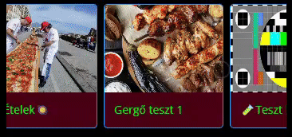
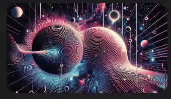

# 📄 Oldalak

## Főoldal

A főoldali beállításokban megtalálhatjuk a bizonyos elemek szín állításának lehetőségét, a főoldali funkciók megjelenítését, illetve testreszabhatjuk a főoldali elemeket, azoknak a sorrendjét.

Van lehetőségünk választani két különböző lokáció választó megjelenés közül (alapértelmezett vagy keretezett)

<figure><figcaption></figcaption></figure>

Ha több mint egy főoldali elem van létrehozva, úgy annak a beállításai fognak érvénybe lépni, mint például képek megjelenítése, tartalmak, kategóriák előző rendelés megjelenítése.

A főoldali elemek közül azokat tudjuk hozzáadni, amelyikeket csak szeretnénk, illetve ezek sorrendjét is tudjuk módosítani:



<figure><figcaption></figcaption></figure>

A feltöltött tartalmakból tudjuk kiválasztani azt, amelyiket szeretnénk megjeleníteni

<figure><figcaption></figcaption></figure>



<figure><figcaption></figcaption></figure>

Azok az elemek jelennek meg, amiket a navigáció menüpontban hozzáadtunk a főoldalhoz

<figure><figcaption></figcaption></figure>



<figure><figcaption></figcaption></figure>

Megjelenítünk egy listát a kategóriákról rácsos, vagy lista nézetben.

<figure><figcaption>
Lista nézet
</figcaption></figure>

<figure><figcaption>
Rácsos nézet
</figcaption></figure>



<figure><figcaption></figcaption></figure>

<figure><figcaption></figcaption></figure>



<figure><figcaption></figcaption></figure>

<figure><figcaption></figcaption></figure>



<figure><figcaption></figcaption></figure>

<figure><figcaption></figcaption></figure>



## Eladás

A terméklista kinézetét és az eladással kapcsolatos funkciókat tudjuk itt szabályozni

## App menü

Az app menü elemeinek a sorrendjét, megjelenítését és funkcióját tudjuk változtatni
