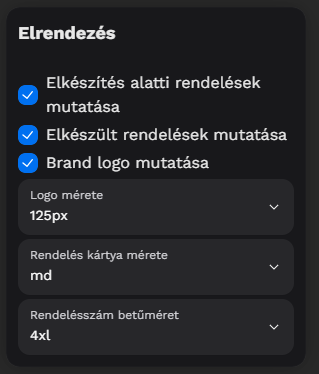
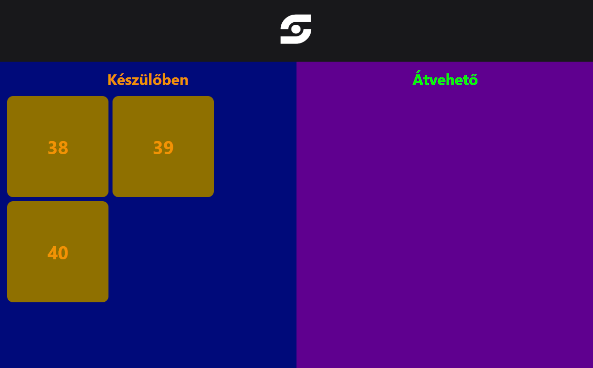

# 🔢 Rendelésszám kijelző

A Rendelésszám kijelző funkcionalitásában lehet szimpla készülőben levő vagy elkészült rendeléseket mutató eszköz, vagy akár a kettőt egyszerre is tudja mutatni, ez a beállításától függ.

### Stílus

Ha azt szeretnénk, hogy minden információ felkerüljön az eszközre, válasszuk ki mind a három dobozt.

<figure><figcaption></figcaption></figure>

A bizonyos elemek méreteit tudjuk módosítani ezen az oldalon, mint például a logó, rendelés kártya, rendelés szám.

<figure><figcaption></figcaption></figure>

### Színek

A színek oldalon lehetőségünk lesz módosítani az alap színeket

<figure><figcaption></figcaption></figure>

Valamint a "Készülőben" és az "Átvehető" oldal elemeinek színét

<figure><figcaption></figcaption></figure>
