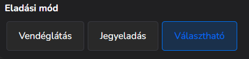
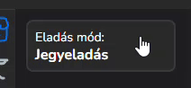

# 🏛️ BarSoft Attrakciók és POS

Beállítások -> testreszabás menüpontban lehet meghatározni az eszköz működési típusát.\
Amennyiben több eszközt használunk, viszont nem mindegyiken értékesítünk jegyeket, érdemes csak azon az eszközön bekapcsolni a Jegyeladást, ahol ez meg is történik, így nem lesz zavaró a mód váltó gomb.\
Ha egy eszközön szükséges a vendéglátás és a jegyeladás használata is, a választható eladási mód lesz segítségünkre.

<figure><figcaption></figcaption></figure>

Ha az eladási mód "Választható", az azt jelenti, hogy a Gyorsnyugta felületen megjelenik egy új gomb, amivel tudunk váltani jegyeladás és vendéglátás között.

<figure><figcaption></figcaption></figure>

A megjelenítésbeli beállítások ki fognak hatni a Jegyeladás felületre is.
