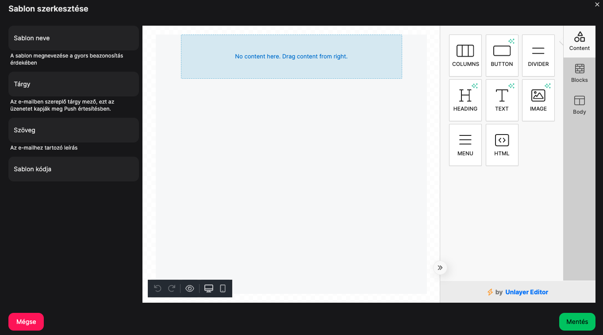

# 📧 E-mail sablonok

Ha automatikus levélkiküldést szeretnél, ahhoz szükség lesz e-mail sablonokra, ezeket tudod itt beállítani.

Ez egy nagyon fontos menüpont, hiszen az automatiziációknál kulcsfontosságú szerepet játszik az üzenetküldés.

Az **"Új léterhozása"** gombra kattintva egy nagyon könnyen kezelhető drag and drop típusú e-mail szerkesztő található ami így néz ki:

<figure><figcaption></figcaption></figure>

## Alap szerkeszői mezők

### Sablon neve

A Sablon neve mezőben a bal oldalon megadhatod a sablon nevét, amivel majd az automatizációk beállítása során könnyen be tudod határolni, hogy melyik sablont szeretnéd használni.

### Tárgy

A tárgy mező nagyon fontos, ugyanis ez jelenik majd meg a postaládában az e-mail tárgy mezőben, valamint ha letöltős Applikációval rendelkezel, akkor a PUSH üzeneteknek a tartalma is ez lesz. Tehát a sablonokat nem csak e-mail küldésre tudod majd használni, hanem PUSH üzenetek küldésére is.

### Szöveg

A rövid összefoglaló szöveg ami a postaládában a tárgy mező alatt fog szerepelni.

### Sablon kódja

Ezt a rendszer automatikusan fogja generálni, nincs vele dolgod.

## Tartalom szerkesztése

Jobb oldalon találhatóak azok az elemek, amik hozzáadhatók az e-mailhez, középen pedig a tartalmakat láttad amiket már hozzáadtál az e-mailhez, és ott tudod szerkeszteni őket.

Tehát a jobb oldalról tudsz behúzni:

* Column (felosztást, oszlopokat)
* Kattintható gombot
* Elválasztót
* Címszöveget
* Szövegmezőt
* Képet
* Menüt
* HTML kódot


Abban az esetben ha valamilyen más levelezőben használsz sablonokat és ki tudod másolni a sablon HTML kódját, úgy a HTML mező behúzásával bemásolhatod azt és kész is ugyanaz az e-mail sablon.


Miután behúztál egy elemet rákattintva további beállítások jelennek meg a jobb oldalon specifikusan ahhoz a tartalomhoz.

***

Miután végeztünk a szerkesztéssel kattintsunk a <mark style="color:green;">**Mentés**</mark> gombra és kész is vagyunk a sablonunkkal.


**TIPP**

Abban az esetben ha nem automatizációhoz szeretnél sablont létrehozni, hanem a [vásárlók menüpontban](jelentesek/vasarlok.md) létrehozott szűrő segítségével egy bizonyos közönség szegmensnek, úgy van lehetőséged a sablonok közül választani, tehát érdemes itt létrehozni ezeket az üzenet mintákat is létrehozni.

