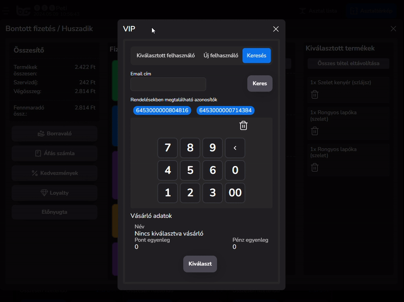

# 👑 VIP és BarSoft

Miután beállítottuk a vendég oldali felületet és a háttér admin felületet is, már csak az értékesítés menetébe szükséges implementálni a VIP rendszert.

### VIP gombok

Ha már a VIP licensz aktiválva van, két új gombbal gazdagodik a POS felületünk.

Loyalty rendszer állapot jelző ikon

<figure><figcaption>
VIP Állapot jelző ikon
</figcaption></figure>

Ennek az ikonnak a színe <mark style="color:green;">zöld</mark>, ha a kapcsolat él a VIP szerverrel, <mark style="color:red;">piros</mark>, ha probléma lépett fel

### VIP rendeléshez párosítás gomb

<figure><figcaption>
VIP vendég párosító gomb
</figcaption></figure>

Amennyiben szeretnénk a jelenlegi rendelésünkhöz egy törzsvásárlót hozzárendelni vagy új törzsvásárlót beregisztrálni anélkül, hogy ő megnyitná a vendég oldali felületet, vagy akár csak az egyenlegét szeretnénk lekérdezni egy vendégünknek, ez az ablak fog segítségünkre lenni

Az ablakban három fület fogunk találni:



* Itt fogjuk látni az aktuálisan a rendeléshez társított vásárló alap adatait, mint Név, Pont egyenleg, Pénz egyenleg
* Ha az adott rendeléshez mégsem szeretnénk a már kiválasztott felhasználót hozzárendelni, az itt található <mark style="color:red;">Leválasztás rendelésről</mark> gombbal ezt javíthatjuk

<figure><figcaption></figcaption></figure>



Itt miután kiválasztottuk, milyen típusú VIP kártyával rendelkezzen majd és megadtuk az e-mail címét és a nevét, a <mark style="color:green;">Mentés</mark> gombbal már be is került az adatbázisba a felhasználó

<figure><figcaption></figcaption></figure>



a VIP vendég kiválasztására szolgáló keresőt itt találjuk meg. Itt e-mail címre tudunk keresni, vagy kézzel be is tudjuk írni a VIP azonosítóját a vendégnek, ha pedig van egy vonalkód olvasó csatlakoztatva a POS-hoz, akkor a QR kódját beolvasva, már ki is választjuk a vásárlót. A <mark style="color:blue;">Kiválaszt</mark> gomb megnyomása után már hozzá is adtuk a vendégünket a rendeléséhez.

<figure><figcaption></figcaption></figure>



### VIP és Asztalok

Amennyiben asztalokat kezelünk a működés során, úgy előfordulhatnak bizonyos helyzetek, amikor egy asztalnál több VIP felhasználó is rendel.

Ha már a rendelés felvételkor beazonosítottuk minden vendég VIP kártyáját, úgy a külön fizetés nagyon egyszerű lesz. A bontott fizetésben mutatjuk melyik rendelések melyik felhasználóhoz tartoznak, így akár pillanatok alatt szét lehet válogatni, melyik terméket ki fogyasztotta.

Amikor egy asztalra több VIP felhasználó is rendel, viszont egy vásárló fizeti az egész nyugtát, lehetőségünk van kiválasztani, hogy melyik felhasználó kedvezményei lépjenek életbe, illetve a pontokat is Ő fogja kapni.

<figure><figcaption></figcaption></figure>

A bontott fizetés ablakban a Loyalty gomb megnyomásával (ha volt már kiválasztva VIP felhasználó), a keresés ablakban láthatjuk, hogy milyen felhasználók találhatóak meg a rendeléseken belül. Innen tudjuk kiválasztani, hogy ki fogja a pontokat kapni és a kedvezményeket érvényesíteni.


Ha egy társaságban két VIP felhasználó van, de az egyiknek több kedvezménye van, legyen az kupon vagy kártya alapú, akkor ha szeretnénk a vendégnek kedvezni, választhatjuk azt a felhasználót, aki jobb ajánlattal rendelkezik


<figure><figcaption></figcaption></figure>

### VIP vendég fizettetése

Miután a felhasználót rögzítettük a fizetés előtt, a fizetési módok beszürkülnek.&#x20;

A Kedvezmények ellenőrzése gombra ha rákattintunk, az előhoz egy ablakot, amiben kilistázzuk az érvényes kedvezményeket. Ha a vendégünk nem választott ki kupont eddig a pontig vagy nem aktiválta a pontjait, viszont mégis szeretné, miután az appon keresztül ezeket elintézte, az "Újra ellenőrzés" gombbal frissíteni tudjuk a kedvezményeit. Miután végeztünk nyomjunk rá a <mark style="color:green;">Rendben</mark> gombra, így már a csökkentett árral számol a rendszer.

A VIP vendégeknél előfordulhat, hogy rendelkeznek feltöltött pénz egyenleggel. Ezt elkölteni az appon keresztül tudják, vagy a POS-on VIP fizetési mód által.
