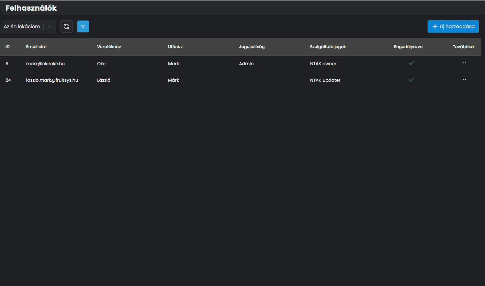
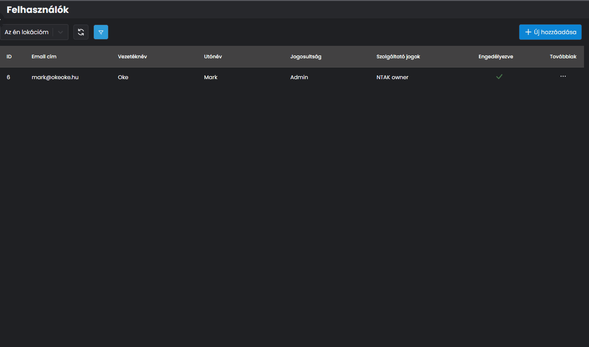

# 🚫 FELHASZNÁLÓ DEAKTIVÁLÁSA

Abban az esetben, ha egy felhasználót már hozzáadtunk korábban, viszont szeretnénk törölni a listából, deaktiválással megtehetjük.


**FIGYELEM!**

Törölni felhasználót nem tudunk az adatbázisból, deaktiválni viszont igen. Ez több szempontból van így, akár szüneteltetni is lehet a hozzáférést.


A felhasználók menüpontban kattintsunk a deaktiválni kívánt felhasználó sorának a végén a **...** ikonra, így megjelenik a felhasználóval kapcsolatos összes beállítás.

Az <mark style="color:blue;">**ENGEDÉLYEZVE**</mark> gomb kikapcsolásával a felhasználó el is tűnik a listából.

<figure><figcaption>
MEGLÉVŐ FELHASZNÁLÓ DEAKTIVÁLÁSA
</figcaption></figure>

Ha később újra aktiválni szeretnénk a felhasználót, könnyen megtehetjük új regisztráció nélkül, a szűrők beállításnál.

<figure><figcaption>
FELHASZNÁLÓ ÚJRA AKTIVÁLÁSA
</figcaption></figure>
