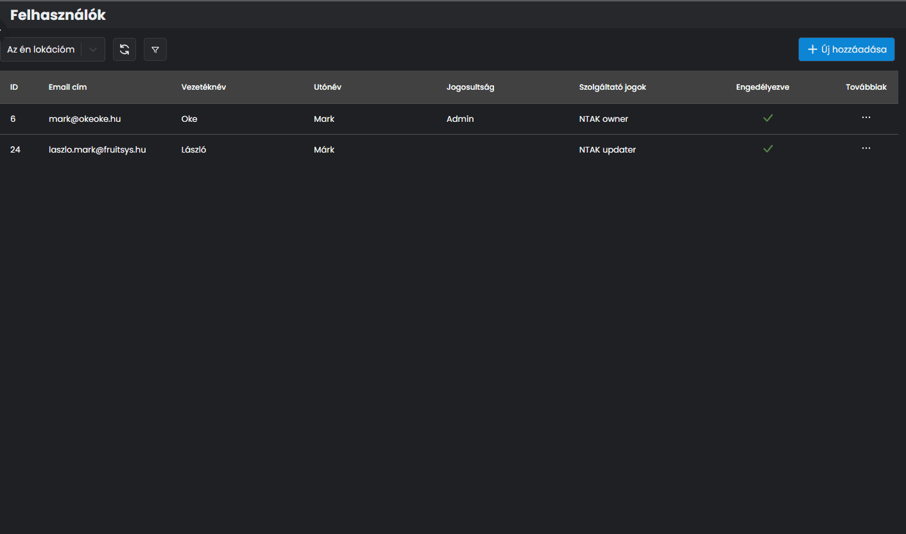

# 🔼 FELHASZNÁLÓI JOGOSULTSÁG MÓDOSÍTÁSA

Ha szeretnénk megadni vagy elvenni jogosultsági szintet egy felhasználótól, bármikor könnyedén megtehetjük.

A felhasználó melletti **...** ikonra kattintva a beállítások ablakban a felhasználói jogosultság menüpontban módosítsuk a szintet és és kattintsunk a <mark style="color:green;">**MENTÉS**</mark> gombra.

<figure><figcaption>
FELHASZNÁLÓI SZINT MÓDOSÍTÁSA
</figcaption></figure>


**TIPP**

Ugyanezzel a módszerrel lehet módosítani az e-mail címet és a nevet is akár, például ha céges e-mail címet használunk pl.: iroda@sajatcegem.hu viszont a személy változott, vagy ha az e-mail cím megszűnt az adott személyhez és másikat használ már, az se jelent problémát.


