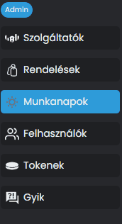
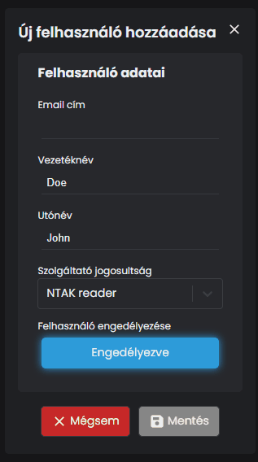

# 🤝 ÚJ FELHASZNÁLÓ HOZZÁADÁSA

Navigálj az NTAK Portál menüjében a <mark style="color:blue;">**FELHASZNÁLÓK**</mark> menüpontra!

<figure><figcaption></figcaption></figure>

A menüpontban, az alábbi oldalt látjuk:

<figure><figcaption>
A FELHASZNÁLÓK LISTÁJA
</figcaption></figure>

Ahhoz hogy új felhasználót tudjunk hozzáadni, kattints a <mark style="color:blue;">**+ ÚJ HOZZÁADÁSA**</mark> gombra.

Töltsük ki a mezőket értelemszerűen az alábbiak szerint:

<figure><figcaption>
ÚJ FELHASZNÁLÓ HOZZÁADÁSA
</figcaption></figure>

A mentés után, már látnunk kell az új felhasználót a listában:

<figure><figcaption>
AZ ÚJ FELHASZNÁLÓLISTA
</figcaption></figure>

Ezután az új felhasználó a linken a saját e-mail címével be tud majd jelentkezni.
