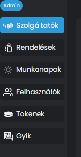
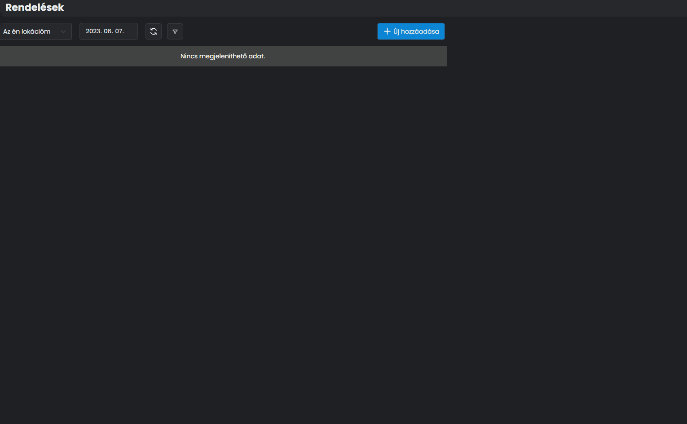

# 📂 RENDELÉSEK & MUNKANAPOK

A rendeléseinket, amiket felküldtünk az NTAK felé, vissza tudjuk nézni, le tudjuk ellenőrizni, és tudjuk helyesbíteni is ha szükséges.

Ha valamilyen oknál fogva vannak olyan értékesítések, amiket nem tudtunk felküldeni az NTAK rendszerébe, mert nem volt elérhető a szoftver, kézzel is fel tudunk vinni rendeléseket a megfelelő adatok megadásával.

A funkciót a Rendelések menüpont alatt éred el:

<figure><figcaption></figcaption></figure>

Ezen a felületen látjuk a rendeléseket, amiket a kiválasztott szolgáltatóval küldtünk be, az adott napon.

Mivel mi még nem adtunk le semmilyen rendelést, ezért nincs megjeleníthető adat jelenik meg.

A fenti menüsorban láthatjuk:

* Szolgáltató választó
* Dátum választó
* Újratöltés gomb
* Új hozzáadása

<figure><figcaption>
A rendelések kezelése ablak
</figcaption></figure>
