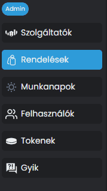
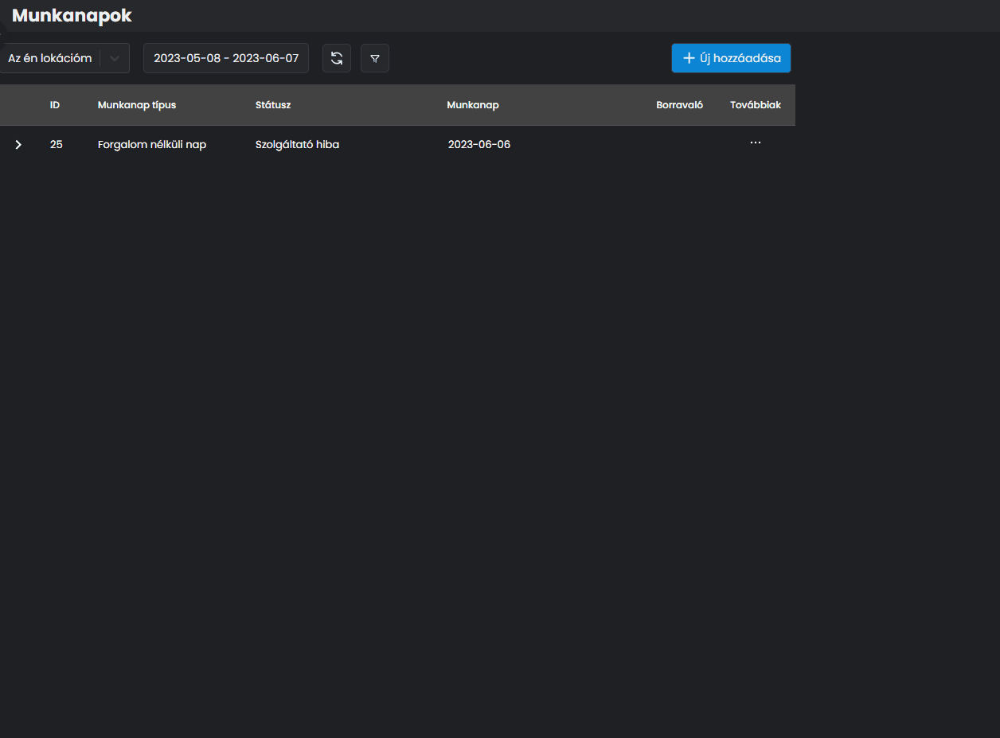
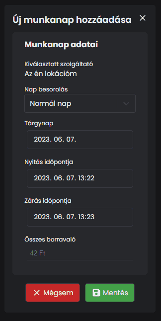

# 👷 Munkanapok kezelése

Amennyiben valamilyen oknál fogva nem elérhető a szoftver, vagy nem kezeli automatikusan a munkanapokat, manuálisan be tudod állítani az aznapi státuszt az NTAK Portálon keresztül, hogy NTAK felé megfelelően kommunikálj.


**TIPP**

A munkanappal kapcsolatos adatokat a nap végén, miután bezártál kell beküldeni.


Az NTAK alapján 3 féle munkanapok különítünk el:

Normál nap

Normál üzemeszerűen lezajlott nap, ahol a nyitvatartási időn belül történt értékesítés

Adott napon zárva

Olyan munkanap, amikor az üzlet nem volt nyitva, azaz nem történt értékesítés

Forgalom nélküli nap

Olyan munkanap, amikor nyitva tartási idő szerint nyitva volt az üzlet, de nem történt értékesítés.

Navigálj a <mark style="color:blue;">**MUNKANAPOK**</mark> menüpontra!

<figure><figcaption></figcaption></figure>

A menürendszer ugyanolyan elrendezésű, mint a rendelés hozzáadás.

Új munkanap hozzáadáshoz kattints az <mark style="color:blue;">**+ ÚJ HOZZÁADÁSA**</mark> gombra.

<figure><figcaption>
ÚJ MUNKANAP FELVITELE
</figcaption></figure>

A felületen vidd fel értelemszerűen az adatokat:

* Munkanap típusa
* Munkanap dátum
* Nyitás azon a napon
* Zárás azon a napon
* Borravaló (ha volt)

<figure><figcaption>
ÚJ NORMÁL NAP HOZZÁADÁSA
</figcaption></figure>

A felvitel után látjuk a listában a napot az alábbiak szerint:

<figure><figcaption></figcaption></figure>


**FONTOS TUDNI!**

Ez egy DEMO szolgáltató, így ezért hibás adatokat kapunk vissza a példában.


