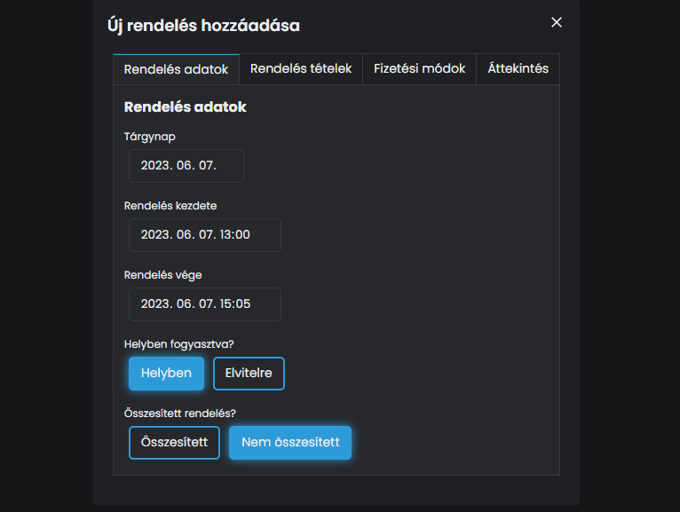

# ➕ Új rendelés hozzáadása

Adjunk hozzá egy új rendelést!

Kattints az <mark style="color:blue;">**ÚJ HOZZÁADÁSA**</mark> gombra.



Itt adjuk meg, a rendeléssel kapcsolatos információkat:

* Tárgynap: Az a dátum, amikor a rendelés megtörtént
* Rendelés kezdete: Mikor történt azon a napon a rendelés
* Rendelés vége: Mikor történt a rendelés véglegesítése
* Helyben, vagy elviteles fogyasztás történt
* Összesített rendelés: Ez azt jelenti, hogy a teljes nap összes tételét visszük most fel, vagy csak egy-egy rendelését.

<figure><figcaption></figcaption></figure>



Itt adjuk meg a rendelésben szereplő termékek adatait:

* Termék neve
* Bruttó egységára
* Tételszám
* ÁFA csoport
* NTAK kategória és alkategória
* Mennyiség
* Mennyiségi egység

<figure><figcaption></figcaption></figure>



Itt tételesen meg tudjuk adni, hogy milyen fizetési módokkal rendezték a számlát.



Egy rövid áttekintést kaphatunk arról, hogy miket állítottunk be.



Vigyünk fel a rendelésekhez egy Cappuccinot és egy Hamburgert.

<figure><figcaption></figcaption></figure>

A <mark style="color:green;">**MENTÉS**</mark> gombra kattintva a rendelést beküldjük az NTAK rendszerébe

<figure><figcaption>
A mentett rendelés
</figcaption></figure>

Így már látjuk, hogy a rendelést beküldtük, és a Státusz feliratnál a beküldés státuszát.


**FONTOS TUDNI**

Ez egy demo szolgáltató, így nem fogunk releváns státuszt és adatot látni a rendelésekkel kapcsolatosan.

