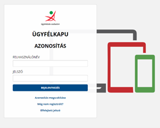
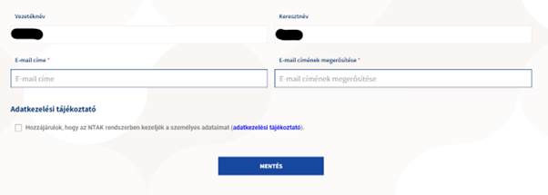
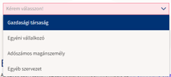
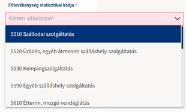
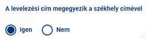
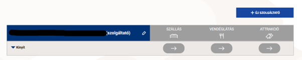
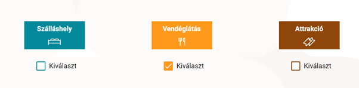
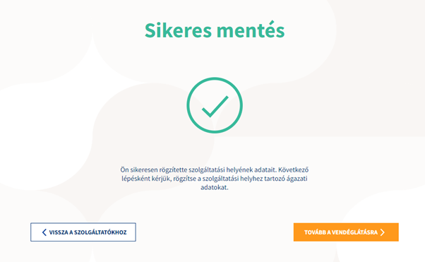
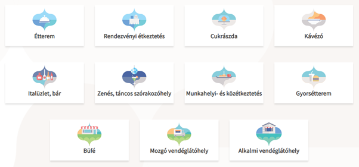

# 🖊️ Regisztráció az NTAK felületén

## Az NTAK regisztráció folyamata

Navigálj böngésződ segítsgével az NTAK felületére!

<figure><figcaption>
NTAK felülete
</figcaption></figure>

A weboldalon ez a felület fog fogadni.

A <mark style="color:red;">**BELÉPÉS**</mark> gombra kattintva továbbít a KAÜ felületére, ahol ügyfélkapud segítségével azonosítani tudják majd vendéglátó helyed.

<figure><figcaption>
Add meg ügyfélkapu adataidat a folytatáshoz!
</figcaption></figure>

## Felhasználói fiók létrehozása

A bejelentkezés után az NTAK fiók regisztrációjának megerősítésére lesz szükség.

<figure><figcaption></figcaption></figure>

Nevedet az ügyfélkapu alapján automatikusan kitölti a rendszer, add meg azt az e-mail címedet, amit hivatalos ügyintézésre szoktál használni!

Ki kell pipálnod a “Hozzájárulok, hogy az NTAK rendszerben kezeljék a személyes adataimat”, de ezt csak úgy tudod megtenni, hogy ha elolvasod az adatkezelési tájékoztatót.

Miután megnyitottad az oldalt, a négyzet kipipálhatóvá válik, kattints a mentés gombra.

## Üzemeltető cég regisztrációja

Sikeres regisztráció után a főmenübe érkeztünk.

Itt két dolgot kell majd beállítanod:

* Üzemeltető cég regisztrációja
* Vendéglátó üzleted beállítása

**DEFINÍCIÓK**



Szolgáltató az NTAK rendszerében az a CÉG, gazdasági szervezet, adószámmal rendelkező magánszemély, aki üzemelteti az adott vendéglátó helyet



**Szolgáltatási hely az NTAK rendszerében az a hely, amit a szolgáltató (cég) üzemeltet. Ez lesz a vendéglátó helyed.**



**Szállás / vendéglátás / Attrakció**




**FONTOS**

Egy üzleti egység több adatszolgáltatásra is kötelezheztő, például ha egy cég alatt fut egy szálláshelyed, ahol éttermet is üzemeltetsz, akkor a szállás és vendéglátás részt is ki kell töltened (szállást már 2019 óta).


Kattints az <mark style="color:blue;">**ÚJ SZOLGÁLTATÓ**</mark> gombra!

Az új szolgáltató regisztrációja résznél első körben ellenőrzik azt, hogy jogosult vagy-e ügyfélkapus regisztrációd alapján az adott cég nevében eljárni.


**TIPP**

Mindenképp azzal az ügyfélkapu regisztrációval lépj be, ami az üzemeltető cégedhez van hozzárendelve!

Amennyiben nincs ahhoz hozzáférésed, úgy jogosultsági kérelmet kell majd benyújtanod egy online letölthető form alapján!


<figure><figcaption>
VÁLASZD KI A SZERVEZET TÍPUSÁT ÉS ADD MEG AZ ADÓSZÁMOT!
</figcaption></figure>

Szervezet alapesetben lehet KFT, BT azaz GAZDASÁGI TÁRSASÁG, EV, vagy adószámos magánszemély.

Ha egyéb szervezettel szeretnél regisztrálni, úgy további adatok megadása szükséges majd!

Ha a felsorolt cég valamelyike vagy, akkor az adószám beírása után a “jogosultság ellenőrzése és mentés” gombra kattintva tovább is léphetünk!

A következő ablakban automatikusan kitöltötte a rendszer adószám alapján a cégadatokat, a főtevékenység statisztikai kódját kell megadnod.

<figure><figcaption></figcaption></figure>

Választhatsz a listából, vagy ha nem találod a megfelelő tevékenységi kört, kattinthatsz a lista aljában szereplő egyéb gombra is.

Ebben az esetben felugrik egy mező, ahol be kell írnod a tevékenységi köröd.

Kiválaszthatod, hogy vállalkozásod AAM (alanyi adómentes) körbe tartozik-e. Amennyiben igen, pipáld ki a mezőt, ha nem, hagyd üresen.

Kattints a **KÖVETKEZŐ** gombra!

A címadatok menüpontban a rendszer automatikusan kitölti a céged székhely címét.

Ezt tudod módosítani ha szeretnéd.

<figure><figcaption>
MÓDOSÍTHATOD A LEVELEZÉSI CÍMET
</figcaption></figure>

Ha nem egyezik meg a levelezési címed a székhely címmel, abban az esetben pipáld ki a “NEM” kört és add meg adataidat.

Ha minden rendben, és a székhely címed egyben a levelezési címed is, kattints a <mark style="color:blue;">**KÖVETKEZŐ**</mark> gombra!

Kapcsolattartó adatait kell kitölteni a következő oldalon, itt annak a személynek az adataira kíváncsiak, akik az ügyintézést fogják végrehajtani a jövőben.

Töltsd ki az adatokat és kattints a <mark style="color:blue;">**MENTÉS**</mark> gombra!

Miután ez megtörtént el is készültünk az Üzemeltető cég regisztrációjával és az alábbi képernyőt kell látnod:

<figure><figcaption></figcaption></figure>

## Vendéglátó hely regisztrációja

Miután az üzemeltető cég regisztrációja megtörtént, úgy az üzletet kell regisztrálni a következő lépésben.

STRUKTÚRA

<table data-card-size="large" data-view="cards"><thead><tr><th></th><th></th><th></th></tr></thead><tbody><tr><td></td><td>ÜZEMELTETŐ CÉG</td><td></td></tr><tr><td></td><td>SZOLGÁLTATÁSI HELY</td><td></td></tr><tr><td></td><td>VENDÉGLÁTÓ ÜZLET</td><td></td></tr></tbody></table>


**TIPP**

Egy helyen több üzlet is működhet, ezért először szolgáltatási helyet kell létrehoznunk.


A cégnév alatt kattints a <mark style="color:blue;">**KINYIT**</mark> gombra, majd a <mark style="color:blue;">**SZOLGÁLTATÁSI HELY FELVÉTELE**</mark> gombra.

AZ alapadatok adatlapon kitöltheted a vendéglátó helyed címét, ami lehet postai cím vagy helyrajzi szám.

Ha a céged székhelycímét használod, kattints a <mark style="color:blue;">**CÍMEK MEGEGYEZNEK A SZOLGÁLTATÓ CÍMÉVEL**</mark> pipára.

Ha NEM szeretnél másik kapcsolattartót hozzáadni, akkor a **KAPCSOLATTARTÓ ADATOK MEGEGYEZNEK** pipával mehetünk is tovább.

Kattints a <mark style="color:blue;">**KÖVETKEZŐ**</mark> gombra!

A következő oldalon azt választhatjuk ki, hogy melyik ágazatban nyújtunk adatszolgáltatást, jelen esetünkben ez a Vendéglátás lesz.

<figure><figcaption>
VÁLASZD KI A SZOLGÁLTATÁSI TERÜLETED
</figcaption></figure>

Kattints a <mark style="color:blue;">**MENTÉS**</mark> gombra!

Ha minden sikeres, akkor az alábbi képernyő tájékoztat minket, hogy minden rendben, és mehetünk tovább az üzlet regisztrálásához.

<figure><figcaption>
SIKERES MENTÉS
</figcaption></figure>

Kattints a <mark style="color:yellow;">**TOVÁBB A VENDÉGLÁTÁSRA**</mark> gombra!

Válaszd ki, hogy milyen típusú vendéglátó üzletet szeretnél regisztrálni!


**FIGYELEM!**

Ha később módosítani szeretnéd a típust, úgy törölnöd kell a jelenlegi üzletet, és újat kell majd létrehozni ezért **nagyon fontos, hogy a jó kategóriát válaszd ki!**


<figure><figcaption>
KÖRÜLTEKINTŐEN VÁLASZD KI A TÍPUST!
</figcaption></figure>

Miután kiválasztottad a korábban kitöltött adataid mutatják meg, kattints a <mark style="color:yellow;">**KÖVETKEZŐ**</mark> gombra!


**TIPP**

Most lesz szükséged a működési engedélyre!


Töltsd ki értelemszerűen a táblázatot:

* Vendéglátóhely neve
* Működési engedély száma
* Vendéglátóhely-szolgáltatás megkezdése: A működési engedélyben megjelölt kezdőnapot, ha ilyen nincs, akkor a dokumentum kiállításának napját kell megjelölni
* Mikor van nyitva: Egész évben vagy szezonálisan. Amennyiben szezonálisan úgy egy új mezőben a szezonális nyitvatartási időt kell megadnod (Pl.: Március 1-től szeptember 31-ig)
* Kapcsolattartó személy megegyezik-e
* Heti nyitvatartás napi szinten lebontva

Amikor kész vagy, kattints a <mark style="color:yellow;">**KÖVETKEZŐ**</mark> gombra!

A részletes adatok menüpontban a működéseddel kapcsolatos kérdéseket kell megadnod.

<table data-view="cards"><thead><tr><th></th><th></th><th></th></tr></thead><tbody><tr><td></td><td><strong>Helyben fogyasztás</strong></td><td><ul><li>Ha igen, akkor van-e kerthelyiség / terasz?</li><li>Férőhelyek száma, ülő+ állóhelyek</li></ul></td></tr><tr><td></td><td>SZÉP kártyát elfogadsz-e</td><td></td></tr><tr><td></td><td>Akadálymentesített?</td><td></td></tr><tr><td></td><td>Házhozszállítás van-e?</td><td></td></tr><tr><td></td><td>Van-e ételkínálat?</td><td></td></tr><tr><td></td><td>Helyi termelőktől származő alapanyagot használsz-e vagy sem</td><td></td></tr></tbody></table>

Ha kész vagy, kattints a <mark style="color:yellow;">**MENTÉS**</mark> gombra.

