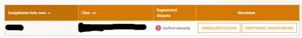
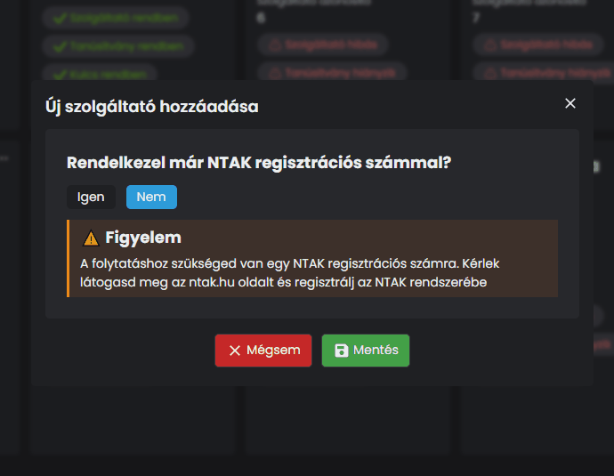
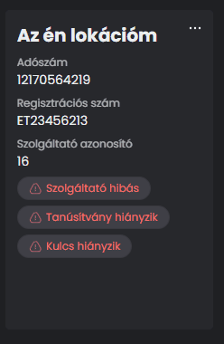
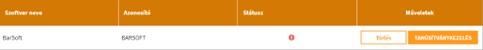
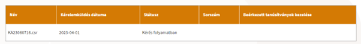
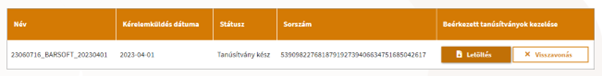
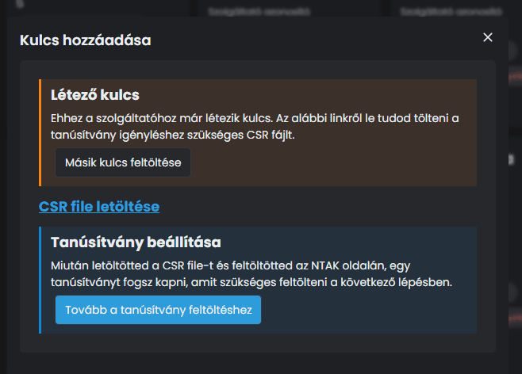

# 🖥️ Szoftverválasztás

## NTAK Regisztrációs szám

Miután megvagyunk a regisztrációval egy összegző oldalra kerülünk, ahol a regisztrált helyszínt, valamint a vendéglátó üzleteket látjuk.

<figure><figcaption></figcaption></figure>

A **VENDÉGLÁTLÓ ÜZLETEK** gombra kattintva a hely alatti üzletek listáját látjuk, amiket beregisztráltunk.


**FIGYELEM!**

**Itt találjuk az NTAK regiszrációs számot, ezt mentsd ki, mivel szükség lesz rá!**


## NTAK Portál beállítás

Ahhoz, hogy összekössük a frissen regisztrált vendéglátó egységed új szoftvereddel, pár beállítást még végre kell hajtanunk az NTAK Portál felületén.

Arra a gombra kattints alább, amelyik rendszert szeretnéd összekötni az NTAK Portállal!

<table data-card-size="large" data-view="cards"><thead><tr><th data-type="content-ref"></th><th data-hidden data-card-cover data-type="files"></th><th data-hidden data-card-target data-type="content-ref"></th></tr></thead><tbody><tr><td><a href="https://ntak.fruitsys.hu">https://ntak.fruitsys.hu</a></td><td><a href="../.gitbook/assets/fruitsys_logo_bigfruit.jpg">fruitsys_logo_bigfruit.jpg</a></td><td></td></tr><tr><td><a href="https://ntak.app.barsoft.hu/">https://ntak.app.barsoft.hu/</a></td><td><a href="../.gitbook/assets/barsoft-icon-blue@300x.png">barsoft-icon-blue@300x.png</a></td><td><a href="https://ntak.app.barsoft.hu/">https://ntak.app.barsoft.hu/</a></td></tr></tbody></table>

A weboldalon egy egyszerű e-mail cím megadásával és az e-mail címedre küldött 4 számjegyű kóddal tudsz bejelentkezni a felületre, és az alábbi képernyő fog fogadni:

<figure><figcaption>
NTAK Portál felület
</figcaption></figure>

### Új NTAK szolgáltató létrehozása

Az NTAK Portál felületén kattints az <mark style="color:blue;">**ÚJ LÉTREHOZÁSA**</mark> gombra!

Új szolgáltató létrehozásakor, a következő adatokra lesz szükségünk:

* Adószám
* NTAK regisztrációs szám

Írd be az adatokat, és kattints a mentés gombra.

<figure><figcaption></figcaption></figure>

Miután elmentettük a szolgáltatót a következő lépésekre lesz szükségünk:

* Kulcs beállítás
* Tanusítvány feltöltés

A kulcsot mi legeneráljuk neked, tehát azzal nem kell vesződnöd, majd annyit kell tenni, hogy visszatölteni az NTAK felületére, de ne szaladjunk ennyire előre.

### Regisztrációs kulcs létrehozása

Kattints az új szolgáltató kártyádon a **...** kis ikonra.

<figure><figcaption></figcaption></figure>

Miután rákattintottál a **KULCS BEÁLLÍTÁS** gombra, generálunk neked egyet, és a végén ez a képernyő fog fogadni:

<figure><figcaption></figcaption></figure>

Kattints a <mark style="color:blue;">**CSR FILE LETÖLTÉSE**</mark> gombra és máris nálad van a kulcs ami szükséges a tovább lépéshez.


**FONTOS!**

Ne zárd be az NTAK Portált, miután végeztél a letöltéssel, mert ide még vissza kell jönnünk!


## Szoftverválasztás az NTAK felületén

Miután megszereztük a kulcsunkat, vissza kell térnünk az NTAK felületére és a szolgáltató hely listánál, a Regisztráció állapota résznél láthatjuk, hogy még szoftvert kell választanunk.

<figure><figcaption></figcaption></figure>

Válasszuk hát ki szoftverünket!

Kattints a <mark style="color:yellow;">**SZOFTVEREK, TANÚSÍTVÁNYOK**</mark> gombra!

A legördülő listából válaszd ki a **Fruitsys-t** vagy a **BarSoft-ot**, majd kattints a <mark style="color:yellow;">**HOZZÁADÁS**</mark> gombra!

Amint hozzáadtuk a szoftvert, az alábbi képernyőt fogod látni:

<figure><figcaption>
MI most a BarSoft-ot választottuk
</figcaption></figure>

Kattints a <mark style="color:yellow;">**TANÚSÍTVÁNYKEZELÉS**</mark> gombra!

Görgess a lap aljára, és a <mark style="color:yellow;">**FÁJL FELTÖLTÉSE**</mark> gombra és tallózd ki a letöltött .csr fájlt amit a szolgáltató beállítás során letöltöttél az NTAK Portálról!

Miután ezzel megvagyunk és feltöltötted a szükséges kulcsot, kattints a <mark style="color:yellow;">**KÉRELEM INDÍTÁSA**</mark> gombra és máris meglesz a tanúsítványod! 🎉

Sikeres kérelem után az alábbi táblázatban a **LETÖLTÉS** gombra kattintva tudod megszerezni a tanúsítványt, ami egy .cert fájl, és ezt kell feltölteni majd az NTAK Portálon!

<figure><figcaption>
Tanúsítvány generálás folyamatban
</figcaption></figure>

<figure><figcaption>
Kész a tanúsítvány, töltsd le!
</figcaption></figure>

## NTAK Portál beállítás folytatása

Megszereztük a tanúsítványt, így tudjuk folytatni a beállítást az NTAK Portálon.

Kattints a **TOVÁBB A TANÚSÍTVÁNY FELTÖLTÉSHEZ** gombra.

<figure><figcaption></figcaption></figure>

Miután feltöltötted a frissen megszerzett tanúsítványt, az alábbi ablak lesz látható:

<figure><figcaption></figcaption></figure>

HURRRÁ! Beállítottuk a szolgáltatót, ezzel nincs több dolgunk!
