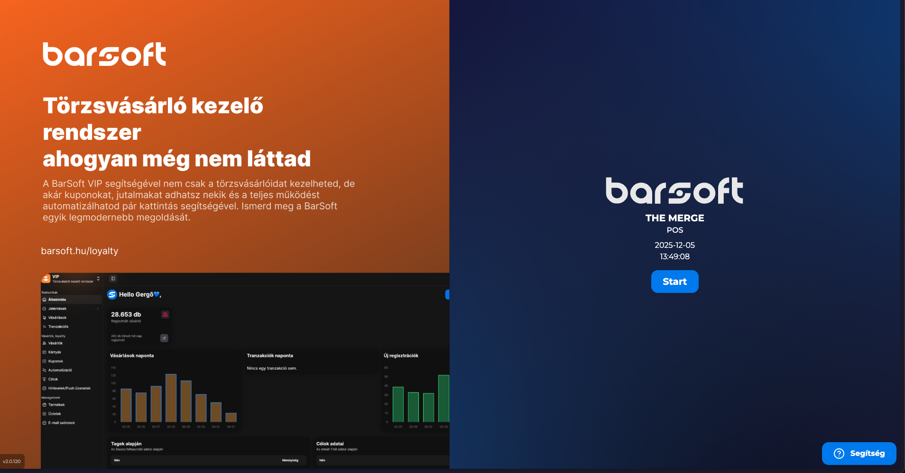

# 📪 Belépés az eladói felületbe

## Egy felhasználó esetén

Az egy felhasználós módban, a pulzáló START gombra kattintva be tudsz lépni a POS alkalmazásba.

<figure><figcaption></figcaption></figure>

## Több felhasználó esetén

Több felhasználó esetén az e-mailben kiküldött kódoddal tudsz bejelntkezni vagy az [iPanel ](https://ipanel.barsoft.hu/)-> Felhasználók menüpont alatt található PIN kóddal.


A felhasználókkal kapcsolatos beállítások és egyéb információk az iPanel / felhasználókezelés oldalon találhatók:\
[Felhasználók](https://app.gitbook.com/s/bUe0ZlDwHEwtVDDR1E11/ipanel-menupontok/felhasznalok "mention")


Nyitó képernyőn megjelenő adatok

* Lokáció neve
* Az eszköz típusa (pl: POS)
* Dátum
* Pontos idő

Mikor beléptél, az első fontos tényező az, hogy megnyisd a műszakot.

## Gyakori kérdések

Mi történik akkor, ha túl sokáig tölt a szoftver és nem jelenik meg a START gomb?

Ebben az esetben általában két dolog szokott történni:

1. Nagyon sok nyitott rendelésed van, és a rendszernek (eszközfüggő) több időbe telik a betöltés
2. Nagyon lassú az internet kapcsolatod vagy egyáltalán nincs

**Mit tegyek ilyen esetben?**

Ilyen esetben érdemes ellenőrizni az internet kapcsolatot, hogy megfelelően működik-e.

Érdemes újraindítani az egész eszközt, hátha valamilyen helyi memória gond akadt amit az újraindítás megold.

Nem tudom a PIN kódomat. Hol tudom megnézni?

A PIN kódját a felhasználónak bármikor meg lehet tekinteni azzal a felhasználóval, akinek van iPanel jogosultsága (általában a regisztráló).

A PIN kódot akár mobiltelefonos iPanel alkalmazásunkon keresztül, vagy böngészőben mobilon / desktopon meg lehet tekinteni az iPanel / Felhasználók menüpont alatt.

Több információt a felhasználókezelésről itt találsz:

[Felhasználók](https://app.gitbook.com/s/bUe0ZlDwHEwtVDDR1E11/ipanel-menupontok/felhasznalok "mention")

Csak a BarSoft logót látom az app elindításakor és nem lép tovább. Mi a teendő?

Ebben az esetben az eszközöd úgynevezett WebView beépített funkciója nem működik megfelelően, és az alábbiakat tudod tenni:

1. Kérlek lépj ki a programból (teljesen - zárd be azt, hogy a háttérben se fusson), és nyisd meg a Play Áruházat, vagy Sunmi Esetében az AppStore-t.
2. Keress rá erre "Android WebView"
3. Amennyiben van frissítés, úgy kérlek frissítsd az appot
4. Frissítés után próbáld meg újra elindítani a BarSoft rendszert

**A legfrissebb WebView-al rendelkezem, mégis ez a szituáció. Mit tudok még tenni?**

Ebben az esetben (általában IMIN készülékeken jellemző), kérlek látogass el a rendszer beállításaiba.

A beállításoknál keress egy olyan menüpontot, hogy "A rendszer névjegye" (általában legalul fogod megtalálni) , majd kattints a "Vezeték nélküli frissítésre".

Amennyiben talált frissítést, úgy várd meg a folyamatot, majd a frissítés végeztével indítsd el újra az appot.

**Minden alalmazás friss az eszközön, de továbbra sem lép tovább az app.**

Ebben az esetben szinte biztos, hogy internet probéma lesz, kérlek ellenőrizd a neted elérhetőségét. Sokszor nem elég az, hogy csatlakozik a hálózatra, azt is meg kell vizsgálni, hogy van-e valós net.

**A fentiek közül egyik sem oldotta meg a problémámat.**


**DANGER ZONE!**

Az alábbi megoldással az applikáció adatai törlődnek, így a lokális beállításokat újra be kell majd állítani.

Erről részletesen itt olvashatsz: [#ha-tonkre-megy-az-egyik-eszkozom-hardveresen-mi-a-teendo](../#ha-tonkre-megy-az-egyik-eszkozom-hardveresen-mi-a-teendo "mention")


Legvégső esetben próbáljuk meg újratelepíteni az appot. Gondoskodj róla hogy a legfrissebb verziót töltöd le.

A teljes törléshez, először navigálj az app menübe az eszközödön, hosszan nyomj a BarSoft ikonra.

Kattints az információra, majd ott a gyorsítótár és adatok törlésére.

Töröld az appot az "Uninstall" vagy "Remove" gombra kattintva.

Töltsd le újra az applikációt és aktiváld be az eszközödet.

Az app megnyitásakor aktiválást kér. Mi a teendő?

Némely esetben előfordulhat, hogy újra aktiválást kér a rendszer. Ebben az esetben itt az eszközön semmilyen műveletet nem kell végezned, kérlek tedd az alábbiakat:

1. Navigálj az iPanel felületére
2. Az eszkökzök / POS menüpontra kattints rá
3. Válaszd ki azt a POS-t aminek ennek az eszköznek kellene lennie
4. Kattints rá a kék "Aktiválás" gombra
5. Ide írd be azt a 6 számjegyű kódot, amit a képernyőn látsz a POS-on
6. Pár pillanat múlva (internet sebbességétől függően) már meg is jelenik a Start gomb az értékesítéshez

