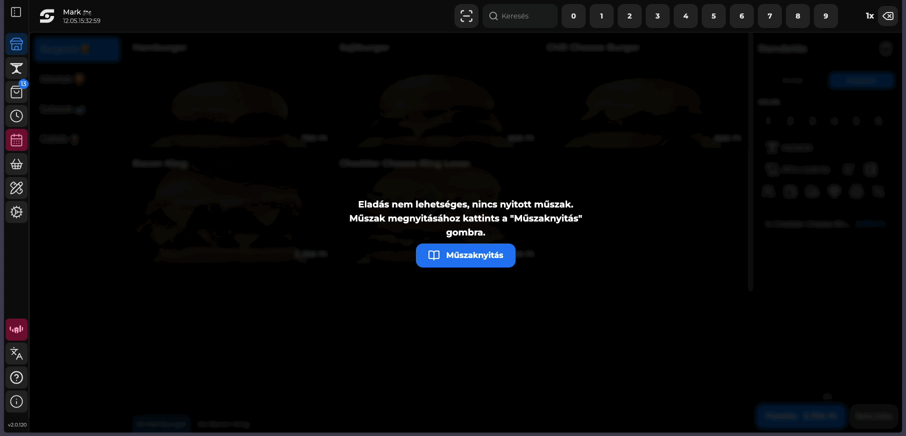
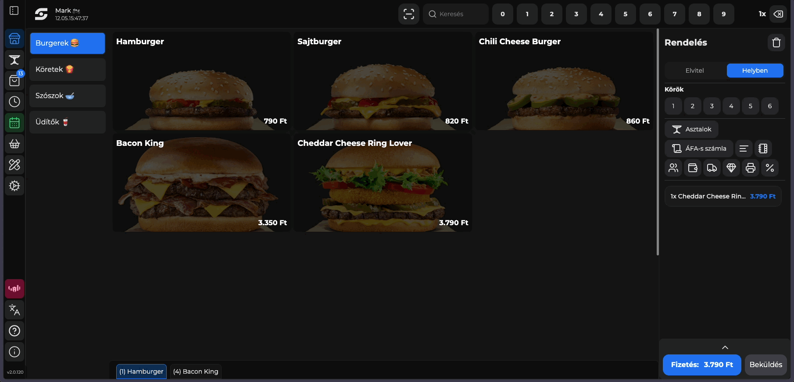
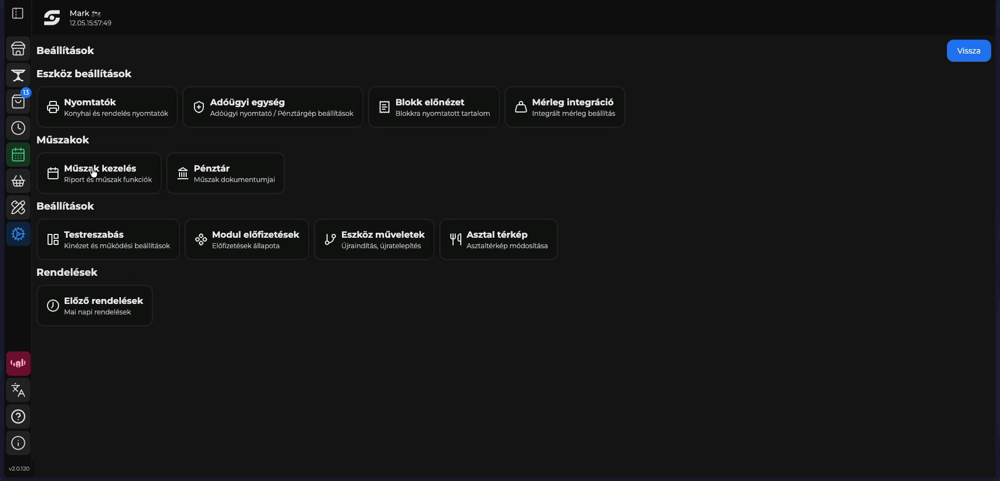

# ⏱️ Műszak kezelés

Ahhoz, hogy elkezdjük az értékesítést, meg kell nyitnod a műszakot.

Első belépéskor, a műszak nyitást kötelezően el kell végezni, tehát egészen addig, míg ez nem történik meg nem is engedjük az értékesítést.

## Műszak nyitás

<figure><figcaption>
A műszak nyitás folyamata
</figcaption></figure>

A műszak nyitás során írd be a váltópénzt valamint opcionálisan az EUR árfolyamot (amennyiben fogadsz el EUR-t és be van állítva az EUR fizetés), amivel meg szeretnéd nyitni a napot, majd a <mark style="color:$primary;">Megnyitom</mark> gombra kattintva vissza is jelezzük, hogy megnyílt a nap, és el tud kezdődni az értékesítés.

Azt írja több mint 24 órája nem volt műszak zárás. Mit tegyek?

Ez azt jelenti, hogy 24 óra elteltével nem történt műszak zárás, ezért le kell zárnod az adott műszakot, majd nyitni egy újat.

**Miért történik ez?**

Statisztika szempontból nagyon fontos, hogy egy napon az adott műszakot meg tudjuk neked mutatni, ezért ragaszkodunk ahhoz, hogy 24 óránként legyen egy műszak zárás.

Szeretnék EUR-t elfogadni, be is írtam a váltót, viszont nem tudom hogyan kell.

Ahhoz, hogy EUR-t el tudj fogadni és a rendszer felismerje, hogy EUR-t kaptál, az EUR váltószám megadása után műszaknyitáskor még szükséged lesz egy EUR fizetési módra is amit iPanelen tudsz beállítani és hozzárendelni az eszközhöz.

**Erről bővebb információt itt találsz:**

[Fizetési módok](https://app.gitbook.com/s/bUe0ZlDwHEwtVDDR1E11/ipanel-menupontok/fizetesi-modok "mention")


**FONTOS!**

Amennyiben FisCat adóügyi nyomtatóval (FP MAX 80) rendelkezel, úgy további teendőd nincs.

Amennyiben viszont online pénztárgéppel (pl FisCat NEON+ stb...) úgy műszak nyitás **előtt** be kell állítanod manuálisan a pénztárgépben is az EUR árfolyamot a megfelelő menüpontjában a pénztárgépen.


A gyors műszak kezelést bármikor eléred a bal oldali menüben felülről az 5. menüpontban:

<figure><figcaption>
Műszak gyorsmenü
</figcaption></figure>

## Műszak információk

Ha részletesen szeretnéd látni a műszak adatait, ahol a statisztikákat, és az értékesített blokkokat szeretnéd látni, kattints a <mark style="color:blue;">Beálltások -> Műszak kezelés</mark> menüpontra.

Ezen az oldalon lehetséges a pénz be és pénz ki funkciók használata is. Ezek segítségével tudod kezelni a nem eladásból származó pénzmozgások rögzítését a pénztárgép felé.

<figure><figcaption>
Műszak kezelés menüpont
</figcaption></figure>

<figure><figcaption></figcaption></figure>

<figure><figcaption></figcaption></figure>


**Ha van pénztárgép / adóügyi integrációd**

Abban az esetben ha van valamilyen adóügyi integrációd, akkor a Beállítások -> Műszak kezelés -> Pénztár dokumentumok menüpontban az adott dokumentumra (blokk / napnyitás / napzárás stb..) kattintva újra nyomtathatod a blokkot.\
\
Amennyiben nincs kinyomtatva valamilyen adóügyi blokk, azt jelezni fogjuk neked napzáráskor adóügyi nyomtató és online pénztárgép esetében is.


<figure><figcaption>
Műszak - Pénztár - Korábbi műszakok nézetek
</figcaption></figure>

A műszak beállításokban eléred a korábbi műszak adatait is.

Miért lehet az, hogy nem látom a korábbi műszakokat?

A korábbi műszak adatait nem tároljuk lokálisan, ezt minden esetben a felhőből tölti be a rendszer. Tehát ha nem látod a korábbi műszakokat, előfordulhat, hogy nincs interneted, vagy nagyon gyenge.


iPanelen bármikor megnézheted a korábbi műszakok adatait akár telefonon is az iPanel -> Műszak Jelentések kimutatásunkban!

További információkat itt találsz erről:

[Műszak jelentések](https://app.gitbook.com/s/bUe0ZlDwHEwtVDDR1E11/ipanel-menupontok/muszak-jelentesek "mention")


Ugyanezt a menüpontot gyorsan is eléred: <mark style="color:blue;">Beállítások -> Pénztár</mark>.

## Műszak zárás

Amint végeztél az értékesítéssel és szeretnéd lezárni a napot, a gyors menüben is meg tudod tenni, valamint a <mark style="color:blue;">Beállítások -> Műszak kezelés -> Műszak zárás</mark> gombra kattintva.

<figure><figcaption>
Műszak zárás lépései
</figcaption></figure>

Ebben az esetben az értékesítési lehetőség megszűnik, egészen addig, amíg újra nem nyitjuk a műszakot.

A műszakot le tudod zárni a gyors eléréssel is, fentről az 5. menüpontban, viszont ha előtte érdekel a teljesítmény akkor érdemes a fenti részletes menüpontot használni.

Műszak záráskor azt írja, hogy vannak nyitott rendeléseim. Mit tegyek?

Ez azért fordul elő, mert a rendelések státuszaiban azt látja a rendszer, hogy vannak lezáratlanul.

Ebben az ablakban lezárhatod a rendeléseidet, ha elfelejtetted volna napközben, vagy nyitva is hagyhatod, így a rendelések átkerülnek a következő műszakra.


FONTOS!

Abban az esetben ha nyitva hagyod a rendeléseket és átviszed a következő műszakra, úgy statisztikailag abban a műszakban fognak realizálódni, amelyikben lezárod azokat!


Megjelent műszak záráskor egy "Kérdéses dokumentumok" lap. Mit tegyek?

Ebben az esetben ez azt jelenti, hogy a rendszer nem tudja azt, hogy valóban ki lettek-e nyomtatva a dokumentumok.

Itt dokumentumonként megteheted azt, hogy sikeresen kinyomtatvára rakod, vagy ha valóban nem történt nyomtatás, akkor újra tudod nyomtatni az adóügyi eszközzel ezt, hogy biztosan bekerüljön a NAV adatok közé is a dokumentum.


**Mikor kell ezt alkalmazni**

Abban az esetben, ha adóügyi nyomtatóval rendelkezel (FisCat FPMAX 80 vagy BBOX), úgy csak azok a dokumentumok fognak itt megjelenni, amik valóban nem nyomtatódtak ki, mert a BarSoft rendszere kap visszaigazolást a nyomtatótól a nyomtatás sikerességéről.

Abban az esetben viszont, ha online pénztárgéppel rendelkezel (például: FisCat NEON+ vagy FisCat iPalm stb..) akkor a BarSoft rendszere nem kap vissza adatot a pénztárgéptől a dokumentum nyomtatásának sikerességéről tehát alapból minden dokumentum kérdéses lesz.


**Online pénztárgép esetén hasznos opció**

Amennyiben online pénztárgéped van, és szeretnéd elkerülni az ablakot, úgy beállíthatod a POS-on, hogy minden értékesítés után kérdezze meg a pultostól, hogy sikerült-e a nyomtatás.

Ezt a Beállítások -> Testreszabás -> Működési beállítások menüpontban éred el, keress egy olyat, hogy "Nyugta jóváhagyás fizettetés után"


Amennyiben online pénztárgéped van, de nem használsz integrációt, úgy azt is beállíthatod itt, hogy mutassa gyűjtőnként a begépelendő összeget.


A bal oldali menüben a <mark style="color:red;">műszak ikon pirosra</mark> vált, valamint ha rákattintunk az értékesítésre, akkor fel is ugrik az ablak, hogy meg kell nyitnunk a műszakot a kezdéshez:

<figure><figcaption></figcaption></figure>
