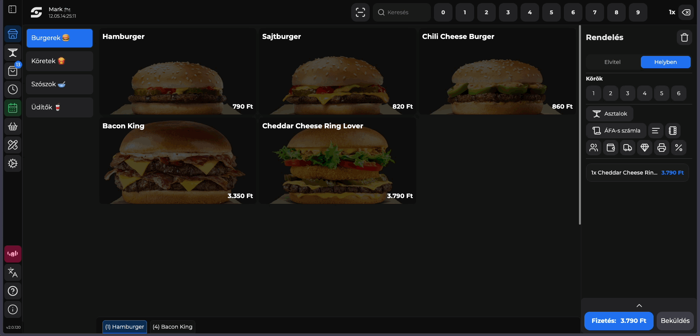

# ◀️ Oldalsó menüsor

Az oldalsó menüsor a <mark style="color:blue;">'</mark><mark style="color:blue;">**Menüsáv**</mark><mark style="color:blue;">'</mark> ikonra kattintva jelenik meg.

**A menüsoron fentről lefelé az alábbi funkciókat éred el:**

* Gyorsnyugta (Értékesítői felület)
* Asztalok (Order Manager vagy Rendelés kezelő asztalok szerinti nézete)
* Rendelések (Order Manager vagy Rendelés kezelő rendelések szerinti nézete)
* Lezárt rendelések
* Műszak kezelés
* Kosarak / Új kosár nyitása
* Termék és kategória láthatóság szerkesztő
* Beállítások menüpont

**További menüpontok**

* NTAK Kapcsolat státusz (ha piros, nincs kapcsolat, ha zöld van kapcsolat)
* Szerver kapcsolat státusz -> Ez csak akkor jelenik meg, ha nincs szerver kapcsolat valamilyen oknál fogva
* Nyelv választás (magyar, angol)
* Interaktív HELP ( Segítségkérés ) menüpont
* Infó (Eszközinformációk, app kilépés, újraindítás, cache törlés, frissítés, felhasználó kijelentkezés)

A menü elrejtéséhez kattints újra a <mark style="color:blue;">**Menü**</mark> ikonra.

<figure><figcaption>
POS menü stuktúra
</figcaption></figure>

### Gyakran Ismételt Kérdések

Nem látok minden menüpontot. Ez mitől lehetséges?

Abban az esetben ha nem látsz minden menüpontot, valószínűleg nincs hozzá jogosultságod.


Jogosultságok

Minden jogosultság beállításnak saját rendszere van, tehát előfordulhat, hogy nem csak menüpontotn me látsz, hanem bizonyos funkciókat sem tudsz elérni.

Amennyiben szeretnél jogosultságot kérni, úgy kérlek keresd meg az Üzlet Adminisztrátorát aki tud majd ebben segíteni.


A felhasználói jogosultság kezeléssel kapcsolatos információkat itt éred el:\
[Felhasználók](https://app.gitbook.com/s/bUe0ZlDwHEwtVDDR1E11/ipanel-menupontok/felhasznalok "mention")

