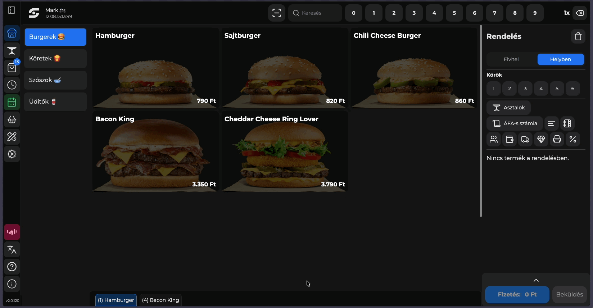
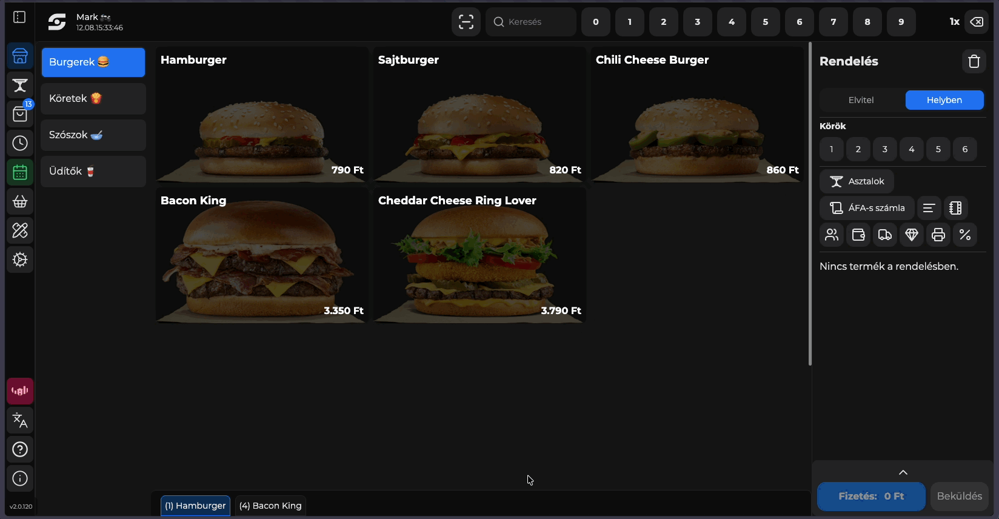
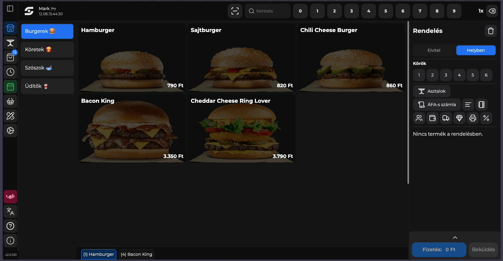
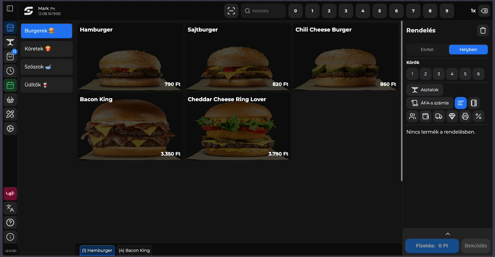
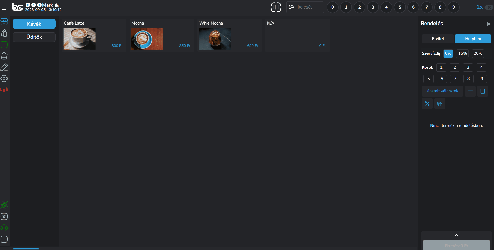
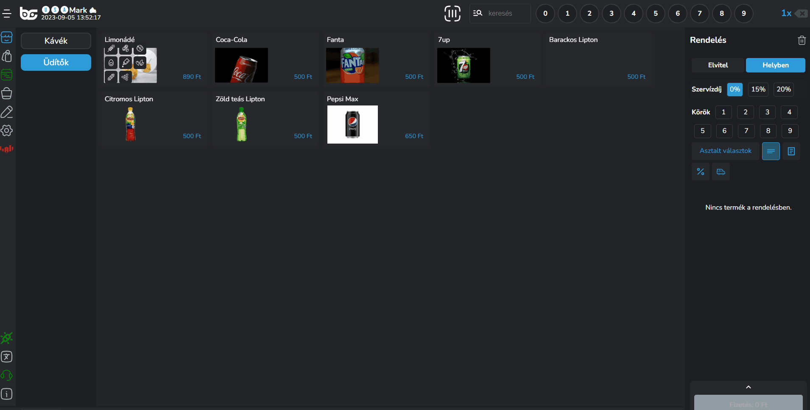
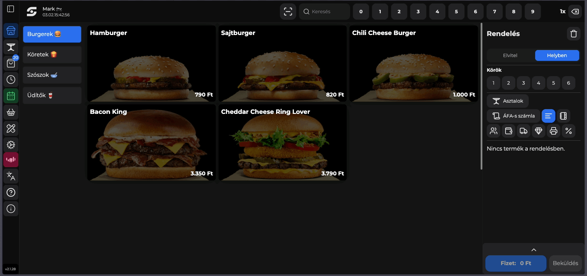

# 🍕 Termék felütés

## Bevezető

Ebben a szekcióban megmutatjuk, hogy hogyan tudsz terméket felütni, milyen technikái vannak a termék felütésnek, hogy a lehető leggyorsabb és legproduktívabb legyen az eladás folyamata.

## Termék hozzáadás a kosárhoz

A termék felütésnek több módja is van.

* Termékre kattintás annyiszor, amennyit hozzá szeretnél adni a kosárhoz
* Szorzó használata a felső menüsávban

<figure><figcaption>
Termék felütés lehetőségek
</figcaption></figure>


**TIPP**

Ha van két azonos terméked, de az egyiket mondjuk elvitelre kérik, akkor **külön kell felütni** hogy tudd módosítani az adott terméket!


### Ugyanazon termék több verziójának gyors felütése

Lehetőség van arra, hogy gyorsan hozzáadj egy termékből több verziót a kosárhoz.

**Reprezentatív példa:**

Abban az esetben, ha egy termékből mondjuk sajtburger, kérnek egy normál húsosat és egy angus húsosat, úgy könnyen a "**Hozzáad"** gombbal hozzá tudod adni a kosrához az egyik verziót, a terméklap nyitva marad, és tudod módosítani a verziót és a **"Hozzáad bezár"** gombbal véglegesíteni a kiválasztást.

<figure><figcaption>
Termék gyors hozzáadása más opciokkal
</figcaption></figure>

<strong>Hogyan tudom gyorsan megváltoztatni a termék elvitel /</strong> helyben státuszát?

**Verzió 1:**

Felütés előtt tartsd nyomva a terméket körülbelül 2 mp-ig, és automatikusan a terméklap fog megnyílni, ahol egyedileg tudod állítani a termék státuszát, módosítóit, méreteit.

**Verzió 2:**

A felütés után kattints ár a termékre a kosárban, és tudod módosítani utólag, hogy azt a terméket, vagy ha egyszerre ütöttél fel 5 db-ot, akkor azokat a termékeket elvitelre vagy helyben szeretné a vendég fogyasztani.

Amennyiben 5 db-ot ütöttél fel, de abból az ötből csak 1-et szeretnél elvitelre, úgy változtasd meg a termék mennyiségét 4-re és üss fel egy újat amit elvitelre állítasz.

A termék mennyiség gyors módosításáról a [#termek-mennyiseg-modositasa](termek-felutes.md#termek-mennyiseg-modositasa "mention") résznél találsz több információt.

<strong>Miért jön fel egy ablak abban a termék részleteivel, ha rákattintok a termékre?</strong>

Abban az esetben, ha be van állítva a POS -> Beállítások -> Személyre szabás -> Működési beállítások -> Termék ablak nyitása több méret esetén funkció, akkor ha a terméknek több mérete van minden esetben fel fogja dobni az ablakot, hogy válaszd ki a megfelelő méretet amit szeretnél.

## Termék mennyiség módosítása

Ha több terméket beraktál mint amennyit kellett volna, nagyon egyszerű a módja, hogy módosítsd az adott termék mennyiségét a kosárban.

Ha 6 db terméket ütöttél fel véletlenül, de csak 5 db-ot szeretnél igazán, akkor kattints a szorzó sávban az 5-ös gombra, majd a termékre a kosárban és már módosult is a mennyiség!

<figure><figcaption>
Termék mennyiség módosítása a kosárban
</figcaption></figure>

## Termék opciók elérése

Termék opciók alatt az alábbiakat értjük:

* Körök beállítása
* Helyben / Elvitelre rendelés
* Megjegyzés
* Termék törlése a kosárból - Amennyiben a kosárban lévő terméket nyitottad meg
* Méret kiválasztása
* Menü elemek beállítása - Amennyiben van menü a termékhez
* Módosítók beállítása

A termék opciókat többféleképpen éred el:

1. A kosárban rákattintasz a termékre
2. Hosszan nyomod a terméket (Érintő kijelzős) / Jobb egérgombbal nyomsz rá (Nem érintő)
3. Ha van kötelező módosító, ami több választásos csoportban van és minimum 1-et kell választani a módosítók közül.
4. Ha a termék mérendő
5. Ha a termékhez van menü csatolva

<figure><figcaption>
Terméklap megnyitása a kosárban
</figcaption></figure>

<figure><figcaption>
Terméklap hosszan nyomva a termékre
</figcaption></figure>

<figure><figcaption>
Terméklap automatikus megnyitása - Kötelező módosítókkal
</figcaption></figure>

<figure><figcaption>
Terméklap automatikus megnyitása amennyiben több méret / menü van a termékhez csatolva
</figcaption></figure>

<strong>Hogyan tudom beállítani a kötelező módosítót?</strong>

Navigálj iPanel felületünkön a Katalógus -> Módosítók lapra.

A módosító csoportok szerkesztésénél be tudod állítani _**csak a több választásos módosítócsoport esetén**_ hogy mi a maximum mennyiség amit lehet kérni ezekből a módosítókból és a minimum.

Amennyiben a minimumot 1-re állítod, akkor kötelezően kell majd válsztani a módosítók közül.


**FONTOS**

A minimum választandó mennyiség **nem lehet nagyobb** a maximum választandónál!



**TIPP**

Ha egy választásos módosító csoportot szeretnél kötelezővé tenni, akkor a következőket tedd:

Módosítsd a csoportot több válsaztásosra, állítsd be maximum mennyiséget 1-re a minimum mennyiséget 1-re így maximum egyet lehet majd választani, de kötelező lesz 1-et.

Abban az esetben ha ezt a megoldást választod, akkor hozz létre egy olyan módosítót is, hogy "Nem kérek" vagy "semmi", hogy fel tudjátok ütni azt is, ami az alapértelmezett (módosító nélküli) érték.


<strong>Hogyan tudok több méretet beállítani egy terméknek?</strong>

Navigálj iPanel felületünkön a Katalógus -> Termékek menüpontra.

A termékeknél a ceruzára kell kattintanod (szerkesztés) és a méretek lapon létre tudsz hozni új méreteket amire szükséged van.

További információért látogass el az alábbi linkre:

[Termékek](https://app.gitbook.com/s/bUe0ZlDwHEwtVDDR1E11/ipanel-menupontok/katalogus/termekek "mention")

Hogyan tudok menüt létrehozni a termékhez?

A menü létrehozásához látogass el iPanel felületünkön a Katalógus -> Menü menüpontra.

Új menü létrehozásakor ki tudod választani a megfelelő terméket amihez szeretnéd, ez egy új méret lesz a termékhez.

Menü elemcsoportot is létre tudsz hozni majd azokat hozzárendelni a menühöz, így választhatók lesznek a menü kiválasztásakor.

További információt az alábbi linken találsz:

[Menük](https://app.gitbook.com/s/bUe0ZlDwHEwtVDDR1E11/ipanel-menupontok/katalogus/menuk "mention")

## Termék törlés a kosárból

Termék törlésnek is több módja is van:

1. Ha minden terméket szeretnél törölni, a jobb felső sarokban lévő <mark style="color:blue;">"Kuka"</mark> ikonra kattintva nullázzuk a termékeket
2. Ha csak egy bizonyos terméket szeretnél törölni, akkor kattints az adott termékre a kosárban és válaszd ki a <mark style="color:red;">"Termék törlése kosárból"</mark> gombot.
3. Ha több terméket ütöttél fel ugyanabból a termékből, akkor a szorzó választóval a felső menüpontból válaszd ki a kívánt mennyiséget, [mint ahogy azt már korábban tettük](termek-felutes.md#termek-mennyiseg-modositasa).

<figure><figcaption>
Termék törlésének lehetőségei
</figcaption></figure>

## Módosítók felütése

Amennyiben módosítókkal is dolgozunk, úgy a termékekhez való hozzáadásának több módja is van:

1. Rögtön felütéskor
2. Felütés után a kosárba került termékre való kattintáskor


**FONTOS!**

Ha két azonos terméket ütünk fel, amihez tudjuk, hogy más - más módosítók kerülnek hozzáadásra, akkor minden esetben külön kell felütnünk a termékeket.\
\
Ha kérnek két azonos terméket, azonos módosítókkal, úgy nyugodtan felüthetjük 2x ugyanazt a terméket, és utána válasszuk ki a módosítókat.

Tehát ha például két Cappuccino-t kérnek mandulatejjel és karamell sziruppal, akkor felütéskor kiválasztjuk a 2-es szorzót, majd a módosítóknál 1 mandulatej és 1 karamel szirup felütésével tudjuk ezt rögzíteni.

Amennyiben viszont 1 Cappucciono-t mandulatejjel kérnek és 1 Cappuccino-t normál tejjel, úgy külön kell hogy felüssük a termékeket. Erre alkalmazd [a termék hozzáadása más opciókkal](termek-felutes.md#ugyanazon-termek-tobb-verziojanak-gyors-felutese) szekcióban leírtakat.

Ha kétszer ütjük fel a tej és szirup módosítót, úgy végeredményben 2x2 tej és 2x2 szirup kerül a nyugtára.



**FIGYELEM!**

A megjelenítésnél vegyük figyelembe a részletező esetében, hogy a részletező az egy termékre vonatkozó információkat tartalmazza, és ezeket az információkat szorozzuk fel.



**TIPP!**\
Módosító felütés esetén érdemes bekapcsolni a részletező módot, hogy lássuk, melyik termékre milyen módosítókat ütöttünk fel.


<figure><figcaption>
Termék módosítók módosítása a kosárból
</figcaption></figure>

## Termék megjegyzés hozzáadása

Amennyiben termék szintű megjegyzést szeretnénk hozzáadni, a kosárban lévő termékre rákattintva a megjegyzés opció segítségével oda tudjuk írni a speciális kéréseket.

A megjegyzés meg fog jelenni az OrderManager felületen és a konyhai blokkon is.

<figure><figcaption></figcaption></figure>


**TIPP!**

Ha sűrűn visszajönnek ugyanazok a speciális kérések, érdemes belőlük módosító csoportokat létrehozni hozzá, a megjegyzéseket akkor érdemes használni, ha vissza nem térő, egyedi megjegyzést szeretnénk hozzáadni a termékhez.


## Különböző méretek hozzáadása

Abban az esetben, ha egy termékhez különböző méret van hozzáadva iPanelen, mint például:

* Fél adag / normál adag
* 0,3l / 0,5l

akkor a termék felütéskor az alapértelmezett méret kerül a kosárba.


**TIPP!**

Érdemes iPanelen azt a méretet beállítani, amit a legsűrűbben kérnek, az értékesítés gyorsítása érdekében.


Ha szeretnénk méretet váltani, abban az esetben a termék opciók menüpont felhozásával (hosszan nyomva / jobb gomb vagy kosárban termékre kattintva) ki tudjuk választani az adott termékhez tartozó méretet.

<figure><figcaption></figcaption></figure>

## EAN / PLU

Rendszerünk lehetővé teszi a vonalkódos és számkódos termék felütési lehetőséget is.

Abban az esetben, ha van vonalkód olvasód, akkor iPanelen a termék szerkesztőben a méret szerkesztésnél be tudod olvasni a vonalkódot.

Termék eladáskor pedig csupán be kell olvasnod az eladási felületen a vonalkódot és automatikusan hozzáadja a terméket a kosárba.

Ha inkább számkódot szeretnél használni, akkor a PLU gombra kattintva (kereső mező mellett a felső menüsorban) be tudod írni azt a kódot, amit megadtál iPanelen a termék szerkesztőben a méretnél.

<figure><figcaption></figcaption></figure>
