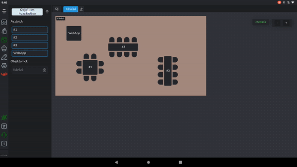
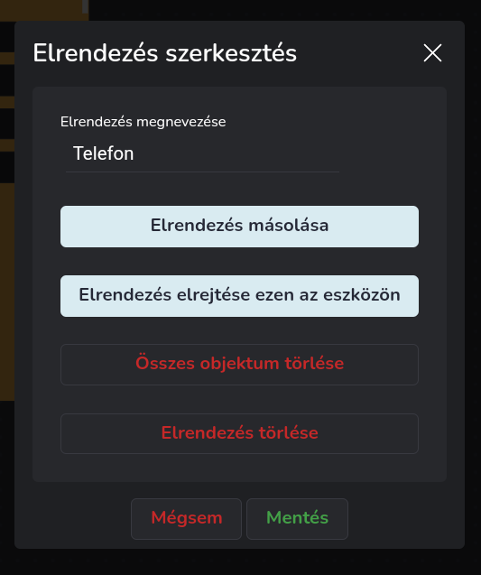
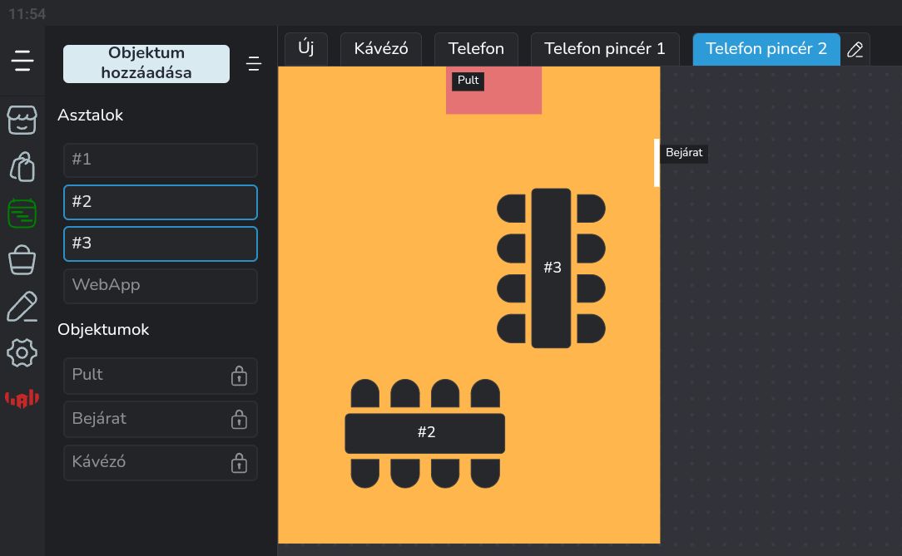
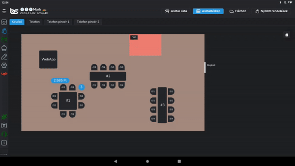

# 🗺️ Asztal térkép

### Asztal térkép elkészítése

Beállításokban Asztal térkép menüpont alatt tudjuk létrehozni és szerkeszteni a térképet.

Első lépés a layout létrehozása, Név megadása, mentés.&#x20;

<figure><figcaption>
Első elrendezés létrehozása
</figcaption></figure>

Asztalok elhelyezése, mélység beállítása, majd asztalok rögzítése&#x20;

<figure><figcaption>
Az első asztalok hozzáadása, testreszabása
</figcaption></figure>

Objektumok létrehozása, elnevezése, (név eltüntetése opció), szín beállítása, mélység beállítása, objektum rögzítése&#x20;

<figure><figcaption>
Objektumok elrendezése
</figcaption></figure>

**Fontos!**\
**Layout mentése**&#x20;

Értékesítés menüpontban "Asztalt választok" gomb&#x20;

Layout kiválasztása, Zárolás feloldása, Zoom és pozíció beállítása, majd Zárolás a lakattal.&#x20;

<figure><figcaption>
Értékesítésnél levő elrendezés beállítása
</figcaption></figure>

### Mélység lényege&#x20;

Azok az objektumok, asztalok, amelyeknek a mélység értéke magasabb, azok rákerülnek azokra az objektumokra vagy asztalokra, amelyek mélység értéke alacsonyabb.&#x20;

### Rögzítés lényege&#x20;

Azok az objektumok, asztalok, amelyek rögzítve vannak, azok nem mozgathatóak, tehát könnyebb mozgatni az egész layout-ot, ha a rajta levő dolgok rögzítve vannak. \
Amennyiben fel vannak oldva, úgy azok lesznek mozgatva, nem az egész elrendezés.&#x20;

### Színek az asztaltérkép szerkesztőben&#x20;

<figure><figcaption>
Asztalok amik még nincsenek egy elrendezésen sem sárgával bekeretezve
</figcaption></figure>

Az asztalok, amelyek még nem szerepelnek egyik layout-on sem, azok sárga kerettel látszódnak a baloldali listában. \
Azok az asztalok, amelyek rajta vannak az adott layout-on, a választott téma színével ellátott kerettel látszódnak a listában.&#x20;

<figure><figcaption>
Elhelyezett asztalok kék keretben, illetve egy másik elrendezésen levő asztalok szürkítve
</figcaption></figure>

\
Azok az asztalok, amelyek rajta vannak egy másik layout-on, keret nélkül, szürkítve látszódnak a listában.&#x20;

### Név eltüntetés lényege&#x20;

Azok az objektumok, amelyek meghatározzák az adott területet, vagy támpontot adnak azoknak érdemes a nevét kiíratni a programmal. \
Azok az objektumok, amelyek csak vizuális kényelmet szolgálnak, érdemes eltüntetni a nevüket, hogy ne legyenek zavaróak.

### Layout-ok lényege&#x20;

Lehetséges minden készülékre saját layout-ot készíteni, ami jól kezelhető és látható az adott készüléken. (Telefonos layout, Swan layout)&#x20;

<figure><figcaption>
Telefonos elrendezés beállítása
</figcaption></figure>

### Több hasonló layout létrehozása

<figure><figcaption>
Elrendezés fül menü
</figcaption></figure>

Egy másik felhasználás, ha egy adott pincérhez tartozó terület van egy layout-on, tehát minden pincér a saját asztalait látja a saját layout-ján. (Pincér 1 layoutja, Pincér 2 layoutja)\
Ennek a felhasználásnak a legegyszerűbb beállítása, ha létrehozzuk az alap elrendezést, amelyiken minden asztal látható, majd az "Elrendezés másolása" gombbal létrehozunk annyi változatot, amennyit szeretnénk, majd levesszük a térképről azokat az asztalokat, amelyeket nem akarjuk, hogy az adott pincér lássa.

<figure><figcaption>
Jelen esetben pincér 1-hez tartozik a WebApp asztal és az #1-es asztal
</figcaption></figure>

<figure><figcaption>
Pincér 2-höz tartoznak a #2-es és #3-mas asztalok
</figcaption></figure>

Amennyiben az adott területhez rendelt pincérnek saját készüléke van, érdemes a készüléken a használaton kívüli elrendezéseket eltüntetni az elrendezés fül menüben az "Elrendezés elrejtése ezen az eszközön" gombbal. Miután elrejtettünk minden elrendezést, amit nem szeretnénk látni, az Értékesítés menüpontban az Asztal választok gomb megnyomása után válasszuk ki azt a layout-ot, amit meghagytunk, állítsuk be a zoom-ot és a pozícíót, majd rögzítsük az elrendezést.

<figure><figcaption></figcaption></figure>

Harmadik felhasználás, ha külön területeket vagy esetleg egy lokáció több szintjét akarjuk feltérképezni, így nem lesz keveredés abból, hogy mi hol van (Földszint, 1. emelet, Terasz)

### Székek használata

Az asztal térkép lehetőséget ad arra, hogy külön, vendégenként regisztráljuk a rendeléseket az alkalmazásba, így amennyiben a vendégek külön szeretnének fizetni, már egyből láthatjuk, kihez melyik rendelések tartoznak. Ehhez annyit kell tennünk, hogy amikor ütjük be a rendelést, nem az asztalt választjuk ki, hanem a széket, így a rendeléshez hozzákapcsoljuk az asztal és a szék azonosítóját is.

### Használat közben

Értékesítés felületen, az "Asztal választok" gomb megnyomásakor láthatjuk az asztal térképen, hogy melyek azok az asztalok, ahol van rendelés. Ezek a választott téma színével lesznek kiemelve, amíg a rendelések az asztalon nincsenek kifizetve és kiadva.

<figure><figcaption>
Kékkel kiemelve láthatjuk a foglalt asztalokat, illetve azokat az asztalokat, ahova ütöttünk már fel rendelést
</figcaption></figure>

#### Rendelések - Asztaltérkép

Amennyiben használjuk a székeket, az adott asztalt kiválasztva székenként lesznek a rendelések feltüntetve.\
Itt ki tudjuk választani, hogy egy adott széken levő rendeléseket fizettetjük ki külön-külön (a kártyákon levő $ jellel), vagy az egész asztalt (Asztal fizet gombbal).

<figure><figcaption></figcaption></figure>
