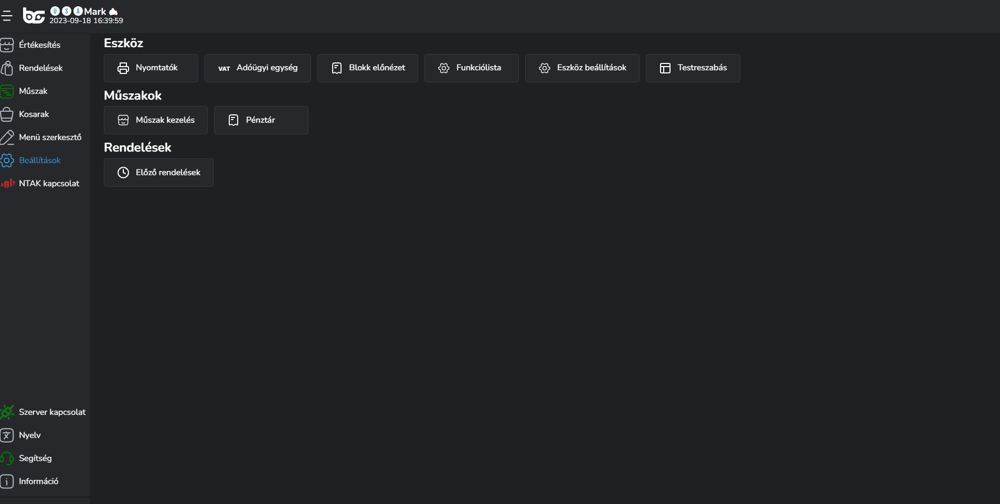

# 🖨️ Nyomtatók

Amennyiben szeretnénk nyomtatóval dolgozni - **ami nem adóügyi eszköz** - tehát konyhai / pult rendelés nyomtató, és vagy összesítő blokk nyomtató.

A beállításokhoz kattintsunk a "Nyomtató" menüpontra.

<figure><figcaption></figcaption></figure>

A nyomtatókat többféleképpen lehet csatlakoztatni, és többfajtaképpen tudjuk kezelni őket.

1. Eszköz privát nyomtatói
2. Hálózati nyomtatók


**TIPP**

Abban az esetben, ha több értékesítési pontod van, és több POS ugyanazt a nyomtató használná, akkor érdemes hálózati nyomtatóként hozzáadni, így a beállításokat nem kell elvégezni még egyszer, csupán a nyomtatási módokat kell majd összerakni (lásd később).

\
Viszont ha USB-vel csatlakoztatunk egy olyan nyomtatót, amit csak az a gép használ, akkor privát nyomtatóként lehet felvinni.\
\
Ha hálózatos nyomtatót csatlakoztattunk, akkor is tudjuk privátként beállítani úgy, hogy másik eszköz ne lássa ezt a nyomtatót a hálózaton, csak abban az esetben ha mi kézzel állítjuk be.


## Nyomtató hozzáadása

Nyomtatót többféleképpen is hozzá tudunk adni a rendszerhez.

1. USB
2. Beépített printer (windows)
3. Hálózaton lévő nyomtatót
4. Bluetooth nyomtatót (android)

Kattintsunk a nyomtató hozzáadása gombra és menjünk végig a lépéseken.

Adjuk meg a nyomtató nevét, a nyomtató típusát, a kommunikáció típusát és a végén a kommunikáció típusától függően, a maradék adatot (IP cím, USB port, Bluetooth név).


**FONTOS TUDNI!**

A legtöbb blokknyomtató EPSON protokollal vagy STAR protokollal rendelkezik. A mellette lévő szám az a blokk szélességével párhuzamos karakterszámot jelenti, hogy a blokkra összesen egy sorba mennyi karakter fér ki.\
\
Ha egyik karakterszám se megfelelő, akkor lehetőség van saját értéket beírni.


Mentsük el a nyomtatót a <mark style="color:green;">"Mentés"</mark> gombra kattintva.

<figure><figcaption></figcaption></figure>

## Nyomtató beállítások

Amint hozzáadtuk a nyomtatót További beállításokat kell elvégeznünk rajta, hiszen be kell állítanunk, hogy miként nyomtasson.

Kattintsunk a nyomtató kártya jobb felső sarkában lévő három pöttyre és végezzük el a beállításokat.

Az alábbi menüpontokat látjuk:

* Nyomtató eltávolítása
* IP cím módosítása (hálózatos nyomtató esetén)
* Rendelés nyomtatás be
* Blokk nyomtatás
* Nyomtató típus váltás
* Pultok kiválasztása


**TESZT nyomtatás**

Minden beállítás után (rendelés nyomtatás, blokk nyomtatás) a rendszer automatikusan tesztelésre kér fel minket, hogy biztosan jó-e a kapcsolat.\
\
Amennyiben igen, kapunk egy blokkot, hogy minden rendben jó munkát!\
\
Ha nem, akkor módosítsuk a beállításokat addig, amíg megfelelő lesz a kapcsolat.


<figure><figcaption></figcaption></figure>

### Blokknyomtatás beállítás

Amennyiben összesítőt szeretnénk nyomtatni, úgy a három pöttyre kattintva a <mark style="color:blue;">Blokk nyomtatást</mark> kell kiválasztani.

Ha azt írja a szoftver, hogy a teszt nyomtatás sikeres volt és jött is ki papír a nyomtatóból, úgy kattintsunk a <mark style="color:green;">Blokk nyomtatás be</mark> gombra.

Ezután a kiválasztott nyomtatón összesítőt fogunk nyomtatni az adott rendelésről, mely szerteágazóan személyre szabható -> Lásd: [**Blokk előnézet**](blokk-elonezet.md) témakör.

### Rendelés nyomtatás

Ha több nyomtatóval is rendelkezünk, vagy ezt a nyomtatót szeretnénk rendelések nyomtatására is használni, úgy a <mark style="color:blue;">Rendelés nyomtatás be</mark> gombbal be tudjuk ezt a funkciót kapcsolni.

A menet hasonlóképpen ugyanaz mint a blokknyomtatásnál, teszt nyomtatást hajt végre a rendszer, és ha azt írja, hogy a teszt nyomtatás sikeres volt és jön ki papír is a nyomtatóból, úgy kattintsunk a <mark style="color:green;">Rendelés nyomtatás be</mark> gombra.


**TÖBB PULT nyomtatása egy nyomtatóra**

Amennyiben egy nyomtatóval rendelkezünk, és a rendeléseken a konyhai blokkot és a pultba kerülő blokkot manuálisan osztjuk szét, úgy a nyomtatót kétszer kell létrehozni és külön beállítani az egyikre az egyik pultot, a másikra a másik pultot a <mark style="color:blue;">"Pultok kiválasztása"</mark> gombra kattintva


