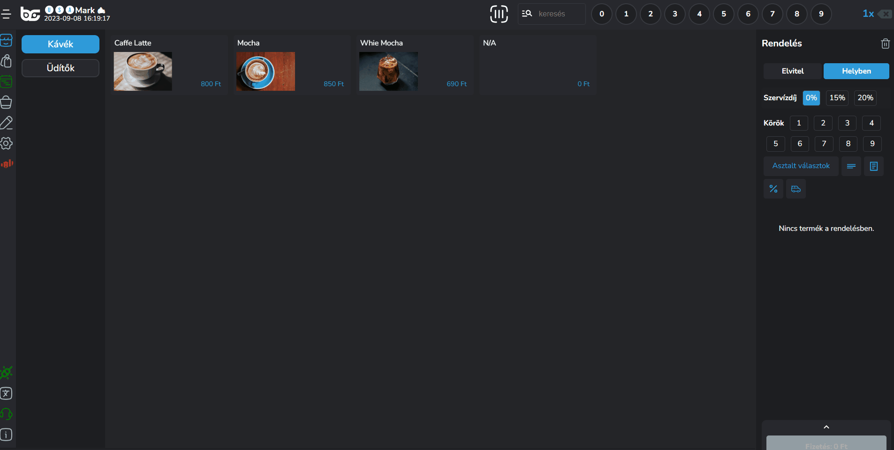
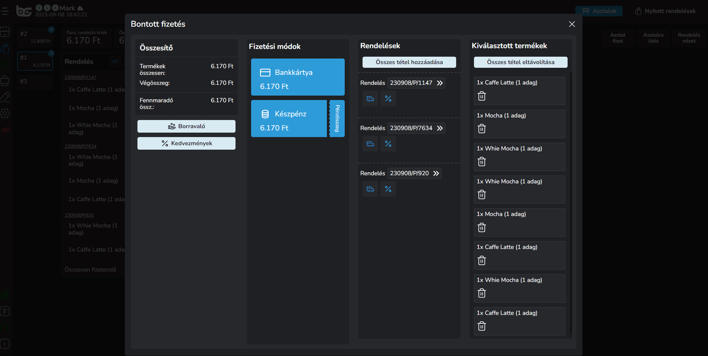

# 🪑 Asztalkezelés

Amennyiben a rendeléseket asztalra ütjük fel, az alábbi módon kezelhetjük a rendeléseket:

## Rendelések asztalra ütése

A rendelések felütése során az asztal kiválasztása után a <mark style="color:blue;">"Beküldés"</mark> gombra kattintva az adott rendelést beküldjük az asztalra (és ezzel együtt a konyhára / pultokba amennyiben be van állítva)

Miután felütöttük asztalra a rendelést az OrderManager-ben az "Asztalok" nézetben láthatjuk asztalonként a felütött rendelést.

Válasszuk ki a kívánt asztalt.

<figure><figcaption></figcaption></figure>

## Asztalra ütés az OrderManageren keresztül

Ha szeretnénk tisztábban rendelést felvenni, egyből az adott asztalra, akkor válasszuk ki az OrderManagerben az adott asztalt, és a "Termék felütés" gombra kattintva tudunk felvenni plusz tételeket az asztalra.

<figure><figcaption></figcaption></figure>

<figure><figcaption></figcaption></figure>

## Személyek / Székek kezelése

A BarSoft-ban van lehetőség arra, hogy a rendeléseknek külön azonosítót adjunk.

A rendelés azonosítót a kosár nézetben, a "Rendelés" feliratra kattintva érjük el.

Három fajta azonosítót is kezelünk:

1. Szabad kezes beírású (akár nevek vagy egyedi azonosító)
2. Számok
3. Székszámok

<figure><figcaption></figcaption></figure>

Ha adunk azonosítót, és asztalra ütünk akkor be tudjuk azonosítani hogy melyik vendég mit kér, és konkrétan hozzá tudunk további rendelést felvenni, így a végén teljesen egyszerű lesz a fizetés.

<figure><figcaption></figcaption></figure>

## Asztal fizettetés

A legsarkalatosabb pont, mikor egy asztal fizet a vendéglátásban.

A BarSoft rendszere nagyon egyszerűen lekezeli a bontott fizetést, abban az esetben, ha a vendégek külön, vagy bizonyos tételeket szeretnének csak fizetni a rendelésekből.

Az asztal fizetés funkciót a rendelések kártyáján (az adott rendelésre vonatokozóan) a "Fizetés" gombra kattintva, vagy ha TELJES asztal fizetést szeretnénk indítani, azaz az összes rendelést egyben, akkor a jobb felső sarokban az "Asztal Fizet" gombra kattintva tudunk kezdeni.

<figure><figcaption></figcaption></figure>

### A fizetőablak

A fizetőablak 4 részre van bontva:

1. Összesítő
   1. Információ a termékek díjának összegéről, a csomagolások és borravaló összegéről
   2. Áfás számla adási lehetőség
   3. Borravaló adási lehetőség (ha kapunk)
   4. Kedvezmény adási lehetőség
2. Fizetési módok ( itt tudjuk kiválasztani majd hogy mivel fizet a vendég)
3. Rendelések (itt adhatjuk hozzá a kosárhoz a rendelésenként a tételeket -> alapesetben minden hozzá van adva)
4. Kiválasztott termékek, az összes termék amit hozzáadtunk a kosárhoz

Kedvezményt és elviteli (szállítási) díjat rendelésenként is adhatunk.

Amennyiben szeretnénk szétszedni a fizetést, a kiválasztott termékek oszlopban kattintsunk az <mark style="color:blue;">"Összes tétel eltávolítása"</mark> gombra és adjuk hozzá a kívánt tételeket a kosárba, majd kattintsunk a fizetési módoknál egy fizetési módra.

<figure><figcaption></figcaption></figure>

A kiválasztott tételek kifizetése után a fennmaradó fizetendő tételeket látjuk csak, így gyorsan tudjuk folytatni a fizettetést.

Amint kifizettettük az összes tételt, egy "Sikeresen lefizettetted az összes tételt" üzenet fog megjelenni. A "Bezárás" gombra kattintva bezáródik az ablak.

<figure><figcaption></figcaption></figure>

### Fizettetés az asztalon azonosítónként

Ha pontosan tudjuk, hogy ki szeretne fizetni, mert előzetesen úgy ütöttük fel a rendelést (adtunk ID-t a vendégnek, vagy székekre ütöttünk az asztaltérképen) úgy csak az ő tételeit ki tudjuk választani az ID felületen a <mark style="color:blue;">"Asztal fizet"</mark> gombra kattintva.

<figure><figcaption></figcaption></figure>
