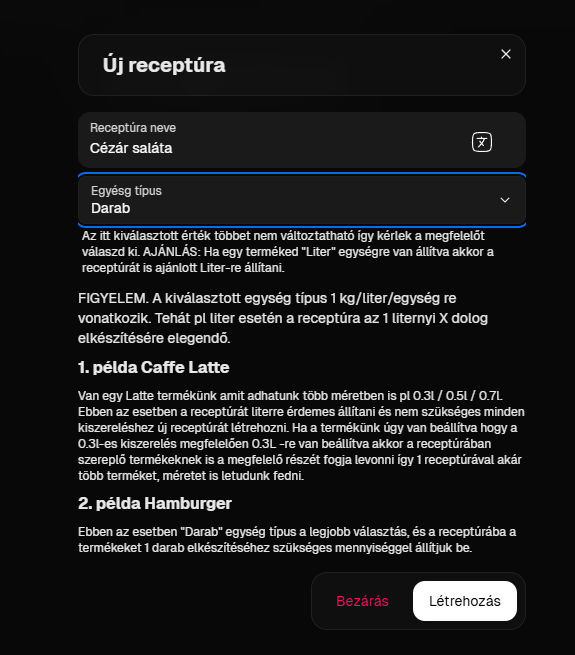
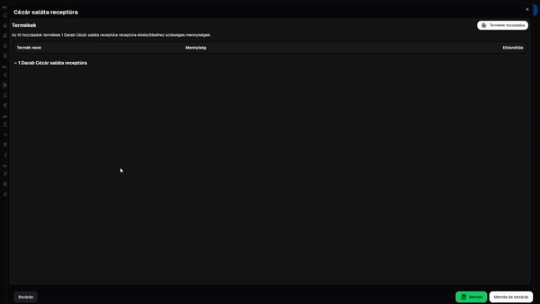

# 🧾 Receptúrázás

A receptúrázás maga egy igen bonyolult folyamat mégis a raktárkezelő egyik legfontosabb eleme, ezért próbáltuk ezt a lehető legjobban megoldani de fontos, hogy megértsük ennek működését és elveit így ameddig nem teljesen érted ennek folyamatát ajánlott ezt az útmutatót használni. A következőkben egy Cézár Saláta receptúráját fogjuk elkészíteni.

## 1. Hozzunk létre egy receptúrát, jelen esetben "Cézár saláta receptúra" néven teszem ezt meg.

Itt az elnevezés mellett a másik legfontosabb az az Egység típus. FONTOS, hogy amilyen egység típust választunk olyan egység típúsú termékhez tudjuk hozzárendelni. Tehát jelen esetben a cézár saláta termékünk Darab típusú így a receptúra is Darab típúsú lesz.&#x20;

<mark style="color:orange;">**FONTOS! A receptúra mindig 1 EGYSÉG VALAMIHEZ készül tehát ha cézár salátát nézzük akkor egy darab cézár salátához készül, Ha húslevesről van szó akkor azt literben mérjük például akkor egy 1 liter húsleveshez készítjük el. Ezt követően az adott termékhez illeszkedik majd a receptúránk, ha az eladási (iPanel) termékünk úgy van beállítva hogy a húsleves termék 1,5 liter mondjuk akkor a receptúránk ehhez alkalmazkodik és a receptúra összetevőit 1,5X  felszorozza. Ez azért hasznos mert ha van esetleg kis, közepes, nagy adagunk akkor mindegyikhez csak egy receptúrát kell létrehoznunk és az adott termék egység beállításait kell megfelelően elvégeznünk. Ez egy sokkal hatákonyabb és egyszerűbb megoldás mint amit a legtöbb raktárkezelő használ.**</mark>

<figure><figcaption></figcaption></figure>

## 2. Termékek létrehozása (ha még nem tettük meg)

Amennyiben a receptúrához szükséges termékeket még nem hoztuk létre akkor azokat elsőnek létre kell hoznunk a Termékeknél. Jelen esetben mi jégsaláta, kígyóuborka, paradicsom, csirkemellfilé termékeket hoztunk létre. Ennek a folyamatát itt találjátok:


[termek-letrehozasa.md](termek-letrehozasa.md)


## 3. Kattintsunk az Összetevők gombra a létrehozott receptúránknál.

Amennyiben ez megtettik akkor elénk tárul egy ablak ahol a látjuk a receptúra termékeit, ez jelen esetben még üres. A jobb felső sarokban találunk egy Termékek hozzáadása gombot. Kattitnsunk rá és válasszuk ki a receptúránkhoz szükséges termékeket. Ezt követően megjelenik egy ablak ahol beírhatjuk a megfelelő mennyiségeket az adott termékhez, jelen esetben Jégsalátóból és kígyóuborkából 1 darab cézár salátához 1 darab kell majd 4 db paradicsom és 0.20 kg csirkemell kell nekünk. Ezt követően kattintsunk a mentésre és mentsük el a receptúránkat. Ezzel el is készült a receptúra.


Olyan terméket is kiválaszthatsz amelyhez már van receptúra állítva, ilyenkor annak a terméknek a receptúrái is vonódni fognak, tehát pl egy hamburger szószt tudunk receptúrázni majd ezt a Hamburger Szósz terméket hozzáadni a Hamburgerhez. Tehát minden eladáskor addig megy lentebb és lentebb a bontás ameddig található receptúra amit vonni kell.


<figure><figcaption></figcaption></figure>

## 4. Receptúrához való hozzárendelés

Navigáljunk a termékek oldalra és keressük meg a termékünket amihez szeretnénk ezt hozzárendelni. Jelen esetben cézár saláta, kattintsunk a szerkesztés gombra ott pedig a receptúra kiválasztása gombra vagy a Receptúra oszlopban a megjelenő + ikonra és a megjelenő ablakban pedig válasszuk ki az elkészített receptúránkat. És kattintsunk a mentés gombra.

## 5. Készen is vagyunk!

Ezt követően a BarSoft POS rendszerében el is adhatunk egy ilyen terméket és ezt követően ha lezártuk a rendelést akkor a Tranzakciók között láthatjuk az alapanyagokat fogyás formájában. A készletünkből pedig megfelelően levonva ezeket.

