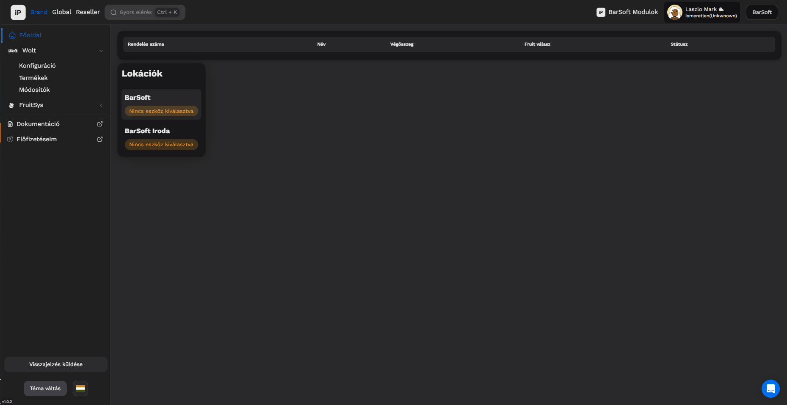

# BarSoft - Wolt  beállítási segédlet

## Technológia

A BarSoft vendéglátóipari szoftver az innováció vonalát képviseli, és célunk az, hogy az ügyfélnek minél kevesebb feladata legyen a rendszer és a különböző integrációk beállításával.

Éppen ezért a BarSoft nem a termék párosítás integrációt választotta, hanem a "menü push" technológiát.

## Integráció Beállítás

A BarSoft szoftvert a WOLT rendszerével az „Integrációk” menüpont alatt lehet megtenni, ott is a "WOLT" menüpontot választva.

Amennyiben az ügyfélnek több boltja is van, úgy boltonként lehet beállítani a WOLT integrációt, minden boltja megjelenik ezen a felületen.

**Az alábbi adatok szükségesek:**



* Felhasználónév
* Jelszó
* VenueID
* woltApiKey



Client secret




FONTOS

Amennyiben ki van töltve minden adat amit a WOLT biztosít, szükséges egy frissítés a böngészőben (F5) és generáljuk a Client Secretet!


<figure><figcaption></figcaption></figure>

## Termék beállítás

A termék beállításokat két lépésben szükséges megtenni:

1. Alap menü beállítás ,amit a BarSoft rendszerében is értékesítünk
2. WOLT felületén megjelenő képek, elérhetőségek, árak

### Alap menü beálítás

Az alap menü beállítást iPanelent a „katalógus” menüpont alatt lehet megtenni.

Az alábbi lépéseket kell megtenni:

* Kategóriák átnevezése úgy, hogy az vendég kompatibilis legyen
* Kategóriák fordítása angolra (szerkesztés bekapcsolása – ceruza – nyelv ikonra kattintva)
* Termékek elnevezése úgy, hogy az vendég kompatibilis legyen
* Termékek leírásának szerkesztése
* Termék név és leírás fordítása angolra a nyelv ikonra kattintva
* Termék kép feltöltése a POS – hoz


FONTOS

Amennyiben a WOLT biztosítja a termék képeket, úgy itt nem kell feltölteni semmit, azt majd az „Integrációk” felületen tudjuk beállítani (kép linkek).&#x20;


<figure><figcaption></figcaption></figure>

### További beállítások

Az „Integrációk” felületen a WOLT menüpont alatt a Termékek és Módosítók menüpontnál az alábbiakat tudjuk beállítani:

* Ár -> abban az esetben ha változna az ár és magasabb áron szeretnénk adni a WOLT felületén a termékeinket
* Kép -> Ha a WOLT biztosított képet, akkor a tőlük kapott linket bemásolva ide megváltoztatjuk a termék képét
* Elérhetőség -> Abban az estben, ha szeretnénk, hogy ez a termék megjelenjen a WOLT felületén pipáljuk be, ellenkező esetben hagyjuk piros X – en.

\

Miután mindennel megvolnánk a jobb felső sarokban található „Termékek élesítése a következőre: \[üzlet neve]” gombra kattintva ki is küldjük a WOLT rendszerébe az adatokat.


Amennyiben valami elfogy, úgy ezen a felületen ki kell kapcsolni, vagy ha új dolgot szeretnénk élesíteni be kell kapcsolni, majd újra rákattintani a korábban említett gombra.

