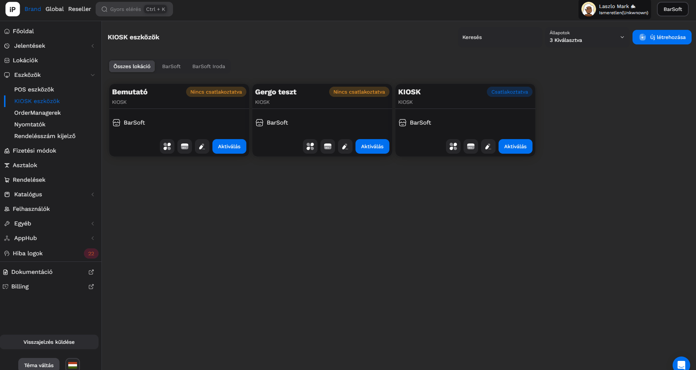

# 💳 KIOSK eszközök

Abban az esetben ha rendelkezel KIOSK eszközzel, az aktiválást és a további beállításokat itt tudod elvégezni.

## KIOSK profil létrehozása

Navigálj iPanelen az Eszközök / KIOSK eszközök menüpontra.

Kattints az <mark style="color:blue;">**Új létrehozása**</mark> gombra, és töltsd ki az adatokat:

* Eszköz neve
* Lokáció


FONTOS

Hasonlóképpen a POS aktiváláshoz, ha több lokációval rendelkezel, akkor nagyon fontos odafigyelni arra, hogy melyik lokációra aktiválod a KIOSK eszközt, ugyanis az adott lokáció beállításait fogja automatikusan használni a KIOSK.


## KIOSK Aktiválás

Miután létrehoztunk egy KIOSK profil kártyát, az aktiválás hasonlóképpen fog történni mint POS vagy OrderManager esetében.

Nyisd meg a KIOSK eszközön a BarSoft appot és az "**Igen, távolról aktiválom (123456)**" gombon található 6 számjegyű kódot jegyezd meg, majd navigálj az iPanel eszközön az adott KIOSK profil kártyához és kattints az <mark style="color:blue;">**Aktiválás**</mark> gombra.

Írd be a 6 jegyű számot és be is töltjük az adatokat a KIOSK-on.

<figure><figcaption></figcaption></figure>

## KIOSK fizetési módok

A KIOSK esetében is többfajta fizetési módot lehet beállítani, azok közül lehet hozzárendelni, amiket már korábban létrehoztál a **Fizetési módok** menüpont alatt.

Navigálj a KIOSK kártyára és kattints a "Fizetési Beállítások" gombra.

<figure><figcaption></figcaption></figure>

A szerkesztés gombra kattintva tudsz hozzáadni új fizetési módot, ha szeretnél eltávolítani egyet, akkor a fizetési mód neve mellett található kis X ikonra kattintva el tudod távolítani azt.

A művelet végén kattints a <mark style="color:blue;">**Mentés**</mark> gombra.


FONTOS!

Minden fizetési mód változtatás után újra kell indítani az eszközt, hogy frissítse a betöltött fizetési mód adatokat!


<figure><figcaption></figcaption></figure>

## Egyéb beállítások

Az egyéb beállítások menüpontban a KIOSK további fontos beállításait tudod módosítani.

<figure><figcaption></figcaption></figure>

Kétfajta csoportot különítünk el ezek között a beállítások között:

* BarSoft beállítások
* Integrációs beállítások (Fruitsys)

### BarSoft KIOSK beállítások



A POS rendszerhez hasonlóan itt is be lehet állítani azt, hogy a KIOSK melyik pultnak a termékeit mutassa. Tehát abban az esetben ha van egy Lángos pultod és egy Hamburger pultod, akkor a KIOSK-nak meg lehet mondani hogy melyik pult termékeit értékesítse.



Ha szeretnél KIOSK-on keresztül ÁFA-s számlát kiadni, akkor megteheted, ebben az esetben a kosár összegzésnél az adószám első 8 számjegyét fogjuk elkérni a vendégtől, és automatikus adatszinkronizáció után kiállítjuk az adóügyi nyomtatón az ÁFA-s számláját.



Le lehet zárni a KIOSK-ot bármikor, tehát ha ez a checkbox ki van pipálva, akkor automatikusan  lezárjuk a KIOSK rendszerét, így nem fognak tudni rendelést leadni. Ez a funkció jó lehet abban az esetben, ha túl sok a rendelés és már nem tudjátok fogadni túlterheltség miatt.



Egyedi szöveget meg tudunk jeleníteni a fizetés után popup modalban, amiben kívánhatsz jó étvágyat a vendégnek, vagy további fontos információt oszthatsz meg vele. A blokkra is tudunk még plusz szöveget nyomtatni.



### Integrációs KIOSK beállítások (Fruitsys)



Több típus közül lehet választani, van dummy és test mód, ezzel nem kell foglalkoznod.



Ki lehet választani azt, hogy melyik asztalra küldjön be rendelést ez a KIOSK eszköz.



Alapesetű felhős megoldásunk mellett képesek vagyunk belső hálózaton is kommunikálni a szerverrel.



