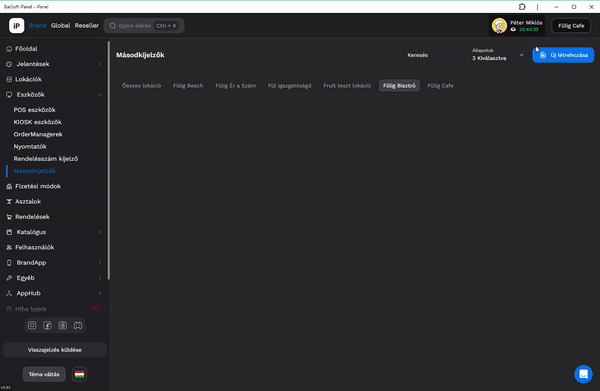
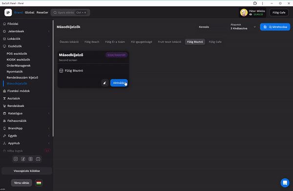
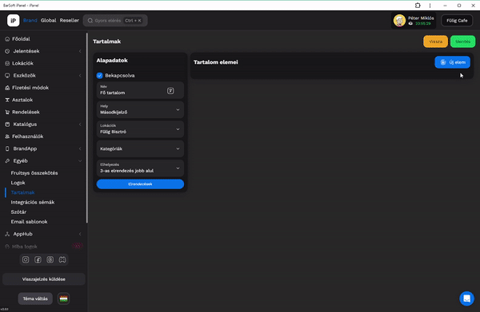

# 📺 Másodkijelzők

Navigálj az iPanel / eszközök / Másodkijelzők menüpontra

Hozzuk létre a másodkijelző eszközt&#x20;

1. Adjunk neki nevet
2. Válasszuk ki a megfelelő lokációt
3. Rendeljük hozzá a kívánt eszközhöz
4. Mentsük el

<figure><figcaption></figcaption></figure>

Az eszköz létrehozása után lépjünk bele a szerkesztésbe, majd menjünk végig sorban a beállításokon

* Betűméret (Egy közepes tablet esetén 38-as körüli érték már olvasható)
* Borravaló kezelés (Amennyiben szeretnénk a másodkijelzőn megjeleníteni a borravaló adás lehetőségét)
* Alapértelmezett tartalom, ami lehet BarSoft logo (Semmi), vagy saját kép/videó (Tartalom)
* Elrendezések gomb (Ez a gomb megmutatja hogy a kiválasztható elrendezések vizuálisan hogyan néznek ki, illetve ki is választhatjuk a számunkra tetszőt)
* Elrendezés (lista: itt kiválaszthatjuk az elrendezést, amennyiben kép nélkül tudjuk, melyik az, amelyiket szeretnénk)

<figure><figcaption></figcaption></figure>

A rendelésfelvételen kívüli tartalmat a "Választott alap tartalom" gomb segítségével tudjuk meghatározni. Ez a tartalom fog megjelenni, amikor éppen nem értékesítünk a POS-on.

<figure><figcaption></figcaption></figure>

Az elemek szerkesztéséhez kattints a legördülő menüre, majd válaszd ki, amit szeretnél.

<figure><figcaption></figcaption></figure>

Miután létrehoztuk az eszközünket és kiválasztottuk mi jelenjen meg rajta, két módon folytathatjuk tovább. Amennyiben saját médiát nem szeretnénk megjeleníteni a vendégek felé, akár már aktiválhatjuk is az eszközt.

<figure><figcaption></figcaption></figure>

Ha szeretnénk, hogy saját képeink vagy videóink jelenjenek meg a másodkijelzőn, navigáljunk át az iPanel / Egyéb / Tartalmak menüpontra, majd hozzuk létre az első megjelenítő dobozunkat

<figure><figcaption></figcaption></figure>

<figure><figcaption>
Tartalom doboz létrehozása
</figcaption></figure>


Egy dobozt akár több kijelzőn, több helyen is megjeleníthetünk


#### Töltsük fel a dobozt tartalommal

<figure><figcaption></figcaption></figure>

* Név (ezt csak mi látjuk, a vendégek nem)
* Cím (félkövérrel megjelenik a doboz alján)
* Szöveg (a legalsó sorba lesz ez megjelenítve)
* Kép/Videó

Miután feltöltöttük a tartalom dobozt médiával, válasszuk ki, majd kapcsoljuk be azokat, amelyeket szeretnénk, hogy megjelenjenek.

<figure><figcaption>
Ha az adott tartalom nincs bekapcsolva, nem fog megjelenni a másodkijelzőn
</figcaption></figure>


FONTOS!

A médiák tartalmát nem szabályozzuk, tehát a megfelelő méretet neked kell majd elkészítened, annak függvényében, mekkora a másodkijelző mérete, azon belül is a doboz mérete.

Tehát, ha van egy 1024x768px felbontású kijelzőnk, megjelenítésből pedig azt választjuk, hogy két doboz jelenjen meg egymás mellett, az egyik a kosár tartalma, a másik pedig egy egyéni videó, akkor a videó mérete 512x768px kell, hogy legyen az ideális megjelenítéshez.



Egy dobozba több média is pakolható, akár vegyesen is (kép / videó).



Amennyiben csak egy média található a dobozban, úgy statikusként mutatjuk, tehát nem mozdul semerre sem. Viszont, ha többet töltünk fel, akkor diavetítés szerűen fogjuk megjeleníteni egymás után őket.



Amennyiben frissítést végeztünk a másodkijelzőn, viszont nem látszódik a változás, érdemes a hozzá csatlakoztatott POS-ról újraindítani a kijelzőt. Ehhez lépjünk be a POS-on a beállításokba, majd Eszköz beállítások, itt pedig a "Másodkijelző újraindítása" fog segíteni.

