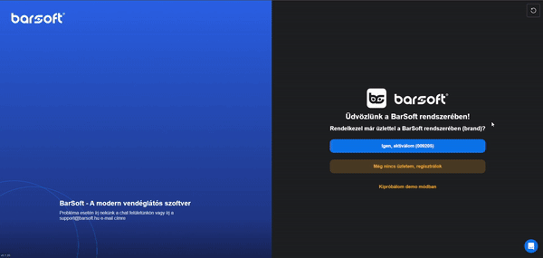
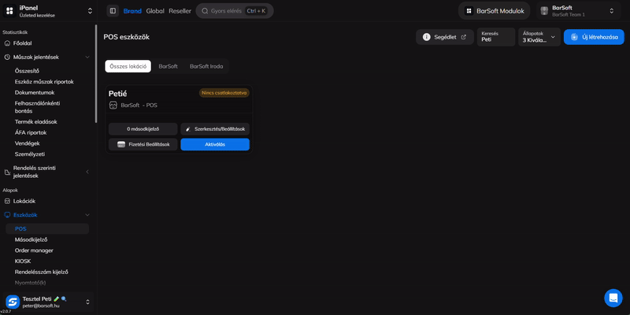
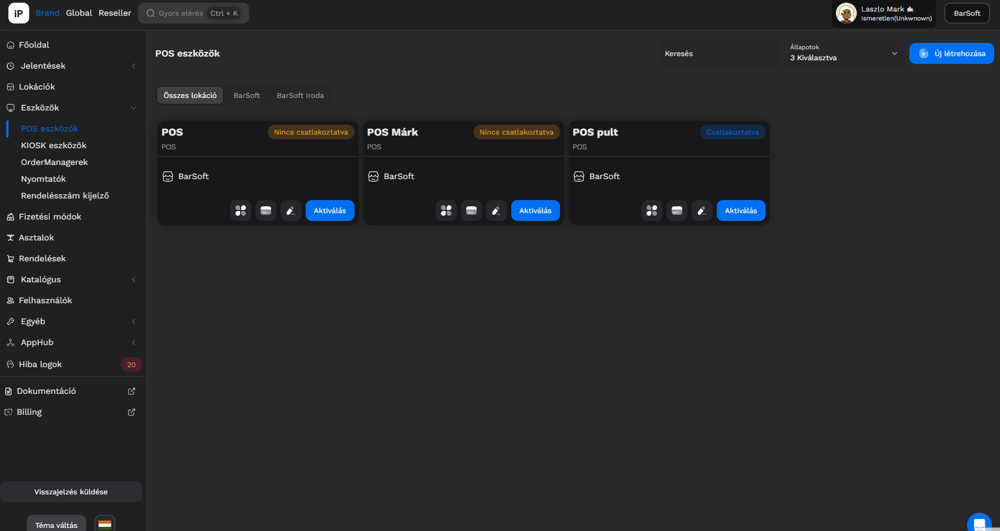

# 💻 POS eszközök

Navigálj az iPanel / eszközök / POS eszközök menüpontra.

Itt látod a már meglévő POS eszközöket.


INFÓ

A brand regisztrációval automatikusan létrehozunk 1 POS eszközt, amit azonnal tudsz használni.


## Új eszköz létrehozása

Kattints az <mark style="color:blue;">**Új létrehozása**</mark> gombra.

Add meg az eszköz nevét és azt, hogy melyik lokációra szeretnéd azt aktiválni.


TIPP

Ha csak kipróbálni szeretnél bizonyos beállításokat, érdemes egy teszt készüléket létrehozni.&#x20;

Ez a készülék ingyenes, sem heti, sem havidíjat nem számolunk fel érte.

A teszt készüléken leadott rendelések nem keverednek az éles készülék rendeléseivel, nem kerülnek beküldésre NTAK vagy NAV felé, tehát nem küldi ki az adatokat adóügyi nyomtatóra sem.&#x20;

A rendelés blokkokat kinyomtatja a hozzá kapcsolt blokknyomtató, viszont ezeken az első sorban fel is tüntetjük, hogy teszt rendelés került kinyomtatásra.

Egy teszt készülék nem lehet éles készülék.&#x20;

Ha egy éles készüléket szeretnénk teszt környezetben kipróbálni, a beállítások, Eszköz műveletek, Sandbox mód-dal tudjuk bekapcsolni, ez ki is kapcsolható.



FONTOS

HA több lokációval rendelkezel, akkor nagyon fontos odafigyelni arra, hogy melyik lokációra aktiválod a POS eszközt, ugyanis az adott lokáció beállításait fogja automatikusan használni a POS.


Az adatok megadása után kattints a <mark style="color:green;">**Létrehozás**</mark> gombra.

Az eszközöket ugyanitt tudod <mark style="color:red;">törölni</mark> is

<figure><figcaption></figcaption></figure>

## Aktiválás



Miután letöltötted a BarSoft applikációt Windowsra, vagy Androidra, az alábbi képernyő fog fogadni az applikáció megnyitása után.

<figure><figcaption></figcaption></figure>

Az <mark style="color:blue;">**"Igen, aktiválom (123456)"**</mark>  gombon látszik az a 6 számjegyű kód, amit iPanelen az adott POS eszköz profil kártyáján az <mark style="color:blue;">**Aktiválás**</mark> gombra kattintva be kell írni.

Ha a gombra rányomnál, ott is írjuk a folyamat menetét.

<figure><figcaption></figcaption></figure>

<figure><figcaption></figcaption></figure>

Az aktiválás után már használatra is kész a szoftver!


INFO

Természetesen vannak olyan beállítások amiket el kell végezni a POS-on, (a felületen) amik eszköz specifikusak mint például: betűméret, színek stb...)



TIPP

Az aktiválást és a beállításokat iPanelen akár TELEFONRÓL is tudod intézni!


## Fizetési módok hozzáadása

Ahhoz hogy el tudjuk kezdeni használni a beaktivált POS eszközünket, néhány beállítást még el kell / lehet végezni.

Az egyik ilyen kötelező az a fizetési módok hozzáadása.

### Mit jelent a fizetési módok hozzáadása?

A branden belül több fizetési módot is kezelhetsz, és POS eszközönként megadhatod, hogy azokon az eszközökön milyen fizetési módokat szeretnél használni.

### **Példa a fizetési módokra**

Az egyik gép össze van kötve a TEYA terminállal, a másikon nincs, vagy az egyikhez van SZÉP kártya terminál a másikhoz nincs.

Így külön be tudod állítani az eszközökhöz a fizetési módokat.

### A fizetési módok hozzáadása

Kattints a POS profil kártyán a "**Fizetési Beállítások**" gombra.&#x20;

<figure><figcaption></figcaption></figure>

A "**Szerkesztés"** gombra kattintva a felugró ablakban hozzá tudod adni azokat a fizetési módokat, amiket előzőleg létrehoztál.

<figure><figcaption></figcaption></figure>


[fizetesi-modok](../fizetesi-modok/)



FONTOS!

A fizetési módok változtatása során a POS appot újra kell indítani a változtatások véglegesítéséhez!


<figure><figcaption></figcaption></figure>

## Egyéb beállítások

Az egyéb beállásokban találhatod meg a POS pulthoz rendelését, valamint az automatikusan beléptetett felhasználó opcióját.

Mi mit jelent?

### Pulthoz rendelés

Ha pultokat is kezelsz (kávés, konyhai, halas, burgeres, lángosos stb...) akkor egy - egy POS eszközt hozzá tudsz rendelni a már létrehozott pultokhoz.

Ez azt jelenti, hogy az adott POS eszközön csak az adott pult termékei fognak megjelenni.


FONTOS!

Azok a termékek, amiket nem rendelsz hozzá pultokhoz, MINDEN POS eszközön meg fog jelenni! További információt a pultok-nál találsz.


### Automatikusan beléptetett felhasználó

Amennyiben szeretnéd, hogy az adott POS-on egy felhasználó automatikusan bejelentkezzen indításkor, úgy a felhasználó listából ezt ki tudod választani.

Ilyenkor az indítás után se pin kódot, se start gombot nem kell megnyomni, automatikusan bejelentkeztetjük a kiválasztott felhasználót.

<figure><figcaption></figcaption></figure>

### Kijelentkeztetés / adatok módosítása / törlés

Abban az esetben, ha mondjuk a hardver eszközöd tönkre ment, vagy másik hardver eszközt szeretnél használni, nincs szükség új profil létrehozására.

Jelentkeztesd ki az eszközt, majd az adatok (pl név) opcionális átírásával és egy újra aktiválással könnyedén meg tudod ezt tenni.

