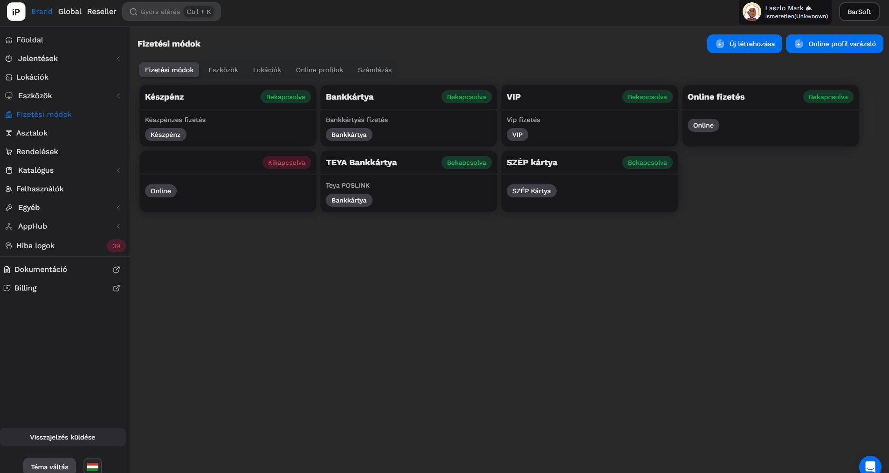
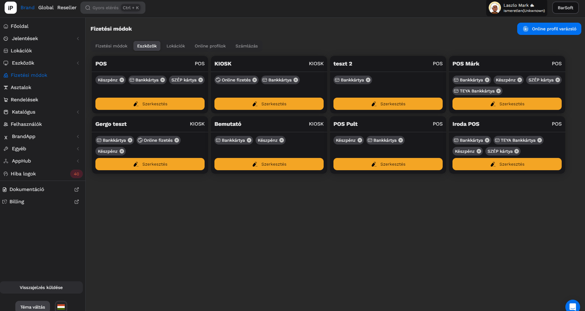
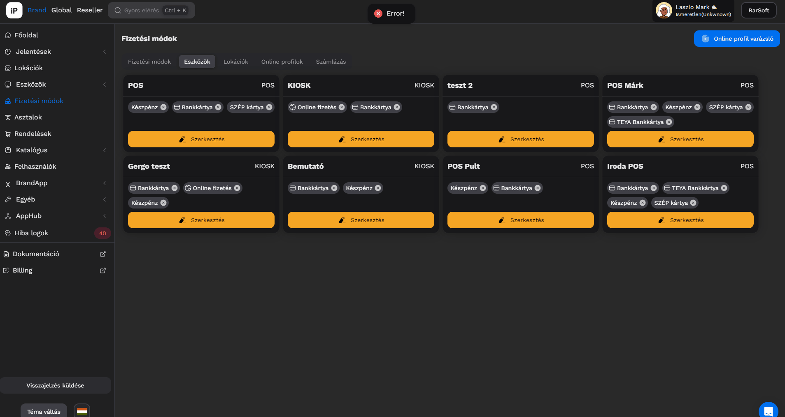

# 💳 Bankkártya terminál összekötések

## Terminál összekötés

A szoftver lehetőséget ad arra, hogy TEYA vagy VivaWallet terminállal összekössük a BarSoft rendszerét, így automatikusan kiküldjük az összeget a kiválasztott terminálra.

## Összekötési lehetőségek

A két szolgáltató esetében különböző összekötési lehetőségekről beszélhetünk.

TEYA összekötések

* POSLINK összekötés
* ON Terminál összekötés
* IP összekötés

VIVA WALLET összekötés

* Online összekötés
* ON Terminál összekötés
* IP összekötés
* SOFT POS összekötés


FIGYELEM

Online profilt is létre kell majd hozni felhős összekötés esetén!


### TEYA összekötés

#### POSLINK összekötés

POSLINK összekötéshez egy online profilt kell létrehoznod, ahol a felhős összekötést be tudod állítani.

A fizetési módok menüpontban hozz létre egy online profilt, mely segítségével össze tudod kötni a TEYA fiókodat a BarSoft rendszerével, majd később a fizetési módot a terminállal, és eszközhöz tudod rendelni.

Miért kell a TEYA fiók?

A TEYA fiókodban tárolja a TEYA szolgáltató azokat az adatokat amik nekünk szükségesek ahhoz, hogy be tudjuk azonosítani a terminálodat.\
\
Az összekötés során automatikusan betöltjük majd az adatokat, így a végén csak a terminál számot kell leellenőrizned, hogy melyikre szeretnéd kiküldeni a fizetési adatokat.

A POSLINK összekötés 4 lépésből áll:

1. Online profil létrehozása a BarSoft rendszerében
2. Profil összekötése a TEYA fiókkal
3. Fizetési mód összekötése a terminállal
4. A terminál menüjében be kell kapcsolni a Kasszaintegráció engedélyezése funkciót.

**ONLINE PROFIL LÉTREHOZÁSA**

Navigálj a Fizetési módok menüpontra, majd kattints az **Online profil varázsló** gombra.

A felugró ablakban kattints az Új profil fülre, add meg a nevét (TEYA POSLINK), majd a legördülő menüből (Típus) válaszd ki a TEYA-t.

Kattints a létrehozás gombra.

A létrehozás gomb után zárd be ezt az ablakot, és már létre is jött az online profilod.

<figure><figcaption></figcaption></figure>

**TEYA FIÓK ÖSSZEKÖTÉSE**

Most, hogy létrejött az online profilod, össze kell kötni a fiókoddal.

Navigálj a Fizetési módok / Online profilok oldalra, és kattints az újonnan létrehozott online profil kártyára.

Megjelenik egy "<mark style="color:blue;">**OAuth**</mark>" gomb a kártya alján, arra kattints rá és át fogunk navigálni a TEYA belépésedhez.

Meg kell adnod a belépéshez az e-mail címed és jelszavad, majd a bejelentkezés gombra kattintva, ha minden rendben történt, SIKER visszaigazolást adunk neked, majd ezt az ablakot bezárhatod.

<figure><figcaption></figcaption></figure>

**TEYA TERMINÁL HOZZÁADÁS**


FONTOS!\
Mivel több kártya terminállal is rendelkezhetsz, főleg abban az esetben ha több POS-od is van, így megadjuk a lehetőséget, hogy egy-egy POS-hoz ugyanazzal a névvel, más terminált csatlakoztass, éppen ezért egyesével kell POS-onként beállítani a terminálokat!


Most hogy készen vagyunk a fiók összekötéssel, rendeljük hozzá POS eszközünkhöz a már korábban létrehozott bankkártyás fizetési módot és adjuk hozzá a terminált!

Navigálj a Fizetési módok / Eszközök menüpontra.

Ha még nem adtuk volna hozzá a Bankkártyás fizetési módot, úgy kattints a <mark style="color:yellow;">**Szerkesztés**</mark> gombra, majd add hozzá a fizetési módot.

Miután megvan, kattints rá a fizetési módra és egy új ablak fog felugrani.

Kattints az Új terminál fülre, majd töltsük ki az adatokat.

A Paraméterek lenyíló ablakaiban, értelemszerűen a megfelelő adatokat válaszd ki, majd a végén a terminál ID-nél azt a számú terminált, amivel össze szeretnéd kötni ezt a POS eszközt.

HOL TALÁLOM A TERMINÁL ID SZÁMOT?

A terminál ID számot a terminál hátoldalán az S/N kóddal megjelölt számsor mutatja.

<figure><figcaption></figcaption></figure>

#### ON Terminál összekötés

Abban az esetben ha a BarSoft appot a TEYA terminálon használjuk (A920 Pro), úgy egy nagyon egyszerű beállítást kell végrehajtani.

Navigálj a Fizetési módok / Eszközök menüpontra!

Válaszd ki a megfelelő eszközt, majd válaszd ki a bankkártyás fizetési módot (kattints rá).

A terminál összekapcsolása felugró ablakban az **Új terminál f**ülön add meg a leírást és válaszd ki a listából a "**Teya Softpos Termina**l" típust.

Kész is vagy!

<figure><figcaption></figcaption></figure>

#### IP Terminál összekötés

Abban az esetben, ha kábelesen szeretnéd összekötni a TEYA terminálodat, úgy ezt is néhány kattintással meg lehet oldani.

Navigálj a Fizetési módok / Eszközök menüpontra, majd kattints a megfelelő bankkártyás fizetési módra.

Nevezd el a terminált, majd válaszd ki a "**Saltpay Terminál"** típust.

A megjelenő mezőkbe írd be a terminál IP címét és kész is vagy.

<figure><figcaption></figcaption></figure>


A terminál menüjében be kell kapcsolni a Kasszaintegráció engedélyezése funkciót!


### VivaWallet összekötés

A VivaWallet bankkártya terminál összekötéshez szükséged lesz egy VivaWallet fiókra admin hozzáféréssel, valamint a terminálra.

A VivaWallet terminált háromféleképpen lehet összekötni:

* Online
* IP
* ON terminál (SoftPos)

#### A VivaWallet fiók áttekintése

Lépj be a VivaWallet fiókodba!

Ha több üzleted van válaszd ki azt, amelyikhez be szeretnéd állítani a terminált!

Bal oldali menüsorban kattints az "**Értékesítés**" menüpontra, majd a "**Fizikai / Terminál alapú fizetések**" menüpontra, azon belül a "**Kártyaterminálok**" menüre.

Jobb oldalon az Új kártyaterminál gombra kattintva meg tudod adni a terminál számát vagy a Viva.com alkalmazásban aktiválni tudod a készüléket.

#### IP Terminál összekötés

Abban az esetben, ha már megvan a VIvaWallet oldalon a terminál regisztrációd, navigálj a Fizetési módok / Eszközök menü pontra.

Kattints a megfelelő bankkártyás fizetési módra, majd válaszd ki a Viva terminál típust.

Írd be a megfelelő IP címet, és kész is vagy!

<figure><figcaption></figcaption></figure>

#### ON terminál

Ebben az esetben navigálj a Fizetési módok / eszközök menüpontra.

Kattints a megfelelő bankkártya fizetési módra és az Új Terminál fülön válaszd ki a Viva Terminal Android profilt.

Nem kell kitöltened semmi egyebet, csak kattints a "<mark style="color:blue;">**Mentés**</mark>" gombra.

<figure><figcaption></figcaption></figure>

#### Online terminál összekapcsolás

Ebben az esetben a következő adatokra lesz szükségünk a VivaWallet fiókból:

* Merchant ID
* Source Code - Üzlet kódja

**Létrehozási lépések:**

1. Lépj be a VivaWallet fiókodba
2. Válaszd ki a Beállítások / API hozzáférés menüpontot
3. Másold ki a Merchant ID-t (Kereskedő azonosító)
4. Navigálj az Értékesítés / Fizikai, terminál alapú fizetések / Üzletek menüpontra
5. Másold ki az üzletkódot
6. Navigálj iPanelre, és hozz létre egy új online profilt
7. Add meg a nevét az online profilnak, majd a típusnál válaszd ki a **"Viva Smart Checkout"-ot**
8. Kapcsold be, másold be a Merchant ID-t és a Source Kódot. Kattints a "**Létrehozás"** gombra
9. Kapcsold össze egy fizetési móddal és kész is vagy!

**Terminálhoz rendelés**

A következő lépésben navigálj a Fizetési módok / Eszközök menüpontra, válaszd ki a bankkártyás fizetési módot a megfelelő eszközön, majd válaszd ki azt a profilt amit az imént készítettünk.

