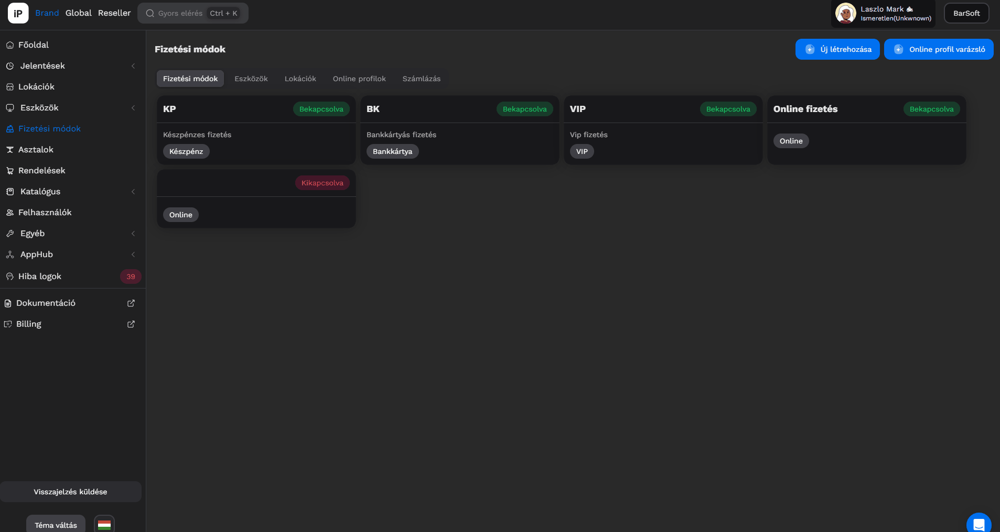
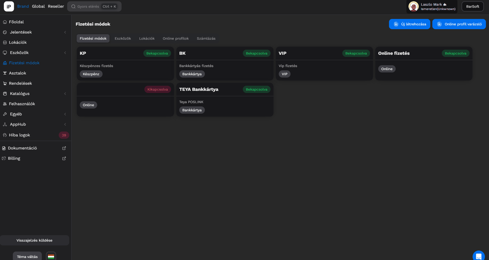
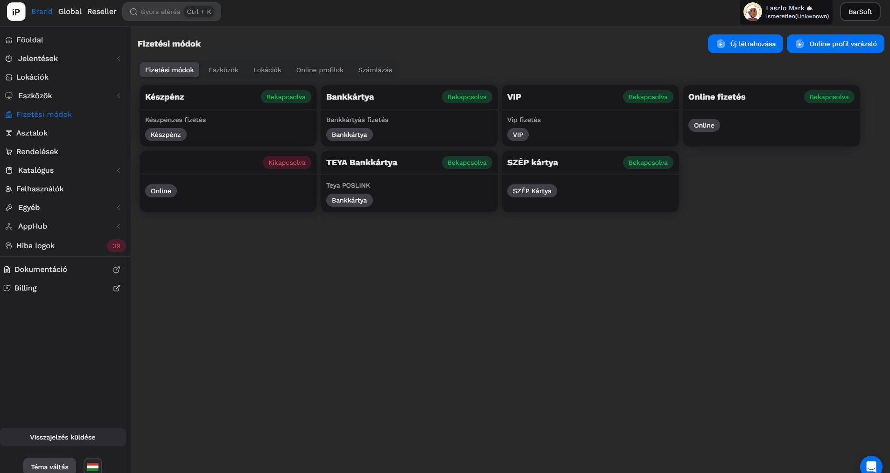

# 💴 Offline fizetési módok

Navigálj iPanelen a Fizetési módok menüpontra.

A Brand létrehozásakor mi automatikusan létrehozunk neked "KP" , "BK" és "VIP" fizetési módokat.

## Offline fizetési mód típusok


INFÓ

Olyan fizetési módokat építettünk be szoftverünkbe, amik az NTAK rendszere által validáltak és elfogadottak.


Az alábbi fizetési módok elérhetők a BarSoft rendszerében:

* Készpénz
* Bankkártya
* Utalvány
* EURO
* SZÉP Kártya
* Átutalás
* Kredit
* VIP
* Egyéb

## Új fizetési mód létrehozása

Ha új fizetési módot szeretnél létrehozni, kattints az <mark style="color:blue;">**Új létrehozása**</mark> gombra.

A felugró ablakban meg tudod adni a fizetési mód nevét, leírását, típusát.

<figure><figcaption></figcaption></figure>


TIPP

Bankkártyás fizetési módok esetén, ha van összekötés (pl. TEYA vagy VivaWallet) akkor érdemes létrehozni egy külön profilt, hiszen ez a fizetési mód egyből meghívja a terminált. Abban az esetben, ha a terminál nem elérhető, vagy valamilyen hiba történne a rendszerben, a nem TEYA vagy VIVA profil használatával tudjuk folytatni az értékesítést.


## Létező fizetési mód szerkesztése

Ha szeretnél egy már létező fizetési módot szerkeszteni, abban az esetben kattints a fizetési mód kártyára, hogy megjelenítsük az adatokat.

Írd át az értékeket és kattints a <mark style="color:green;">Mentés</mark> gombra.

<figure><figcaption></figcaption></figure>


FONTOS

A fizetési módok PROFILJÁT (bankkártya, készpénz, hitel stb...) nem tudod utólag módosítani, ahhoz új fizetési módot kell létrehoznod.


## Eszközökhöz rendelés

Új felületünkön már egy helyen az összes eszközhöz hozzá tudod rendelni a fizetési módokat.

Kattints az Eszközök menüpontra.

Ezen az oldalon felsoroljuk az összes eszközödet, amivel rendelkezel, minden lokáción.

A <mark style="color:yellow;">**Szerkesztés**</mark> gombra kattintva hozzá tudsz adni már létrehozott fizetési módokat, a fizetési módok neve mellett szereplő "X" gombra kattintva pedig könnyedén el tudod távolítani azokat.

<figure><figcaption></figcaption></figure>


FONTOS

Minden módosítás után, ha már meg van nyitva az adott eszközön a BarSoft app, újra kell indítani az appot a módosítás véglegesítéséhez!


## Fizetési módok lokációnként

Amennyiben rendelkezel BrandApp-al, lokációnként be tudod állítani a BrandApp-ban kiválasztható online fizetési módokat.

<figure><figcaption></figcaption></figure>


TIPP

Abban az esetben, ha rendelkezel SimplePay, VivaWallet és TEYA SecurePay fizetési móddal is, úgy akár mindhármat be tudod állítani egy lokációra, de azt is meg lehet ezzel a beállítással oldani, hogy egy-egy lokáción csak néhány legyen elérhető a fent felsoroltak közül.


