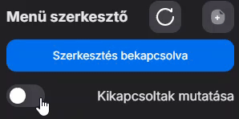

# Menü szerkesztő

Ebben a menüpontban tudunk menü termékeket létrehozni, vagy termékekből menüt készíteni.

## **Új menü létrehozása:**

1. Kattintsunk a Menü szerkesztő melletti + ikonra

<figure><figcaption>
Új menü létrehozása a + gomb segítségével
</figcaption></figure>

### &#x20;**Új termékből:**

<figure><figcaption></figcaption></figure>

2.  A felugró ablakban válasszuk ki az "Új termék" gombot

    Így egy új terméket fogunk létrehozni, ami "menü" termék, tehát ugyanúgy, mint egy másik termék létrehozásakor: meg kell adnunk az árat, áfacsoportot és a nevét, létrehozás után pedig elérhetőséget, láthatóságot kell állítani neki.

<figure><figcaption>
Menü termék ára, áfacsoportja
</figcaption></figure>

<figure><figcaption>
Láthatóság automatikus bekapcsolása az összes lokáción
</figcaption></figure>

### Létező termékből:

<figure><figcaption></figcaption></figure>

2.  Amennyiben a Létező termékhez gombot választjuk ki, úgy egy keresővel fogunk találkozni, aminek segítségével kiválaszthatjuk a terméket, majd ehhez a termékhez a menü méret létrehozó ablak fog feljönni, ahol a kapcsolódó adatokat tudjuk megadni.\

    <figure><figcaption>
Létező menü termék keresése
</figcaption></figure>

    <figure><figcaption>
Termékhez menü méret létrehozása
</figcaption></figure>
3. Menü termék-hez lehet hozzárendelni termék csoportokat, amiket előzőleg elkészítettünk az <mark style="color:blue;">Új csoport hozzáadása</mark> gombbal

<figure><figcaption></figcaption></figure>

<figure><figcaption>
A választható csoportok között kilistázzuk az összes létrehozott csoportot
</figcaption></figure>

4. Miután hozzáadtuk a különböző Menü csoportokat a menü termékünkhöz látni fogjuk milyen csoportok tartoznak ide, illetve ha lenyitjuk az egyik csoportot, a benne levő termékek nevét, méret nevét, alapértelmezett mennyiségét és a menüben levő árát is mutatjuk.

<figure><figcaption>
Az információk, amiket lát a vendég
</figcaption></figure>

5. A menün belüli csoportok sorrendjét tetszőlegesen változtathatjuk a <mark style="background-color:orange;">Sorrend szerkesztése</mark> gombbal. Ez megnyit egy drag'n'drop ablakot, ahol egyszerű egér általi áthelyezéssel határozhatjuk meg a megjelenítést.

<figure><figcaption></figcaption></figure>

<figure><figcaption>
Sorrend változtatás
</figcaption></figure>

6. Ha véletlenül rossz csoportot adtunk hozzá a menühöz, megoldható hogy eltávolítsuk azt a <mark style="color:red;">Csoport eltávolítása</mark> gombbal ezt kiszedhetjük.

<figure><figcaption></figcaption></figure>

<figure><figcaption>
A választható csoportok, amik a menüben megtalálhatóak, a kiválasztottak, amik kivételre kerülnek
</figcaption></figure>

## **Menü törlése:**

<figure><figcaption></figcaption></figure>

Első lépésként kapcsoljuk be a szerkesztést és amennyiben a törlendő menü ki van kapcsolva, a kikapcsoltak mutatását kapcsoljuk be.

<figure><figcaption></figcaption></figure>

Ezután a ceruza ikonra kattintva elő fog jönni egy ablak, amiben a <mark style="color:red;">Törlés</mark> gomb segítségével tudjuk törölni a rendszerből a menüt.

<figure><figcaption></figcaption></figure>
