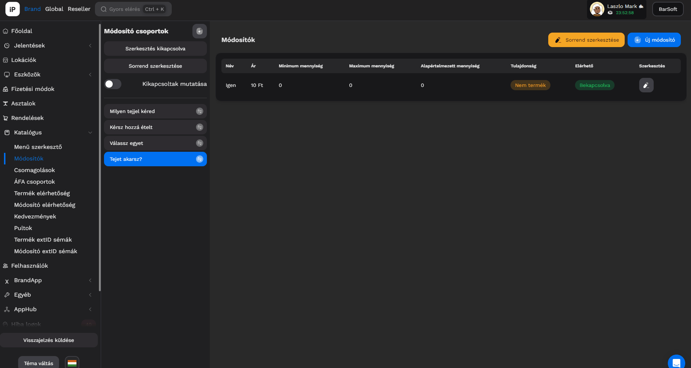
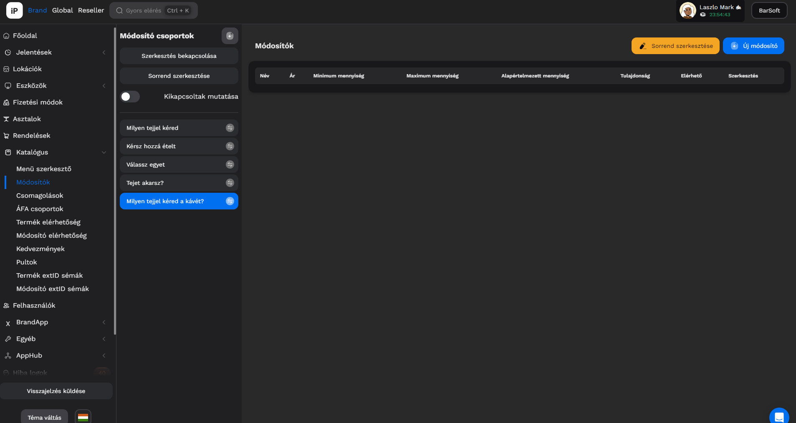

# 🍟 Módosítók

## Áttekintés

Mi az a módosító és miért jó?

A módosítóval tudsz olyan módosításokat hozzáadni a termékhez, amik alapesetben nem változtatják az alap terméked összetételét, de az árát viszont igen.\
\
Vannak olyan esetek, amikor egy terméked alap összetevőjét cserélhetik ki az ügyfelek, kéréseik alapján, ez is módosítónak számít.

Az editor felépítése ugyanaz, mint a Menü szerkesztőé, bal oldalon találhatók meg a módosító csoportok, jobb oldalon pedig a módosítók a kiválasztott kategóriában.

## Módosító csoport típusok

<table data-card-size="large" data-view="cards"><thead><tr><th></th><th></th><th></th></tr></thead><tbody><tr><td><strong>Egy választási lehetőség</strong></td><td>Ezzel a módosító típussal mindenféleképpen <strong>KÖTELEZŐ</strong> választani egyet a listából.</td><td>Példa: Cafe Latte, milyen tejjel kéred?</td></tr><tr><td><strong>Több választási lehetőség</strong></td><td>Ezzel a módosító típussal opcionális választási lehetőséget adhatsz az ügyfeleknek.</td><td>Példa: Margarita pizza, extra feltétek választása</td></tr></tbody></table>

### Egy választási lehetőség



Abban az esetben, ha egy választási lehetőség van beállítva a módosító csoportoknál, úgy 1 db-ot mindenképpen kötelező kiválasztani.

Ebben az esetben a "Nem kérek" vagy "Jég nélkül" stb... módosítónak is szerepelnie kell a listában.

A módosítóknál a módosító csoport létrehozása után be tudod állítani azt, hogy melyik legyen az alapértelmezett, ha szeretnéd, azaz ha berakják a terméket a kosárba POS felületen, úgy automatikusan azzal a módosítóval fog bekerülni.

### Több választási lehetőség



Több választási lehetőséggel beállított módosító csoportnál megadhatod, hogy szükséges-e minimum 1-et kiválasztani avagy sem, valamint a maximum módosító mennyiséget is be tudod állítani csoport szinten.

A módosító tételeknél, be tudod állítani azt, hogy melyik tételből minimum és maximum mennyit lehet berakni a kosárba a kiválasztott termékhez.

## Módosító csoport létrehozása

Kattints a Katalógus / Módosítók menü pontra.

1. A "Módosító csoportok" feliratnál kattints az új létrehozása ikonra.
2. A felugró ablakban válaszd ki, hogy milyen módosító csoportot szeretnél létrehozni
3. Add meg a módosító csoport nevét
4. Több választási lehetőségnél a csoport szinten megadott minimum és maximum választható mennyiséget
5. KIOSK használata esetén ha szeretnéd kiemelni a módosító csoportot, válaszd ki a Kiemelt csoport beállítást


Azok a módosító csoportok, amik megkapták a Kiemelt csoport beállítást, a KIOSK-on termék kiválasztás után az első oldalon lesznek. A többi módosító csoport egy következő oldalon lesz.



TIPP!\
Abban az estben, ha BrandApp-al és KIOSK-al is rendelkezel, az elnevezésre nagyon figyelj, mert a vendég fogja látni az itt megadott csoport nevet!\
\
Példa:\
Kávéhoz tej módosító csoportnak ne "Kávé tej" nevet adj meg, amiről te tudod, hogy mit jelent, hanem fogalmazd meg: "Milyen tejjel kéred a kávét?"


<figure><figcaption></figcaption></figure>

## Módosító csoport szerkesztése

Abban az esetben, ha utólag szeretnél valamilyen beállítást módosítani a módosító csoportodban, úgy könnyedén megteheted hasonlóképpen, mint a Menü szerkesztőnél.

A csoportok nevei mellett lévő ceruza ikonra kattintva előugranak a megfelelő beállítási lehetőségek.


FONTOS!\
Ha BrandAppal és KIOSK-kal is rendelkezel, vagy rendelkezni fogsz, a létrehozás után a szerkesztésre kattintva újabb mezők jelennek meg, amik fontosak lesznek a beállításhoz!


### Oldal

Az oldal mezőbe beírt számmal meghatározhatod, hogy a KIOSK-on hányadik oldalon jelenjen meg a módosító csoport.

### Típus


NAGYON FONTOS BEÁLLÍTÁS!\
Amennyiben KIOSK-od vagy BrandApp-od van, úgy KÖTELEZŐ ezt a mezőt kitölteni, miután létrehoztad a csoportot.


Itt be tudod állítani, hogy milyen stílusban jelenjen meg a KIOSK-on a módosító csoport.

<figure><figcaption></figcaption></figure>

### Kép

<figure><figcaption></figcaption></figure>

KIOSK használata esetén a módosító csoport neve felett mutatjuk az itt feltöltött képet.

A módosítások végeztével kattints a "Mentés" gombra.

