# 📖 Termékek



## Összefoglaló:

A menü szerkesztő az a felület, ahol létre tudod hozni a kategóriákat, a termékeket és a kategóriákkal és termékekkel kapcsolatos összes beállítást.

## Áttekintés

<figure><figcaption></figcaption></figure>

A bal oldali menüsoron találhatók a kategóriák, valamint a kategóriákkal kapcsolatos beállítások.

Középen találod az adott kategória termékeit.


INFÓ

Abban az esetben, ha vannak olyan termékeid, amik nem tartoznak semmilyen kategóriába, a "<mark style="color:blue;">**Kategória nélküliek**</mark>" csoportba kerülnek.


### Mezők Beállítása

Ha töltöttél már fel termékeket, a mezők kiválasztásával tudsz szűrni, hogy milyen adatok jelenjenek meg a listában.

* Ár
* Leírás
* Méretek száma
* Engedélyezve
* Kép

<figure><figcaption></figcaption></figure>

## Kategóriák

### Termék kategória létrehozása

1. Kattints a "**Katalógus / Termékek"** menüpontra.
2. Kattints az "**Új kategória**" gombra
3. Add meg a kategória nevét, típusát (főkategória vagy alkategória)


TIPP!

Ha előre tudod, hogy ebben a kategóriában ugyanolyan típusú termékek lesznek, akkor előre beállíthatod az NTAK kategóriát, így minden olyan termék, ami ebben a kategóriában jön létre, azzal az NTAK adattal fog rendelkezni.


<figure>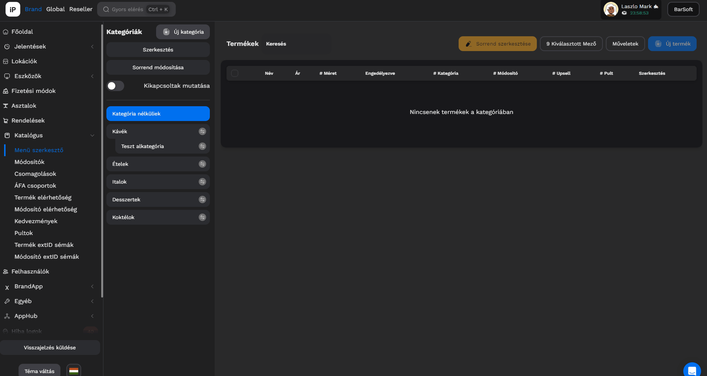<figcaption></figcaption></figure>

### Virtuális kategória

A kategória létrehozásakor van lehetőség kipipálni a virtuális kategória lehetőséget.&#x20;

<figure><figcaption></figcaption></figure>

Ez abban az esetben hasznos, ha használunk a termékeknél Tageket. Ezek megjelölik a termékeket bizonyos szempontok szerint, amiket egy virtuális kategória tud összecsoportosítani. Az ilyen típusú kategóriák termékeit nem lehet tömegesen módosítani. Csak azok a termékek kerülnek bele (automatikusan), amiknek be lett állítva az a Tag, amit a kategóriához kiválasztottunk.

<figure><figcaption>
Egy termék szerkesztésekor itt tudjuk kiválasztani a Tageket
</figcaption></figure>

### Termék kategória szerkesztése

Ha szeretnéd a kategória beállításait módosítani, kattints az adott kategória szélén a ceruza ikonra!

Itt tudod állítani:

* Kategória neve
* Leírás
* Főkategória / alkategória
* NTAK besorolás
* Testreszabás
* extID (Fruitsys integráció esetén)
* Kategória képe
* Kategória törlése

<figure><figcaption></figcaption></figure>

### Termékek tömeges kategóriához rendelése


TIPP

Abban az esetben, ha a termék feltöltést Excel táblázattal csináltad, vagy olyan termékeket szeretnél hozzáadni az adott kategóriához amiket ide is szeretnél beállítani.


Kattints a jobb felső sarokban látható "Termékek hozzáadása a kategóriához" gombra!

A felugró ablakban láthatod bal oldalon a termékeket, amelyeket szűrni is tudsz már meglévő kategóriáid alapján, valamint azokat a termékeket amik már bekerültek ebbe a kategóriádban.

Miután kiválasztottad a termékeket, kattints a mentés gombra.

<figure>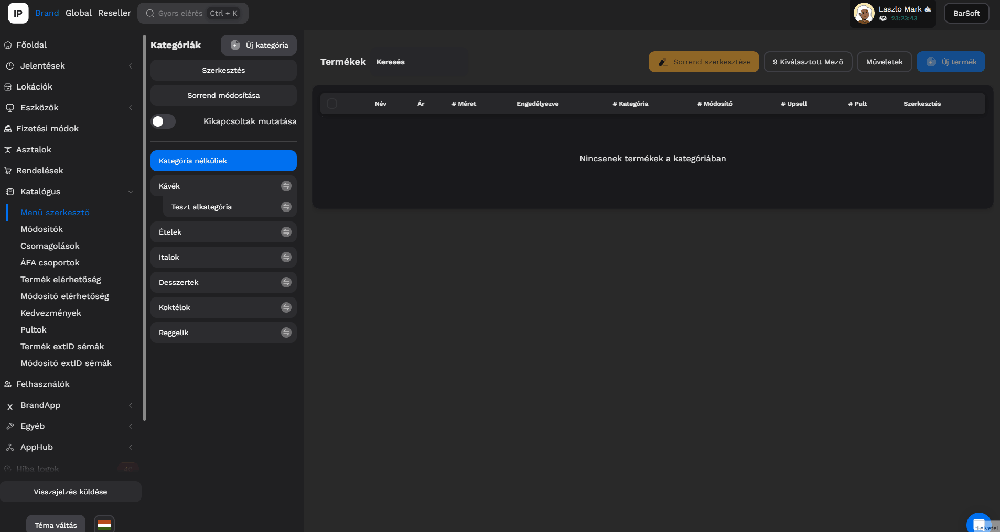<figcaption></figcaption></figure>


INFÓ

Ha olyan termékeket adsz a kategóriához, amik már egy kategóriában szerepelnek, úgy NEM átraktad az új kategóriába, hanem hozzáadtad, tehát mindkét kategóriában szerepelni fog!


### Kategória sorrendjének módosítása

A kategória sorrendjét a "**Sorrend módosítása"** gombra kattintva tudod módosítani.

A gombra kattintás után egy szimpla drag\&drop mozdulattal az ablakban át tudod állítani a sorrendet.

Kattints a "**Mentés"** gombra és kész is vagyunk.


FONTOS

Csak a főkategóriák sorrendjét tudod ezzel a lehetőséggel állítani, alkategória sorrend módosításra nincs lehetőség!


## Termékek

### Termék létrehozás

Új termék létrehozásához válaszd ki a kategóriát, amiben el szeretnéd helyezni a terméket.

Kattints az "<mark style="color:blue;">**Új termék**</mark>" gombra!

Válaszd ki, hogy milyen módon szeretnél terméket létrehozni: egy termék, tömeges termék létrehozása, vagy importálás FruitSys Cloud-ból!

Egy termék létrehozásánál add meg a következő adatokat:

* Termék neve
* Termék leírása
* Termék ára
* Termék ÁFA csoportja
* Termék mérete (Ha szeretnél, többet is hozzáadhatsz)

Tömeges termék létrehozásánál a termék nevét és árát kell megadnod.

Importálás esetén ki kell jelölnöd a termékeket, amiket importálni szeretnél, majd rá kell nyomnod az "Importálás" gombra.

Mi a termék méret és mire jó?

Ha a termékednek több kiszerelése van, mint például egy üdítő, amiből van 0,33l és 0,5l akkor itt létre tudod hozni mindkettőt.

Ételnél például kisadag és nagyadag.

A méreteknek külön lehet árat megadni, és egy termékkártyán belül tudod kezelni POS-on az értékesítés során.

Kattints a "**Létrehozás"** gombra, és el is készült a terméked!

<figure>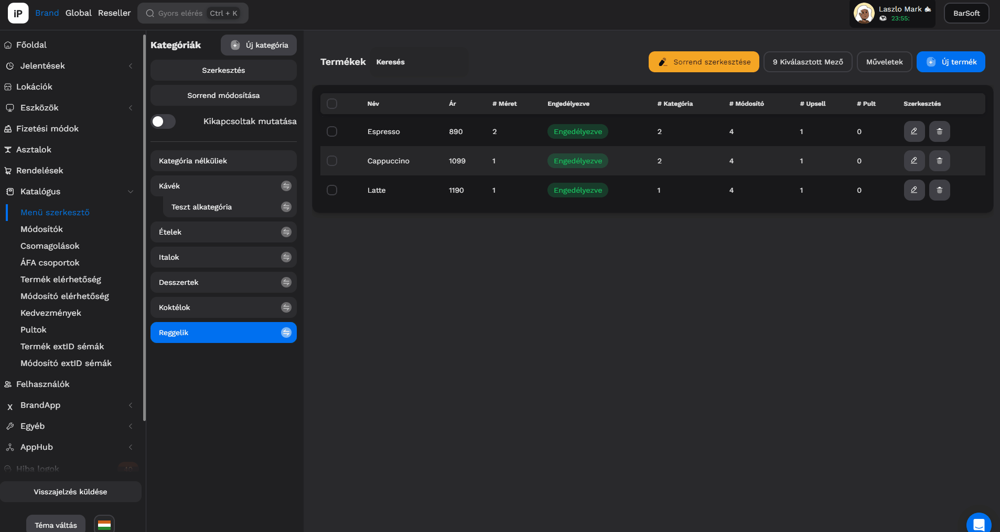<figcaption></figcaption></figure>


TIPP

Mivel arra készülünk, hogy nem csak egy terméket szeretnél felvinni, így az ablakot nyitva hagyjuk, hogy gyorsan lehessen több terméket felvinni egymás után.


A létrehozás után, ha kikattintasz az ablakból, láthatod, hogy el is készült a új terméked.


FONTOS!

Abban az esetben, ha kikapcsolod a terméket (azaz az engedélyezve kapcsolót kikapcsolt állapotba rakod), úgy SEHOL nem lesz elérhető, egyik lokáción sem a termék.


### Termék szerkesztés

Abban az esetben, ha a már létrehozott termékednek szeretnéd az adatait módosítani, ennek két módja van. Sorközi szerkesztéssel vagy a ceruza gombra kattintva bármikor megteheted.

<figure>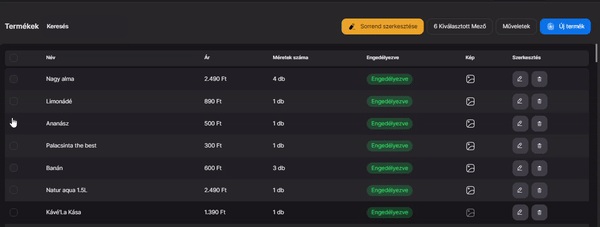<figcaption></figcaption></figure>

A ceruza ikonra kattintva a következőket tudod módosítani:

* Alapadatok
* Méretek/kiszerelések
* Termék testreszabása
* Módosítók, pultok, upsellek
* Képek
* Allergének és Tápérték

***

#### Alapadatok

Az alapadatok módosítása során át tudod nevezni a terméket, tudsz neki leírást adni, valamint az ÁFA csoportot módosítani és csomagolást hozzáadni.

Az alapadatokhoz tartozik a Méretek beállítása is.

Fordítás

Abban az esetben, ha több nyelven is meg szeretnéd jeleníteni a terméked, például a POS-on angol nyelvű kollégák dolgoznak, vagy BrandAppon van nyelvváltási lehetőség, úgy érdemes megadni az angol nevét, leírását is a terméknek.\

Kattints a fordítás ikonra, majd add meg az angol megfelelőjét is.

Termék leírás

Abban az esetben ha használsz BrandAppot vagy KIOSK-ot, ezt határozottan ajánlott kitölteni.

ÁFA csoport

Itt hozzá tudsz rendelni a termékhez egy ÁFA csoportot.&#x20;

Az ÁFA csoportokkal kapcsolatos tudnivalókért kattints az [**ÁFA CSOPORTOK**](afa-csoportok.md) menüpontra.

Csomagolás

Itt tudsz csomagolást hozzárendelni a termékhez. A csomagolás akkor fog hozzáadódni a termékhez, ha azt elvitelre kérték.&#x20;

Tudj meg többet a [**CSOMAGOLÁSOK** ](csomagolasok.md)menü pontra kattintva.

<figure><figcaption></figcaption></figure>



***

#### Termék méretek

A termék méretek menüpontnál láthatod a jelenlegi kiszereléseidet, amiket a termékhez állítottál be, és szerkesztheted a sorrendjüket.

Itt láthatod, hogy be van-e kapcsolva a méret, a ceruza ikonra kattintva szerkesztheted, az elérhetőség ikonra kattintva megadhatod (már itt), hogy melyik lokáción legyen elérhető, valamint a zöld felirat jelzi, hogy melyik az alapértelmezett méret.

Ez azt jelenti, hogyha POS-on rákattintasz a termékre és nem választod ki, hogy melyik méret legyen berakva a kosárba, akkor automatikusan ezt a méretet fogja beállítani.


TIPP!

Érdemes azt a méretet beállítani alapértelmezettnek, amit többen kérnek, hiszen nem kell pluszban hozzányúlni majd a termékhez értékesítés során.

Például ételek esetén a normál adagot, hiszen kevesebben kérnek kisadagot.


<figure>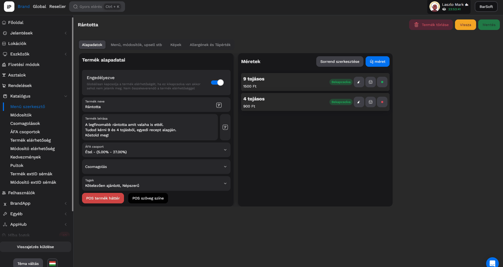<figcaption></figcaption></figure>

#### Termék méretek szerkesztése

A méret kártyán kattints a szerkesztés gombra.

Itt a felugró ablakban tudod szerkeszteni a mérettel kapcsolatos információkat:

* Név
* Ár
* Göngyöleg/Betétdíj típusa
* A méret elérhetősége a lokációkon
* NTAK beállítások
* EAN és PLU kódok
* Egyéb adatok (engedélyezés, mérendő termék, csomagolás súlyának levonása)
* Fruitsys integráció (kiszerelés extID)

EAN kód

Abban az esetben, ha rendelkezel vonalkód olvasóval és hozzá van csatlakoztatva a POS eszközödhöz, úgy ha ebbe a mezőbe is beolvasod a termék vonalkódját, az értékesítés során a beolvasáskor automatikusan hozzáadjuk a kosárba a termékhez.

PLU kód

A PLU kód egy tetszőlegesen megadható számkombináció, amit a POS felületén beírva a megfelelő mezőbe kiadja a terméket és nem kell keresgélni.

<figure><figcaption></figcaption></figure>

#### DRS rendszerrel való kompatibilitás

2024.01.01-től Magyarországon is bevezették a belföldön forgalomba hozott visszaváltási díjas termékek kötelező visszaváltási rendszerét.&#x20;

A rendszer lényege, hogy minden üveg, fém és műanyag palackos, egyutas italtermék értékesítésekor palackonként, egységesen 50 Ft visszaváltási díjat fizet a vásárló, amit visszakap, miután visszaváltotta a palackot.

A termék méretének ezen tulajdonságát lehet bekapcsolni a Göngyöleg típusa opcióval.

Göngyöleg

A termék szerkesztésénél a méret tulajdonságai között találjuk meg a göngyöleg opciót. Ha ezt beállítjuk, onnantól kezdve a termék árához hozzáadódik a göngyöleg is.

Amennyiben az adott termékből van még nálunk raktáron göngyöleges és nem göngyöleges verzió is, érdemes két méretet használni, illetve ezeknek a méreteknek megfelelő beszédes nevet adni.\
Pl: Termék név: Coca cola\
1.méret név: 0,5l göngyöleg\
2.méret név: 0,5l

A fenti esetben az 1.méretnek szükséges bekapcsolni Göngyöleg típusa opcióból az 50Ft értéket

#### Új termék méret létrehozása

Ha új termék méretet szeretnél létrehozni, szimplán kattints az "Új méret" gombra, majd az ablakban töltsd ki a megfelelő adatokat.

<figure><figcaption></figcaption></figure>

#### Méret sorrend módosítása

Ha sok mérettel rendelkezel, viszont fontos, hogy milyen sorrendben lásd őket, tudod módosítani.

Kattints a "**Sorrend szerkesztése"** gombra, majd egy szimpla húzás művelettel állítsd be úgy, ahogy szeretnéd.

<figure>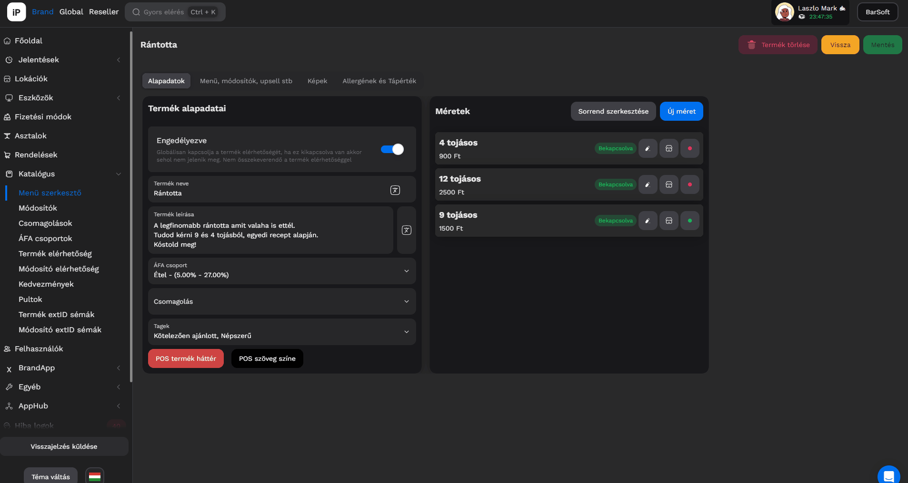<figcaption></figcaption></figure>

#### Termék testreszabás

Itt adhatsz hozzá tag-eket, módosíthatod a szöveg színét és a termék hátterét, és címkéket is tudsz hozzáadni.

TAGEK

Termékeidet el tudod látni bizonyos további attribútumokkal, mint például népszerű, vegetáriánus stb... \
Ez a Feature leginkább BrandAppon és KIOSK-on fontos, vagy virtuális kategóriák használatakor

POS termék háttér / Szöveg szín

[https://youtu.be/lsItuoTPJ6A](https://youtu.be/lsItuoTPJ6A)

Itt tudod beállítani, hogy a POS értékesítési felületén milyen háttérszínnel és szövegszínnel jelenjen meg ez a termék.

***

#### Termék módosítók, pultok, upsellek

A következő menüpontban a termékhez rendelt módosítókat, valamint pultokat és upselleket lehet szerkeszteni.

A "**Szerkesztés"** gombra kattintva tudsz hozzáadni értéket, a szöveg melletti X gombra kattintva tudod törölni az értéket a listából.

<figure>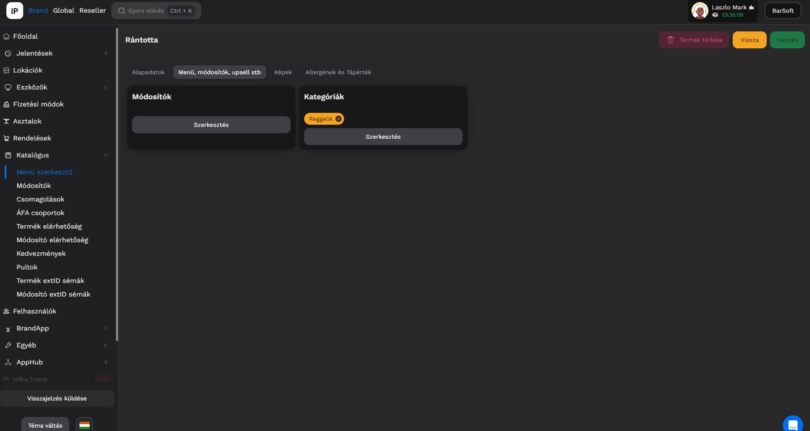<figcaption></figcaption></figure>

***

#### Termék képek szerkesztése

A Képek fülre kattintva be tudod állítani, hogy a BarSoft ökoszisztémában lévő 3 fajta eszközön milyen képek jelenjenek meg a termék kártyákon.


FONTOS

Az ajánlott dimenziók:

* 1920x1080 (fekvő)
* 4 mb max
* PNG vagy JPG


A "**Fájl kiválasztása"** gombra kattintva fájlböngésződ segítségével ki tudod választani az adott képet.

***

#### Allergének és tápérték

Az allergének kiválasztásával a termék kártyán mutatni fogjuk az ikonokat, amik be lettek állítva.

A beállításokat elég egy kattintással elvégezni, az aktív ikonok fognak megjelenni a termék kártyán.

***

### Termék sorrend beállítása

A "**Sorrend szerkesztése"** gombra kattintva be tudod állítani, hogy ha POS-on nem ABC sorrendben jelennek meg a termékek, hanem saját sorrend alapján szeretnéd listázni őket, úgy egy sima drag & drop mozdulattal be tudod állítani a kívánt sorrendet.

<figure>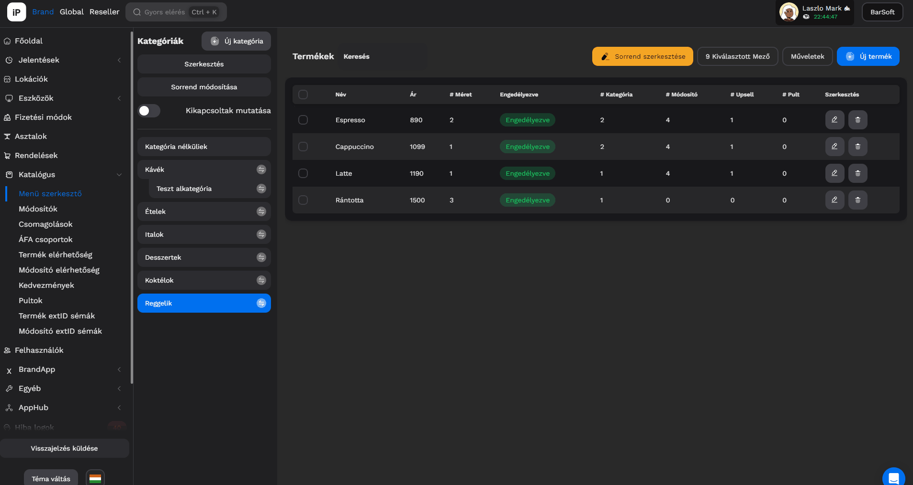<figcaption></figcaption></figure>

### Termék feltöltés Excel táblázatból

Lehetőséget biztosítunk arra is, hogy ha Excel táblázatban megvan a termék listád, úgy gyorsan és tömegesen fel lehessen tölteni termékeket.


FONTOS TIPP!

Először hozd létre a kategóriákat, majd minden kategóriára szedd szét a termék listádat, így később nem kell pakolgatni egy-egy kategóriából a másikba a termékeket!


Nagyon egyszerű a termék feltöltés Excel táblából.

Válaszd ki a kategóriát ahova szeretnéd felölteni a termékeket.

1. Kattints az "**Új termék"** menüpontra.
2. Kattints az "I**mportálás Excelből"** gombra.
3. Válaszd ki a fájlt fájlböngésződ segítségével.
4. Párosítsd az oszlopokat a megfelelő adatokkal
5. Ha van hibás termék, javítsad ki

Kattints a "**Létrehozás"** gombra majd várd meg míg végigmegy a folyamat.

Frissítés vagy kategória váltás után már látod is a termékeket.



<figure>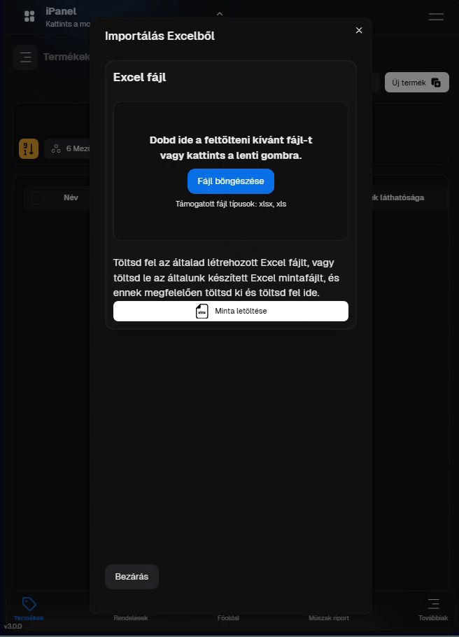<figcaption></figcaption></figure>



<figure>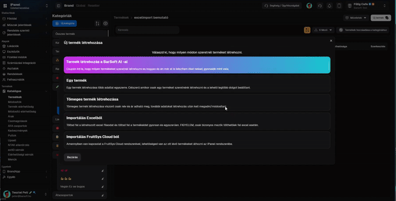<figcaption></figcaption></figure>




FONTOS!

Excel feltöltéskor egy termékhez csak 1 méretet tudunk hozzá csatolni, valamint az NTAK és ÁFA kulcs beállításokat manuálisan kell elvégezni!


**Példa Excel tábla a feltöltéshez:**



### Tömeges termék létrehozás

Ha nem 100 terméket szeretnénk felvinni, csupán 5-öt vagy 10-et azaz kisebb mennyiséget, úgy lehetőséget adunk gyors termékfelvitelre is.

Válaszd ki a megfelelő kategóriát, majd kattints az "**Új termék"** gombra.

Válaszd ki a "**Tömeges termék létrehozás**" menüpontot.

A listába kezdd el írni a termékeket, majd a végén kattints a "<mark style="color:blue;">**Létrehozás"**</mark> gombra.

<figure>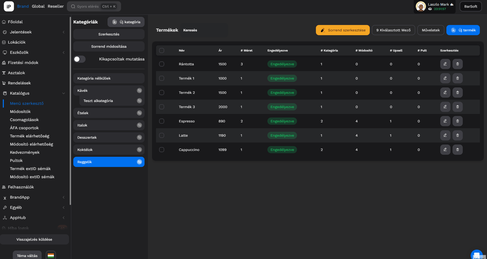<figcaption></figcaption></figure>


FONTOS!\
Ezzel a termék létrehozási lehetőséggel is lesz még utómunka, hiszen a mérteket, ÁFA csoportokat, és NTAK információkat még be kell majd állítanod!


### Termék törlése

A termékek törlése igen egyszerű.

A termék listában a ceruza mellett lévő kuka ikonra kattintva törölheted a terméket.

<figure><figcaption></figcaption></figure>

