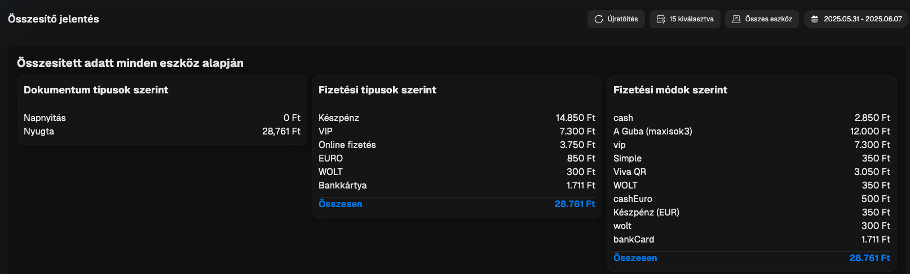

# 🪙 Összesítő

Ezen az oldalon fogod találni a műszakok adatait összesítve, különböző bontásokban.

## Adatok

### Összesített adat minden eszköz alapján

Az összesített adatoknál egy teljes riportot látsz alapbeállításként minden eszközre és minden üzletre (lokációra) nézve a kiválasztott dátumtartományban.

#### LEKÉRDEZÉS MÓDOSÍTÁSA

A lekérdezést bármikor tudod módosítani a jobb felső sarokban található szűrők segítségével.

Amit itt tudsz módosítani:

* Lokációk (üzletek) kiválasztása
* Eszközök kiválasztása
* Dátumtartomány

<figure><figcaption>
Összesítő - Adatok szűrése
</figcaption></figure>

#### ADATOK

Ebben a nézetben az alábbi fontos információkat látod:

* Dokumentum típus szerinti bontás (napnyitás, nyugta, sztornó)
* FIzetési típus szerinti bontás -> Ezek azok a típusok, amik hivatalosan is NTAK kompatibilis kategóriák
* Fizetési módok szerinti bontás -> Ezek azok a módok, amiket te elneveztél vagy elnevezel majd hogy Pultosaid megértsék mire kell kattintani fizetés során

### Összesítő eszközök szerint

Itt a fenti bontások szerinti információkat látod, csak eszközökre bontva tovább, így pontosan látod azt is, hogy az adott értékesítési pontokon hogyan alakultak a bevételek.

<figure><figcaption>
Összesítő - Eszközönkénit bontás
</figcaption></figure>
