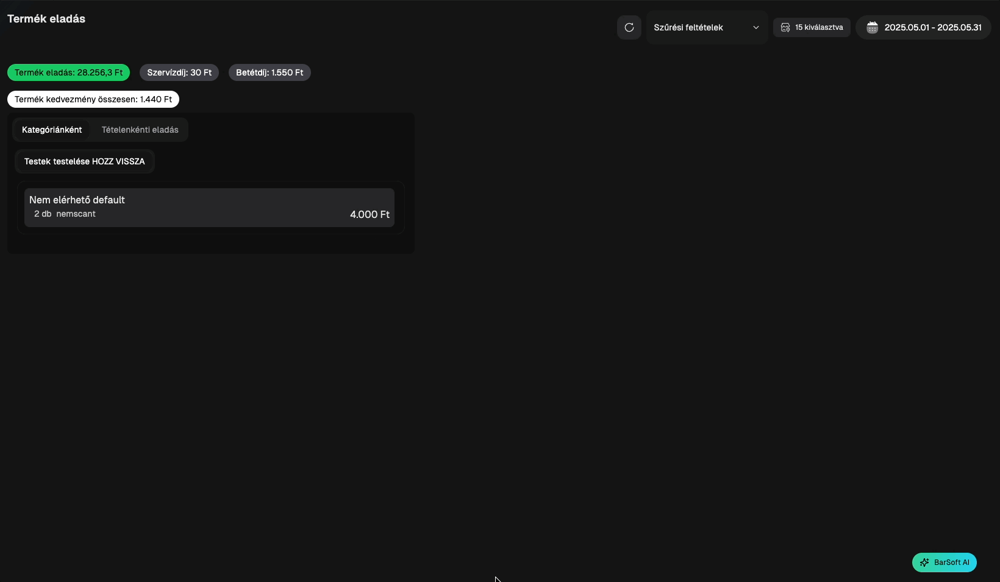

# 💰 Termék eladások

Ebben a menüpontban az oldal tetején összesítve láthatod a következő adatokat:

* Termék eladás
* Szervízdíj (ha volt)
* Betétdíj (ha volt)
* Csomagolási költség (ha volt)
* Termék kedvezmény összesen

<figure><figcaption>
Termék eladások - Összegző
</figcaption></figure>

További bontásban kategóriánként is látod az adatokat, valamint tételenként, a csúszkás választóval ki tudod választani, hogy melyik nézetre vagy kíváncsi.

<figure><figcaption>
Termek Eladás - Kategóriák
</figcaption></figure>

A tételenkénti eladás fülön napló szerűen tudod követni melyik termékek mikor mennyiért lettek eladva.

Az oldal alján kilistázzuk azokat a termékeket, amiket a nap folyamán töröltek a rendelésekből, mielőtt azt leadták volna.

Ezen az oldalon is lehetséges szűrni eszközökre, dátumra vagy akár bizonyos feltételekre.

A <mark style="color:blue;">**Részletek**</mark> gombra kattintva pedig elnavigálunk ahhoz a rendeléshez, ahol értékesítve lettek az az adott termékek.
