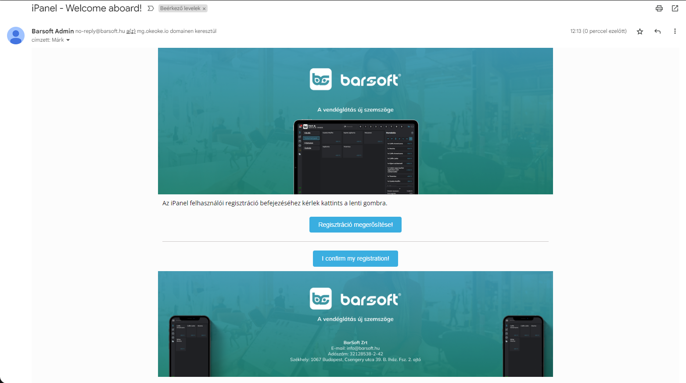

# 🖊️ Regisztráció / bejelentkezés

## Bejelentkezés

Abban az esetben, ha BarSoft POS előfizetéssel rendelkezel és te vagy a tulajdonosa a fióknak, a regisztrációt automatikusan elvégezzük neked.

Navigálj az [iPanel ](https://barsoft.hu/ipanel)felületére, itt több fajta bejelentkezési móddal is be tudsz lépni.



1. Írd be e-mail címedet
2. Kattints a <mark style="color:blue;">Bejelentkezés</mark> gombra!
3. A beírt e-mail címre kapsz egy 4 jegyű kódot, ezt írd be ide!

<figure><figcaption>
Ha az eszközön már írtál be e-mail címet, azt elmentjük és felajánljuk
</figcaption></figure>



Az első bejelentkezés során a rendszer fel fogja ajánlani a Passkey létrehozás lehetőségét.

Fizikai USB PassKey vagy telefonos biometrikus azonosítás általi bejelentkezés így elérhetővé válik, valamint ha mobilodon létrehoztál már egyet, akkor legközelebb desktopon is be fogsz tudni jelentkezni ennek a használatával egyszerűen és gyorsan.

<figure><figcaption>
iPanel - Passkey bejelentkezés
</figcaption></figure>




A felugró ablakban jelentkezz be a google fiókodba, és máris benn vagy

<figure><figcaption>
iPanel - Google fiók bejelentkezés
</figcaption></figure>




TIPP\
Érdemes bekapcsolni a böngésző beállításaiban az értesítéseket, és a bejelentkezéssel kapcsolatos PIN kódot megkapod értesítésként!



**PRO TIPP**

Ha letöltöd az iPanel alkalmazást telefonodra és engedélyezed az értesítéseket, úgy telefonon megkapod az e-mail-es bejelentkezéshez a négyszámjegyű kódot PUSH értesítésben!


## Regisztráció


**MIKOR KELL IPANEL FIÓKOT REGISZTRÁLNOM?**

iPanel fiókot csak akkor kell regisztrálni, ha szeretnél már egy meglévő Brand-hez (fiókhoz) hozzáférést kapni úgy, hogy utólag adnak hozzá.

Más esetben a fiók tulajdonosa tud neked meghívót küldeni, amit e-mailben kapsz meg.


A regisztráció folyamata teljesen egyszerű.

1. Nyisd meg az [iPanel ](https://barsoft.hu/ipanel)felületét
2. Kattints a <mark style="color:blue;">Regisztráció</mark> gombra
3. Add meg az e-mail címed, Vezetékneved és Keresztneved
4. Ellenőrizd adataid és kattints a <mark style="color:blue;">Regisztráció</mark> gombra

<figure><figcaption></figcaption></figure>


**TIPP**

Abban az esetben, ha Google mail címed van (Gmail), vagy Google Workspace fiókkal rendelkezel, és azt az e-mail címet szeretnéd használni az iPanel belépéshez úgy a **"**_**Regisztrálás Google fiókkal"**_ gombra kattintva két kattintással megteheted a regsztrációt!


Az adatok megadása után küldeni fogunk egy e-mailt a megadott e-mail címre, hogy erősítsd meg a címet.

<figure><figcaption></figcaption></figure>

Miután rákattinottál a gombra az alábbi képernyő fog fogadni

<figure><figcaption></figcaption></figure>

A [<mark style="color:blue;">**Bejelentkezés**</mark> ](regisztracio-bejelentkezes.md#bejelentkezes)gombra kattintva a már korábban leírt módon tudsz bejelentkezni az iPanel felületére.


FIGYELEM!

Ha IOS készüléket használsz és böngészőben nyitod meg az appot, az e-mailt KÜLÖN ablakban nyisd meg hogy biztosan megmaradjon a bejelentkezési felület.


Miután bejelentkeztél, látnod kell a hozzád rendelt Brand adatait (vagy ha te vagy a tulajdonos akkor ez alapból be van állítva)

&#x20;Amennyiben nem látod az adatokat, de be van állítva az érték, előfordulhat, hogy 10 perc után újra be kell jelentkezned!

A bejelentkezés után az alábbi képernyőt kell hogy lásd:

<figure><figcaption></figcaption></figure>

