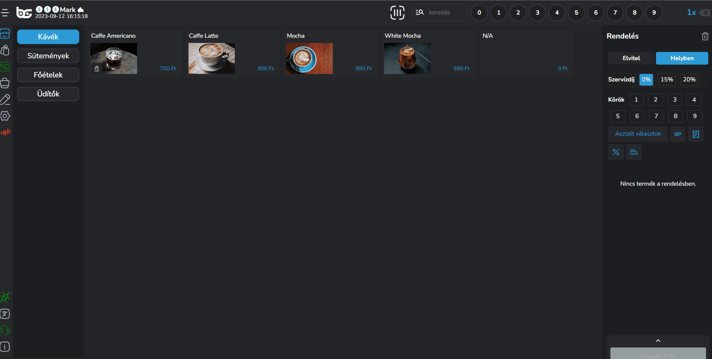
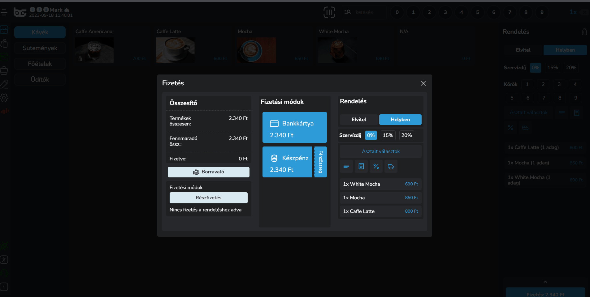
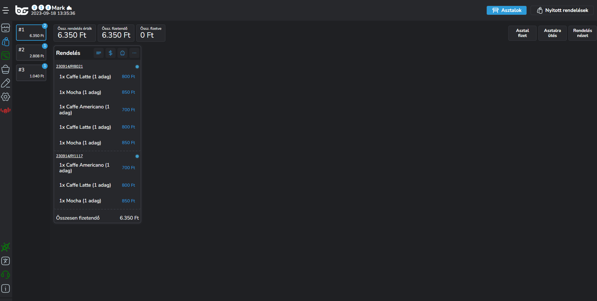

# 💰 A fizetőablak

Fizetőablak típusát tekintve két verziót különböztetünk meg:

1. Gyorsnyugtás fizetés
2. Asztal fizetés (bontott fizetés)

## Gyorsnyugtás fizetőablak

A gyorsnyugtás fizetőablakot úgy érjük el, ha felütünk tételek majd rámegyünk a <mark style="color:blue;">"Fizet"</mark> gombra a képernyő jobb alsó sarkában.

<figure><figcaption></figcaption></figure>

A fizetőablak 3 oszlopból áll:

* Összesítő
* Fizetési módok
* Rendelés részletei

### Összesítő

Az összesítőnél láthatod hogy milyen pénzösszegben lett a rendelés felvéve, hogy összesen mennyit kell még fizetni és mennyi lett belőle kifizetve -> erre később kitérünk.

Itt lehet megadni borravaló mennyiséget és részfizetést is.

Ha a testreszabás menüpontban be van kapcsolva az előnyugta funkció, az is itt fog megjelenni.

Amennyiben kapunk borravalót a "Borravaló" gombra kattintva felugrik egy ablak, ahol előre definiált százalékos borravaló mennyiséget, vagy akár pénzösszegű mennyiséget is meg lehet adni.

Ha és amennyiben egyik sincs közel a valósághoz, úgy manuálisan mi is megadhatjuk az összeget két módon. Vagy meghatározzuk az adott borravaló mennyiségét, vagy az ennyiből kérek gombbal beírhatjuk mennyiből kér vissza a vendégünk.

<figure><figcaption></figcaption></figure>

A készpénz fizetési opció mellett találsz egy olyan gombot, hogy <mark style="color:blue;">"Pénzösszeg".</mark>

A <mark style="color:blue;">"Pénzösszeg"</mark> azt jelenti, hogy meg tudsz adni mennyiséget, hogy mennyi pénzt kaptál és a fizetés után megmutatjuk mennyi volt a visszajáró.

<figure><figcaption></figcaption></figure>

### Fizetési módok

A fizetőablak középső részében találhatók a fizetési módok.

Ezek a lehetőségek, amiket iPanelen korábban már beállítottál, és hozzárendelted az eszközödhöz.

A könnyebb átláthatóság érdekében különböző színekkel jelöljük a különböző típusú fizetési módokat.

A Készpénzes fizetési módok zöld színnel lesznek megjelölve, a bankkártyások lilával. A Szépkártyás fizetési módok narancssárgával, minden egyéb pedig kékkel

<figure><figcaption></figcaption></figure>

### Rendelés részletei

A fizetőablak jobb szélén még mutatunk olyan beállításokat, amiket tudsz módosítani fizetés előtt:

Az alábbi opciókat lehet módosítani kosár szinten fizetés előtt:

* Elvitelre vagy helyben szeretnénk értékesíteni a rendelést
* Szervízdíj mértékét tudjuk állítani
* Asztal választhatunk még, ha mégis asztalra szeretnénk ütni
* Részletes nézet be, ki kapcsolása
* Megjegyzés hozzáadása a kosárhoz
* Kedvezmény adás fizetés előtt
* Szállítási költség hozzáadása
* Számlázási adatok hozzáadása
* VIP vendég hozzárendelése a rendeléshez

<figure><figcaption></figcaption></figure>

### Visszajáró mutatása

Amennyiben olyan összeget értékesítünk, amelyik esetben nehéz a visszajárót kiszámolni, úgy segítünk és megmutatjuk neked a visszajáró összegét.

Nincs más dolog hátra, mint értékesítés során a <mark style="color:blue;">"Készpénz"</mark> fizetési mód melletti <mark style="color:blue;">"Pénzösszeg"</mark> gombot megnyomni.

Felugrik egy ablak, ahol meg tudod adni, hogy mennyi készpénzt kaptál, és a rendszer automatikusan visszaszámolja a visszajárót.

<figure><figcaption></figcaption></figure>

## Asztal fizet (Bontott fizetés) fizetőablak

Ez az ablak eltér a gyors nyugtás verziótól, hiszen plusz funkciókat építettünk be, hogy még könnyebb legyen az asztalos fizetések kezelése.

Az <mark style="color:blue;">"Asztal fizet" "Rendelés fizet"</mark> gombok valamelyikére kattintva ugrik fel a bontott fizetés ablakunk.

<figure><figcaption></figcaption></figure>

**Az ablak összetevői balról-jobbra:**

* Összesítő
* Fizetési módok
* Rendelések listázása
* Kiválasztott fizetendő termékek


**Miért jó ez az módosított ablak?**

Abban az esetben, ha a vendégek külön szeretnének fizetni, rendelésenként vagy akár termékenként meg tudjuk adni a fizetendő tételek listáját.

Alapesetben minden tételt berakunk a <mark style="color:blue;">"Kiválasztott termékek"</mark> oszlopba, de ez bármikor módosítható termékenként vagy akár rendelésenként.


<figure><figcaption></figcaption></figure>

A rendelésekre tudunk külön szállítási költséget és kedvezményt is beállítani.

