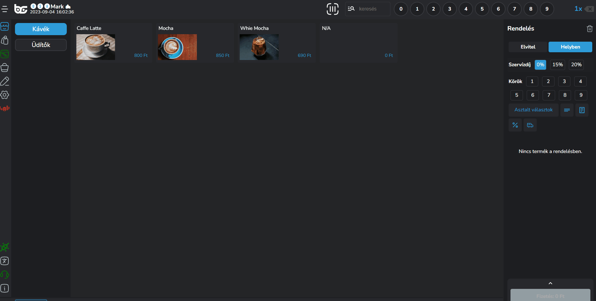
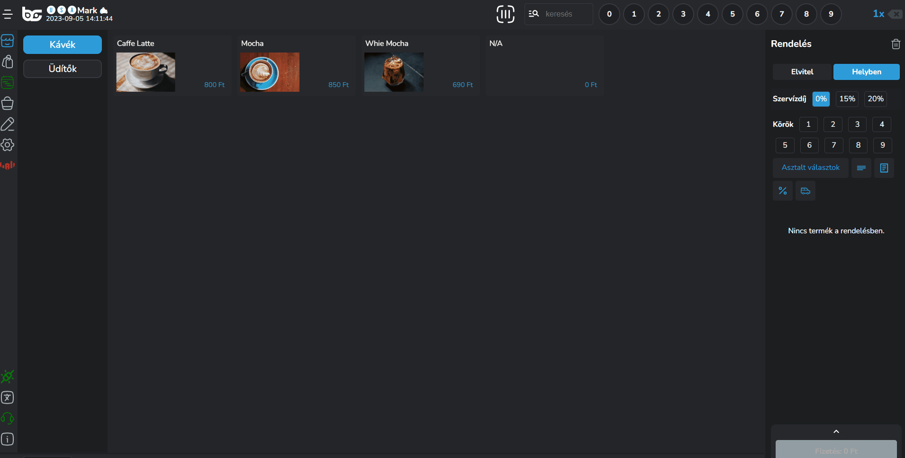
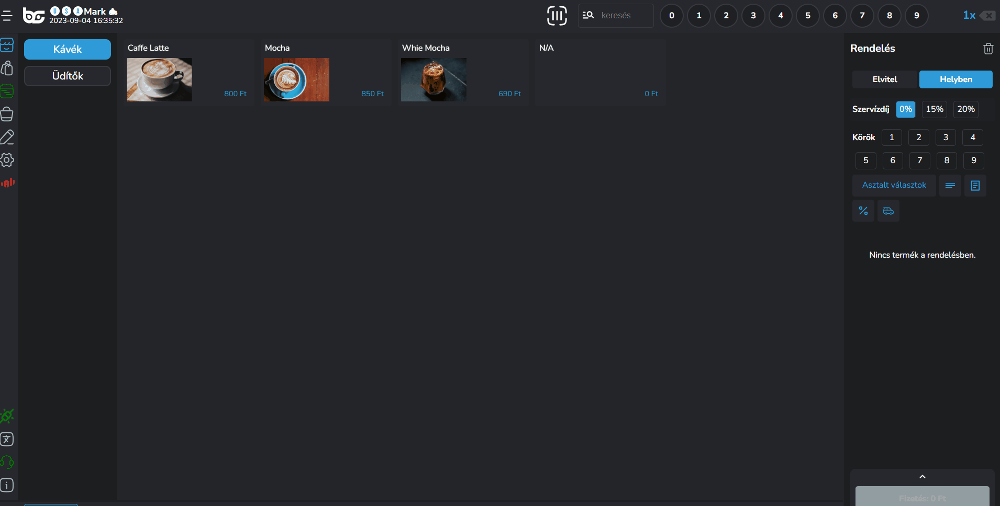
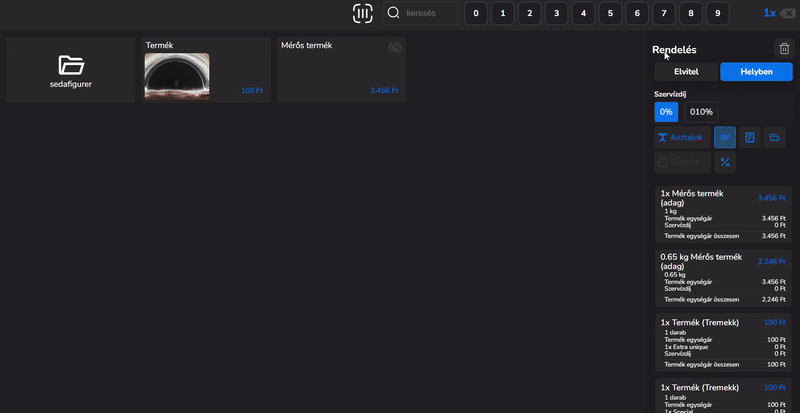
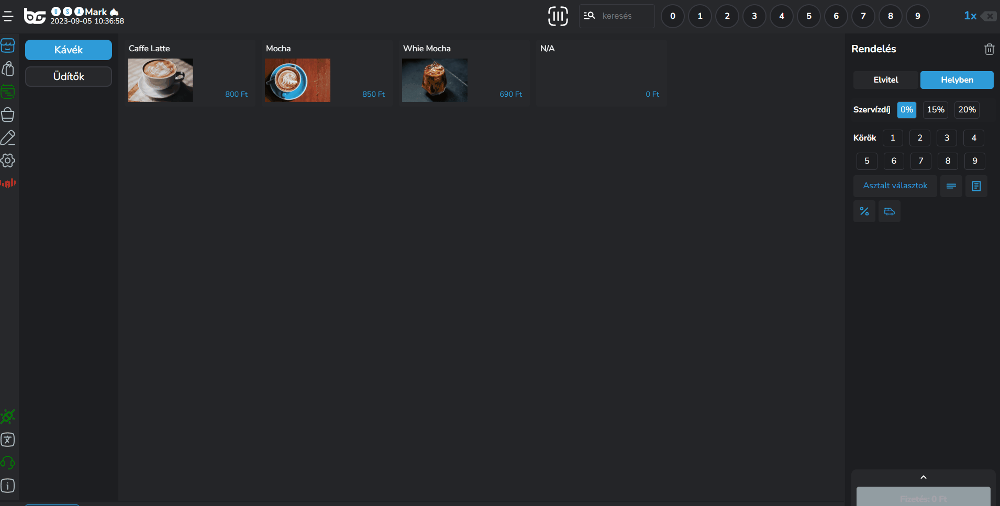

# 🛒 Kosár

A kosár a jobb oldali sávban található alapértelmezetten, az itt levő funkciók megjeleníthetőek vagy elrejthetőek.

A felső kosár menüsorban az alábbi funkciókat tudod állítani:

## Hol fogyasztás

Termék felütéskor kosár szinten és termék szinten is tudod állítani a hol fogyasztás kérdését.


Az ÁFA kulcsok miatt nem kell aggódnod!

Rendszerünk automatikusan állítja az ÁFA kulcsokat helyben / elviteles fogyasztás esetén.


### Helyben fogyasztás

Alapértelmezetten helyben fogyasztásra van állítva a kosár tartalom, tehát amit beraksz a kosárba és értékesítesz, az mind helyben fogyasztásként fog megjelenni és az ÁFA tartalma is a beállított értékeként fog megjelenni.

### Elvitel

Ha mindent elvitelre kérnek, ami a kosárban található, akkor egyszerűen egy gombnyomással elviteles módba tudod állítani a termékeket.

<figure><figcaption></figcaption></figure>

### Termék szintű elvitel / helyben fogyasztás választása

Ahogy korábban említettük van arra is lehetőség, hogy termékenként váltsd a helyben fogyasztás / elviteles fogyasztás státuszát.


Reprezentatív példa

Tehát ha kérnek 3 cappuccino-t, amiből 2-t helyben fogyasztanak 1-et pedig elvisznek, akkor ezt két kattintással be tudod állítani.


<figure><figcaption></figcaption></figure>

### Alapértelmezett Helyben/Elvitel

Amennyiben többnyire elviteles rendeléseket rögzítünk a POS-on, vagy akár csak elviteles rendeléseket, úgy érdemes a beállításokban ezt testreszabni.\
(Beállítások -> Testreszabás -> Működési beállítások -> Egyéb -> Alapértelmezett Elvitel/Helyben)

Ha csak az egyik módot használjuk, akkor az Elvitel/Helyben gombokat el is tudjuk rejteni.\
(Beállítások -> Testreszabás -> Elrendezés -> Eladási felület -> Elvitel/Helyben gombok)

## Szervízdíj kezelés

Amennyiben az iPanelen a lokációnál be lett állítva több szervízdíj opció, a POS-on tudunk a kosárban változtatni a megfelelő mértékre való kattintással.

<figure><figcaption></figcaption></figure>

## Körök kezelése

Klasszikus éttermi működésnél fontos az, hogy megjelöljük a konyha számára, hogy melyik ételek, melyik körben megy ki a vendég számára, hogyan készüljenek sorrendben.

A BarSoft segítségével a felütés során be tudod állítani a köröket termékenként, vagy felütési sorrendben.


**FIGYELEM!**

A körök funkció a POS beállításaiban a testreszabás menüpontban érhető el, alapesetben ki van kapcsolva!


A köröket termékenként mutatjuk az OrderManagerben, és elválasztva csoportosítva a konyha blokkon.

<figure><figcaption></figcaption></figure>

## Asztal kezelés

### Asztal választó

Rendszerünk képes az asztalok kezelésére. Tehát ha klasszikus éttermi kiszolgálással IS dolgozol, akkor lehetőséged van arra, hogy kiválaszd melyik asztalra szeretnéd felütni az adott rendelést.

<figure><figcaption></figcaption></figure>

### Székválasztás

Ha szeretnél asztalra ütni, viszont valamilyen egyéb, extra jellel ellátni a rendelést, akkor van arra lehetőség, hogy számot, vagy valamilyen egyéni szöveget beírj a rendeléshez.

Innentől kezdve az OrderManager-ben (lásd később) azzal az ID-vel fognak megjelenni a rendelések csoportosítva.


Reprezentatív példa

Van egy asztaltársaság, és mindegyik széken rendelnek. Szeretnéd megjelölni, hogy az 1-es széken 2-es széken, 3-as széken ki mit rendelt, és a jövőben is hozzáütni ahhoz a székhez a következő rendeléseket.

Ezzel a funkcióval ezt könnyedén megteheted.


Üsd fel a termékeket, válaszd ki az asztalt és kattints a <mark style="color:blue;">"Rendelés"</mark> szövegre a kosár tetején.

Add meg az ismertető jelet és kattints a <mark style="color:green;">"Mentés"</mark> gombra, majd a <mark style="color:blue;">"Beküldés"</mark> gombra.

<figure><figcaption></figcaption></figure>

### Székválasztás asztaltérkép esetén

Amennyiben használsz asztaltérképet, asztal választáskor az asztaltérképen ki tudod választani, melyik asztal, mely székéhez szeretnéd hozzárendelni a rendelést.

### Egyedi azonosítók rögzítése

Ez a funkció akkor lehet hasznos ha sűrűn használjuk ugyanazokat az azonosítókat vagy neveket, például visszatérő vendégeknél.

<figure><figcaption></figcaption></figure>

## Részletes nézet

A részletes nézettel nem csak a termékek neveit látod majd, hanem minden fontos információt, ami a termékhez kapcsolódik.

* Termék egységár
* Módosítók és azok árai
* Szervízdíj
* Megnövelt termék egységár


**TIPP**

Ezt a funkciót akkor érdemes bekapcsolni, ha nagy képernyővel rendelkezel, valamint sokat módosítózol.

Így látsz minden olyan információt, ami az esetleges vendégkérdéseknél szükséges.


<figure><figcaption></figcaption></figure>

## Megjegyzés mező

Ha az egész rendeléshez szeretnél megjegyzést írni, megteheted a megjegyzés gombra kattintva.

**Hol fog megjelenni a megjegyzés amit írtál?**

1. Blokknyomtatón - ha a rendeléseket nyomtatóra kiküldjük a konyhára / pultba, akkor a tételek felett meg fog jelenni a kosár megjegyzés
2. Rendelés nézetben az Order Managerben - Amennyiben digitális rendelés rendszerezővel dolgozol, az OrderManager-ben a <mark style="color:blue;">"Nyitott rendelések"</mark> menüpontban a rendelés alján olvashatod majd a megjegyzést.

<figure><figcaption></figcaption></figure>

## Személyzeti fogyasztás

A felhasználók közül azok nevére lehet csak személyzeti fogyasztást felvinni, akiknél ez előzőleg engedélyezve lett iPanel-en.

A funkció használatához válasszuk ki a megfelelő felhasználót a személyzeti fogyasztás ablakban, majd a kosár tartalmát be tudjuk küldeni a rendszerbe.

<figure><figcaption></figcaption></figure>

Beküldés után a személyzeti fogyasztásokat le tudjuk zárni a nyitott rendelések között akár fizettetés nélkül is, de ha szeretnénk, lehet fizettetni őket.\
A nyitott rendelések között az ilyen típusú rendeléseknél mutatjuk a felhasználó nevét a rendelésen belül, illetve az ikonnal is jelezzük, ez a rendelés a kiírt névhez tartozik.

<figure><figcaption></figcaption></figure>

Amennyiben a név a rendelést felvevő személyzeté, más ikonnal jelezzük ezt.

<figure><figcaption></figcaption></figure>

## Később fizet funkció

Hasonló módon, mint a személyzeti fogyasztás: az itt kiválasztott név alá fog bekerülni a kosár tartalma, miután beküldtük a rendszerbe.&#x20;

A fő különbség, hogy később fizet vendégeket a POS-on tudunk hozzáadni.

<figure><figcaption></figcaption></figure>

Az így felütött rendeléseket később megtaláljuk a Rendelések menüpontban, a Később fizet fülre kattintva. Itt jobbra egymás alá listázzuk ki a vendégeket, akiknek gyűltek rendelések a nevükre, fizetni a rendelések hozzáadásával lehet.

<figure><figcaption></figcaption></figure>

## Házhozszállítás, szállítási költség

Amennyiben vállalunk házhoz szállítást, szükségünk lesz a vendég címét, telefonszámát, nevét rögzítenünk. Ha már rögzített vendégről van szó, használhatjuk a kereső funkciót (név vagy telefonszám alapján), meggyorsítva a rendelés felvételt. Olyan esetben, amikor nem tudjuk eldönteni, hogy az adott telefonszámhoz tartozik e mentett információ, elég a keresőbe beírni a számot. Ha nincs rá találat a telefonszám mezőben levő nyíl gombbal egyből be is másolhatjuk a számot, majd folytathatjuk a vendég információinak rögzítését.

<figure><figcaption></figcaption></figure>

## Áfás számla készítése

Amennyiben az iPanelen beállítottál számlázási profilt erre a lokációra, vagy adóügyi nyomtatóval dolgozol, ami tud egyszerűsített számlát nyomtatni, kattints a <mark style="color:blue;">Számla</mark> gombra.&#x20;

A felugró ablakban, ha cég számára szeretnél áfás számlát kiállítani, elég lesz beírni az adószám első 8 számjegyét. Ez alapján kikeressük a rendszerből a többi információt.&#x20;

<figure><figcaption></figcaption></figure>

Ha magánszemély számára szeretnél számlát kiállítani, a másik fülre lesz szükséged, itt nem validáljuk az adatokat, fontos, hogy pontosan írd be őket.

<figure><figcaption></figcaption></figure>


Ha e-mail címet írsz be és az adóügyi egységed nem nyomtatja ki a számlát, akkor a beállított számlázási profil alapján a rendszer legenerálja és e-mailben kiküldi a számlát.


## VIP

A VIP vendég rendeléshez való hozzárendeléséhez [itt](https://barsoft.gitbook.io/barsoft-vip/vip-es-barsoft) találsz leírást

## Kedvezmények

Tudsz előre beállított kedvezményt biztosítani rendelés szinten és termékenként is.


A kedvezményeket [iPanelen](https://ipanel.barsoft.hu/brand/discounts) tudod beállítani. -> A kedvezmények beállításával kapcsolatban olvasd el iPanel dokumentációnkat!


Ha be vannak állítva a kedvezmények, akkor a kosárba rakott termékekre egyesével, vagy akár globálisan is (összes termékre) hozzá tudod adni a kedvezmény mértékét a <mark style="color:blue;">"%"</mark> gombra kattintva!

* Ha globálisan (azaz az összes termékre) szeretnéd hozzáadni a kedvezmény mértékét, úgy csak szimplán kattints a kedvezmény nevére!
* Ha csak egy - egy termékhez szeretnéd hozzáadni a kedvezményt, úgy először kattints a termék nevére, majd utána a kedvezményre!
* Ha törölni szeretnéd az egyik terméknél a kedvzemény mértékét, úgy kattints a terméknél a "Kuka" ikonra.


**TIPP**

Ilyen esetekben érdemes bekapcsolni a [részletes nézetet](kosar.md#reszletes-nezet), hogy lásd tételesen a kedvezmény mértékét!



**FIGYELEM!**\
Ha nem tudsz hozzáadni egy tételhez kedvezményt, a részletes kedvezmény szerkesztőnk beállításai miatt lehet iPanelen!

\
A BarSoft rendszere képes automatizmusokat kezelni, tehát be lehet állítani egy kedvezménynél hogy:

* Melyik termékre érvényes
* Melyik méretre érvényes egy terméken belül
* Mikor érvényes
* Milyen időintervallumban adható
* Ki adhatja


## Üzenet küldés nyomtatóra

A POS-hoz hozzárendelt nyomtatót meg tudjuk címezni üzenetekkel, amennyiben valamilyen extra információt szeretnénk küldeni a nyomtatónál dolgozó kollégának.&#x20;

<figure><figcaption></figcaption></figure>

A nyomtató ikonra kattintva fel is ugrik az ablak, ahova be tudjuk írni az üzenetet.

A POS-hoz rendelt nyomtatók közül tudunk választani, illetve el tudjuk menteni az üzenetet, ha többször, ugyanazt akarjuk üzenni.

A mentés gombra kattintva a nyomtató amint megkapta az üzenetet már nyomtatja is.

<figure><figcaption></figcaption></figure>

## Rendelés műveletek gomb

Ez a gomb tartalmazza az összes említett funkciót, amennyiben bekapcsoljuk \
a POS -> beállítások -> testreszabás felületen.

<figure><figcaption></figcaption></figure>

<figure><figcaption></figcaption></figure>
