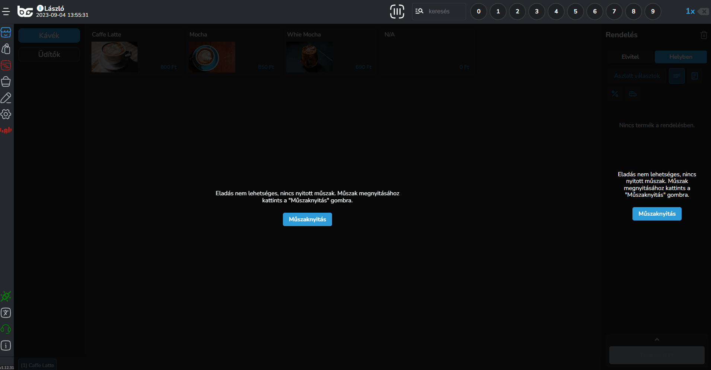
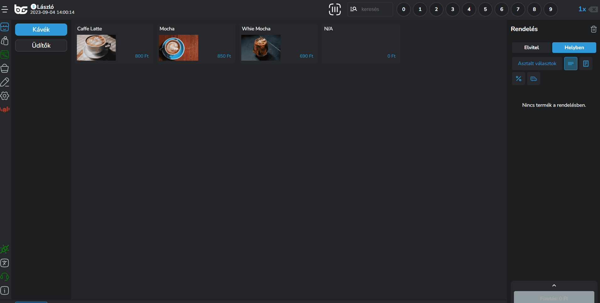
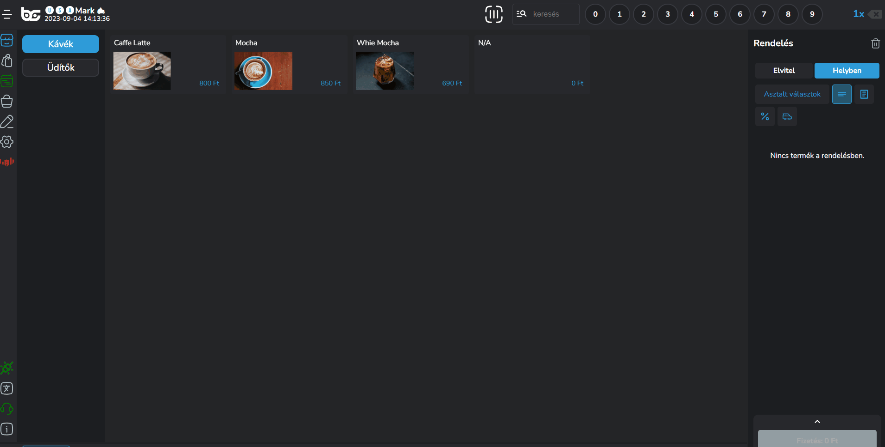
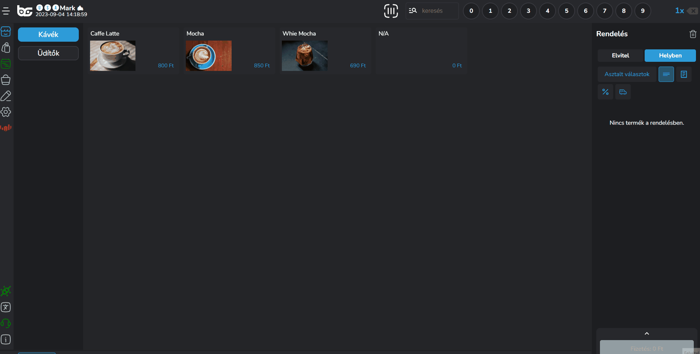
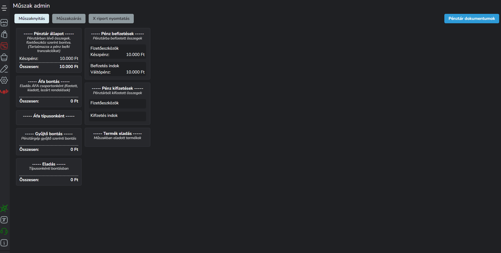

# ⏱️ Műszak kezelés

Ahhoz, hogy elkezdjük az értékesítést, meg kell nyitnod a műszakot.

Első belépéskor, a műszak nyitást kötelezően el kell végezni, tehát egészen addig, míg ez nem történik meg nem is engedjük az értékesítést.

## Műszak nyitás

<figure><figcaption></figcaption></figure>

A műszak nyitás során írd be a váltópénzt, amivel meg szeretnéd nyitni a napot, majd a <mark style="color:yellow;">"Megnyitás"</mark> gombra kattintva vissza is jelezzük, hogy megnyílt a nap, és el tud kezdődni az értékesítés.

A gyors műszak kezelést bármikor eléred a bal oldali menüben felülről a 3. menüpontban:

<figure><figcaption></figcaption></figure>

## Műszak információk

Ha részletesen szeretnéd látni a műszak adatait, ahol a statisztikákat, és az értékesített blokkokat szeretnéd látni, kattints a <mark style="color:blue;">Beálltások -> Műszak kezelés</mark> menüpontra.

Ezen az oldalon lehetséges a pénz be és pénz ki funkciók használata is. Ezek segítségével tudod kezelni a nem eladásból származó pénzmozgások rögzítését a pénztárgép felé.

<figure><figcaption></figcaption></figure>

<figure><figcaption></figcaption></figure>


**Ha van pénztárgép / adóügyi integrációd**

Abban az esetben ha van valamilyen adóügyi integrációd, akkor a Beállítások -> Műszak kezelés -> Pénztár dokumentumok menüpontban az adott dokumentumra (blokk / napnyitás / napzárás stb..) kattintva újra nyomtathatod a blokkot.\
\
Adóügyi nyomtató esetén nem is engedjük, hogy lezárd úgy a napot, hogy nincsenek ezek a tételek kinyomtatva!


<figure><figcaption></figcaption></figure>

Ugyanezt a menüpontot gyorsan is eléred: <mark style="color:blue;">Beállítások -> Pénztár</mark>.

## Műszak zárás

Amint végeztél az értékesítéssel és szeretnéd lezárni a napot, a gyors menüben is meg tudod tenni, valamint a <mark style="color:blue;">Beállítások -> Műszak kezelés -> Műszak zárás</mark> gombra kattintva.

<figure><figcaption></figcaption></figure>

Ebben az esetben az értékesítési lehetőség megszűnik, egészen addig, amíg újra nem nyitjuk a műszakot.

A bal oldali menüben a <mark style="color:red;">műszak ikon pirosra</mark> vált, valamint ha rákattintunk az értékesítésre, akkor fel is ugrik az ablak, hogy meg kell nyitnunk a műszakot a kezdéshez:

<figure><figcaption></figcaption></figure>
