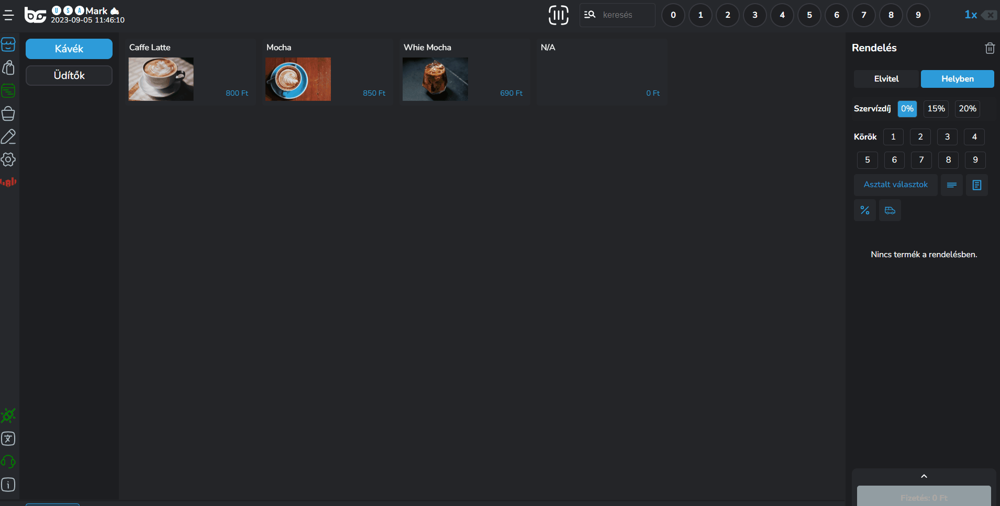
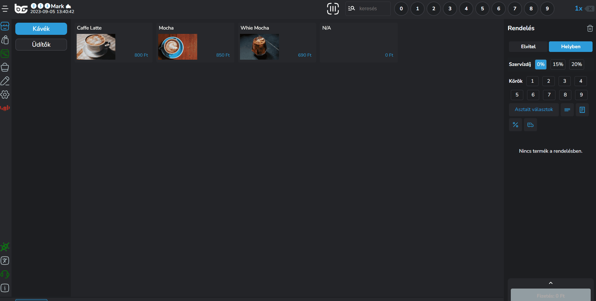

# 🍕 Termék felütés

## Bevezető

Ebben a szekcióban megmutatjuk, hogy hogyan tudsz terméket felütni, milyen technikái vannak a termék felütésnek, hogy a lehető leggyorsabb és legproduktívabb legyen az eladás folyamata.

## Termék hozzáadás a kosárhoz

A termék felütésnek több módja is van.

* Termékre kattintás annyiszor, amennyit hozzá szeretnél adni a kosárhoz
* Szorzó használata a felső menüsávban

<figure><figcaption></figcaption></figure>


**TIPP**

Ha van két azonos terméked, de az egyiket mondjuk elvitelre kérik, akkor **külön kell felütni** hogy tudd módosítani az adott terméket!


## Termék mennyiség módosítása

Ha több terméket beraktál mint amennyit kellett volna, nagyon egyszerű a módja, hogy módosítsd az adott termék mennyiségét a kosárban.

Ha 6 db terméket ütöttél fel véletlenül, de csak 5 db-ot szeretnél igazán, akkor kattints a szorzó sávban az 5-ös gombra, majd a termékre a kosárban és már módosult is a mennyiség!

<figure><figcaption></figcaption></figure>

## Termék opciók elérése

Termék opicók alatt az alábbiakat értjük:

* Körök beállítása
* Helyben / Elvitelre rendelés
* Megjegyzés
* Termék törlése a kosárból
* Méret kiválasztása
* Módosítók beállítása

A termék opciókat több féle képpen éred el:

1. A kosárban rákattintasz a termékre
2. Hosszan nyomod a terméket (Érintő kijelzős) / Jobb egérgombbal nyomsz rá (Nem érintő)
3. Ha van kötelező módosító, aminek az alapértelmezett értéke 0
4. Ha a termék mérendő

<figure><figcaption></figcaption></figure>

<figure><figcaption></figcaption></figure>

## Termék törlés a kosárból

Termék törlésnek is több módja is van:

1. Ha minden terméket szeretnél törölni, a jobb felső sarokban lévő <mark style="color:blue;">"Kuka"</mark> ikonra kattintva nullázzuk a termékeket
2. Ha csak egy bizonyos terméket szeretnél törölni, akkor kattints az adott termékre a kosárban és válaszd ki a <mark style="color:red;">"Termék törlése kosárból"</mark> gombot.
3. Ha több terméket ütöttél fel ugyanabból a termékből, akkor a szorzó választóval a felső menüpontból válaszd ki a kívánt mennyiséget, [mint ahogy azt már korábban tettük](termek-felutes.md#termek-mennyiseg-modositasa).

<figure><figcaption></figcaption></figure>

## Módosítók felütése

Amennyiben módosítókkal is dolgozunk, úgy a termékekhez való hozzáadásának több módja is van:

1. Rögtön felütéskor
2. Felütés után a kosárba került termékre való kattintáskor


**FONTOS!**

Ha két azonos terméket ütünk fel, amihez tudjuk, hogy más - más módosítók kerülnek hozzáadásra, akkor minden esetben külön kell felütnünk a termékeket.\
\
Ha kérnek két azonos terméket, azonos módosítókkal, úgy nyugodtan felüthetjük 2x ugyanazt a terméket, és utána válasszuk ki a módosítókat.

Tehát ha például két Cappuccino-t kérnek mandulatejjel és karamell sziruppal, akkor felütéskor kiválasztjuk a 2-es szorzót, majd a módosítóknál 1 mandulatej és 1 karamel szirup felütésével tudjuk ezt rögzíteni.

Ha kétszer ütjük fel a tej és szirup módosítót, úgy végeredményben 2x2 tej és 2x2 szirup kerül a nyugtára.



**FIGYELEM!**

A megjelenítésnél vegyük figyelembe a részletező esetében, hogy a részletező az egy termékre vonatkozó információkat tartalmazza, és ezeket az információkat szorozzuk fel.



**TIPP!**\
Módosító felütés esetén érdemes bekapcsolni a részletező módot, hogy lássuk, melyik termékre milyen módosítókat ütöttünk fel.


<figure><figcaption></figcaption></figure>

## Termék megjegyzés hozzáadása

Amennyiben termék szintű megjegyzést szeretnénk hozzáadni, a kosárban lévő termékre rákattintva a megjegyzés opció segítségével oda tudjuk írni a speciális kéréseket.

A megjegyzés meg fog jelenni az OrderManager felületen és a konyhai blokkon is.

<figure><figcaption></figcaption></figure>


**TIPP!**

Ha sűrűn visszajönnek ugyanazok a speciális kérések, érdemes belőlük módosító csoportokat létrehozni hozzá, a megjegyzéseket akkor érdemes használni, ha vissza nem térő, egyedi megjegyzést szeretnénk hozzáadni a termékhez.


## Különböző méretek hozzáadása

Abban az esetben, ha egy termékhez különböző méret van hozzáadva iPanelen, mint például:

* Fél adag / normál adag
* 0,3l / 0,5l

akkor a termék felütéskor az alapértelmezett méret kerül a kosárba.


**TIPP!**

Érdemes iPanelen azt a méretet beállítani, amit a legsűrűbben kérnek, az értékesítés gyorsítása érdekében.


Ha szeretnénk méretet váltani, abban az esetben a termék opciók menüpont felhozásával (hosszan nyomva / jobb gomb vagy kosárban termékre kattintva) ki tudjuk választani az adott termékhez tartozó méretet.

<figure><figcaption></figcaption></figure>

## EAN / PLU

Rendszerünk lehetővé teszi a vonalkódos és számkódos termék felütési lehetőséget is.

Abban az esetben, ha van vonalkód olvasód, akkor iPanelen a termék szerkesztőben a méret szerkesztésnél be tudod olvasni a vonalkódot.

Termék eladáskor pedig csupán be kell olvasnod az eladási felületen a vonalkódot és automatikusan hozzáadja a terméket a kosárba.

Ha inkább számkódot szeretnél használni, akkor a PLU gombra kattintva (kereső mező mellett a felső menüsorban) be tudod írni azt a kódot, amit megadtál iPanelen a termék szerkesztőben a méretnél.

<figure><figcaption></figcaption></figure>
