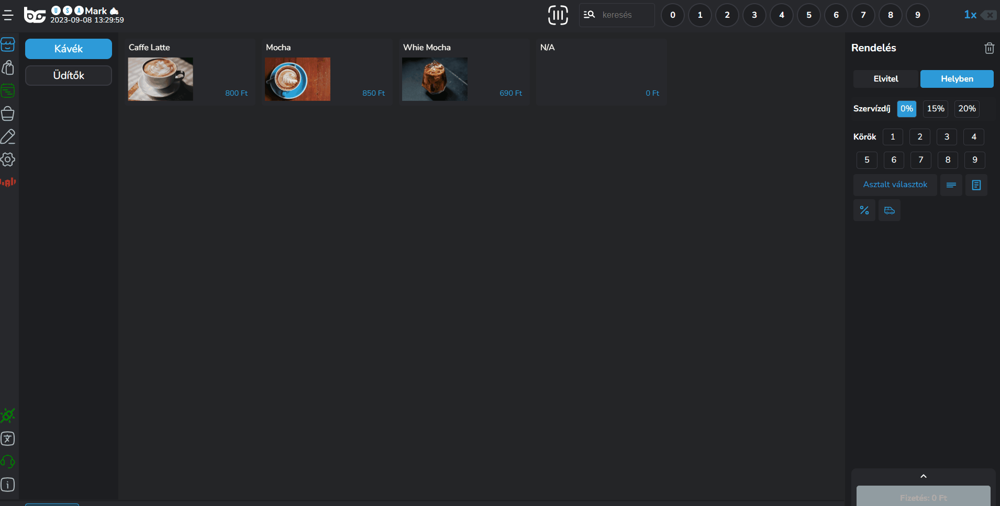
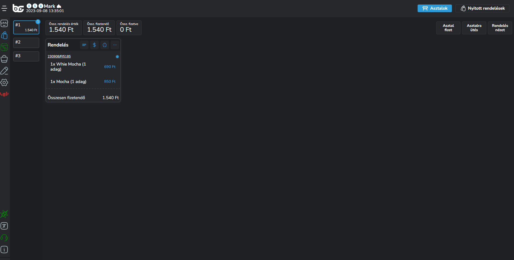
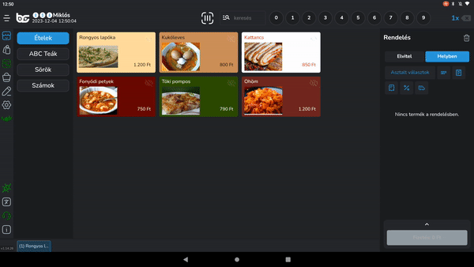
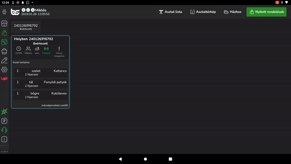
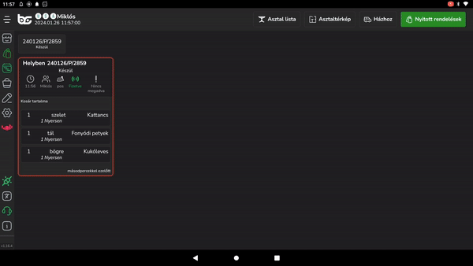

# 🔢 Az OrderManager felépítése

A BarSoft beépített rendeléskezelőjét arra használjuk, hogy a beérkezett rendeléseket a konyha / pult lássa, és fel tudja dolgozni.

## Rendelések típusai

Rendelések típusainál három félét különítünk el:

1. Gyors nyugtás rendelés
2. Asztalos rendelés
3. Házhoz rendelés

### Gyors nyugtás - Nyitott rendelések

Gyors nyugtás rendelés esetén az OrderManager felületén a <mark style="color:blue;">"Nyitott rendelések"</mark> menüpontnál jelennek meg a leadott igények, amit a jobb felső sarokban lévő gombra kattintva érsz el.

<figure><figcaption></figcaption></figure>

### Asztalos rendelések

Amennyiben asztalokat kezelünk, és beküldjük a rendeléseket asztalokra, úgy az OrderManager <mark style="color:blue;">"Asztalok"</mark> nézetében láthatjuk a rendeléseinket.

Ebben a nézetben minden asztalt felsorolunk és azokat az asztalokat soroljuk előre, amelyiken van már valamilyen rendelés.

Az asztalok nézethez kattints a beküldés után az "Asztalok" menüpontra.

<figure><figcaption></figcaption></figure>

Amennyiben ugyanarra az asztalra ütünk további rendelést, úgy rendelésszám szerint jelenítjük meg a megrendelt tételeket az adott asztalon, egymás alatt.


**TIPP**

Akár az asztalnézetben is tudsz felütni plusz rendelést az <mark style="color:blue;">"Asztalra ütés"</mark> gombbal a jobb alsó sarokban a rendeléseknél!


Ha új rendelést ütünk fel az adott asztalra, akkor ha szeretnénk, az asztalonkénti rendelés nézet is elérhető, így tételesen egymás mellett látjuk külön-külön a rendeléseket.

<figure><figcaption></figcaption></figure>

### Házhoz rendelés

Ebbe a menüpontba két féle képpen érkezhet be rendelés.

* BrandApp-ból beérkező rendelés házhoz szállítási igény esetén
* POS-on felütött rendeléskor, ha a cím adatok ki vannak töltve

<figure><figcaption></figcaption></figure>

## Státuszok

Lehetőség van több státusz kezelésére is.

iPanel felületünkön a lokációk menüpont alatt be lehet állítani, hogy milyen státuszt szeretnénk kezelni OrderManager-ben, amit a BrandAppon, és saját magunknak meg tudunk mutatni.

**Státuszok típusai:**

* Fogadva
* Időpont megadása
* Kész
* Kiadva


**FONTOS!**

Mindig az lesz az a státusz amit kezelnünk kell, ami be van kapcsolva utoljára!



**FIGYELEM!**

Asztalkezelés során, a KIADVA státusz nem kikapcsolható!


<figure><figcaption></figcaption></figure>

Lehetőség van egy rendelésen belül termékenkénti státusz állításra is.

Ez abban az esetben lehet érdekes, ha több pult van beállítva, és minden pult külön státuszol az adott rendelésen belüli termékekkel kapcsolatban, hogy a kiadó pult lássa, hogy hol tartanak a rendelésen belüli tételek, és mikor adhatja ki az adott rendelést.

<figure><figcaption></figcaption></figure>
