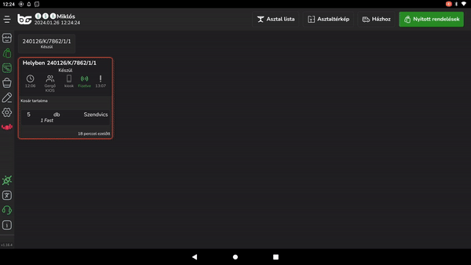

# ℹ️ Egyéb beállítások

A rendeléskezelővel kapcsolatosan további opciók érhetők el a POS eszközön.


TIPP

Minden POS-on egyénileg beállíthatod, hogy hogyan szeretnéd megjeleníteni a rendeléseket az OrderManager felületén.


POS-on a lezárt rendelések állapotát tudod állítani:

* Sikeresen lezárt rendelések tűnjenek el automatikusan amennyiben KIADVA státuszt megkapta a rendelés
* Sikertelenül lezárt rendelések (sztornózott) tűnjenek el automatikusan


FIGYELEM!

Asztalra felütött rendelések esetén a KIADVA státuszt mindenképp meg kell nyomni, és csak utána tűnnek el automatikusan a rendelések amennyiben ez az opció be van kapcsolva.


<figure><figcaption></figcaption></figure>

## Értesítés hangok

Ha a személyzet nem feltétlenül nézi folyamatosan a rendeléskezelőt, van lehetőség értesítés hangok bekapcsolására, amennyiben az adott eszköz rendelkezik hangszóróval. \
(Beállítások -> Testreszabás -> Egyéb -> Hangok)\
Miután ez be van kapcsolva, egy hang értesítéssel jelzi a rendszer számunkra a beérkező rendeléseket.&#x20;
