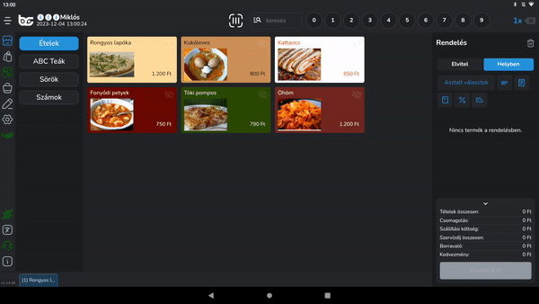

# 📞 Súgó, Segítség / Support

A fejhallgató ikonra kattintva megjelenik/eltűnik a jobb alsó sarokban egy chat ikon, a bal oldalt pedig az eszköz információ ablak. Az információs ablakban feltüntetjük a viszonteladód elérhetőségeit (ha van). Ők leszek az elsődleges segítségnyújtási elérhetőségetek, ha probléma történne.\
Ha a chat ikonra rákattintunk lehetőségünk van böngészni a súgóban, a gyakori kérdésekben, vagy egy BarSoft ügyfélszolgálatossal beszélgetni akinek amint lehetőségében áll válaszolni fog a kérdéseinkre és megpróbálja megoldani a problémánkat.

<figure><figcaption></figcaption></figure>

<figure><figcaption></figcaption></figure>
